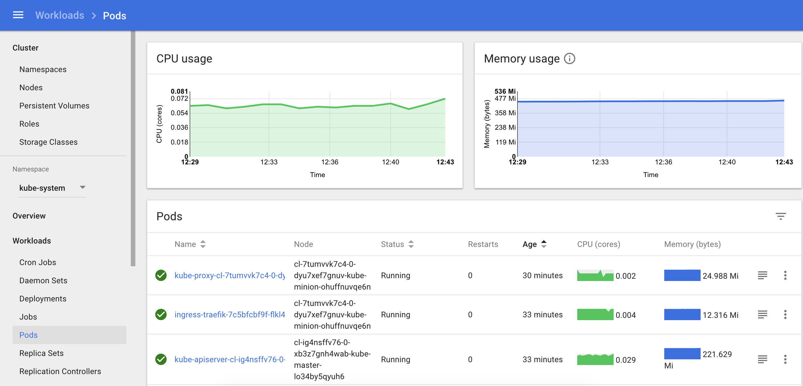

Описание
--------

Кластер Kubernetes содержит встроенные средства мониторинга на базе Heapster, time-series базы данных InfluxDB и Grafana.

В результате Kubernetes Dashboard отображает данные мониторинга как Node-узлов, так и каждого индивидуального Pod.



Расширенный мониторинг инфраструктуры Kubernetes и всех пользовательских приложений можно настроить с помощью Grafana. Каждый Pod, который задеплоен в кластер Kubernetes, будет автоматически зарегистрирован в Grafana. Также с помощью Grafana можно настроить оповещения о недоступности ресурсов.

Подключение
-----------

Для входа в панель Grafana установите соединение с кластером с помощью команды:

```
kubectl -n prometheus-monitoring port-forward service/kube-prometheus-stack-grafana 8001:80
```

Затем откройте [](http://127.0.0.1:8001)[интерфейс Grafana](http://127.0.0.1:8001) в браузере. Для первого входа используйте:

*   Логин: **admin**
*   Пароль: **admin**


**Примечание**

После первого входа рекомендуется сменить пароль пользователя в Grafana.

## Расширение диска
> **Примечание**
>
> Уменьшить размер или изменить тип диска не получится. Максимальный размер ограничен квотами.

Чтобы расширить диск Prometheus:
1. Перейдите в «Контейнеры» → «Кластеры Kubernetes».
2. В строке кластера, которому нужно расширить диск, нажмите меню управления кластером.
3. Нажмите «Изменить размер диска Prometheus».
4. Укажите новый размер диска. 
5. Нажмите кнопку «Подтвердить».

VK CS запустит операцию изменения размера диска.