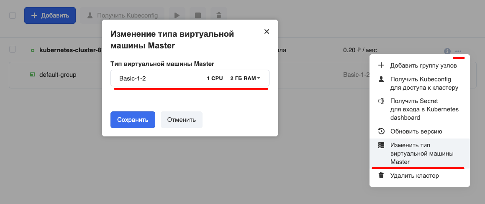
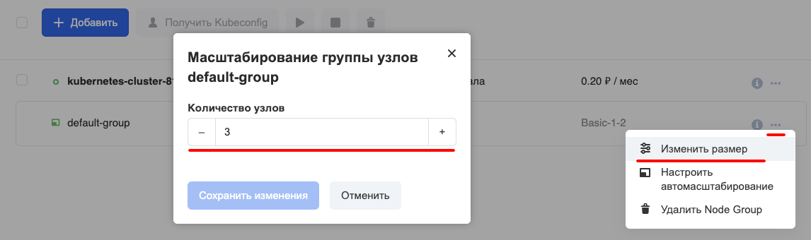

## Master

Зайдите в [панель управления кластерами](https://mcs.mail.ru/app/services/containers/list/). Выберите в контекстном меню нужного кластера пункт "**Изменить тип виртуальной машины Master**" и выберите новые параметры мастера.

## Node group

Зайдите в [панель управления кластерами](https://mcs.mail.ru/app/services/containers/list/). Выберите в контекстном меню нужного кластера пункт "**Изменить размер**" и выберите новое количество узлов.

Нажмите "Сохранить изменения" и дождитесь окончания операции.
