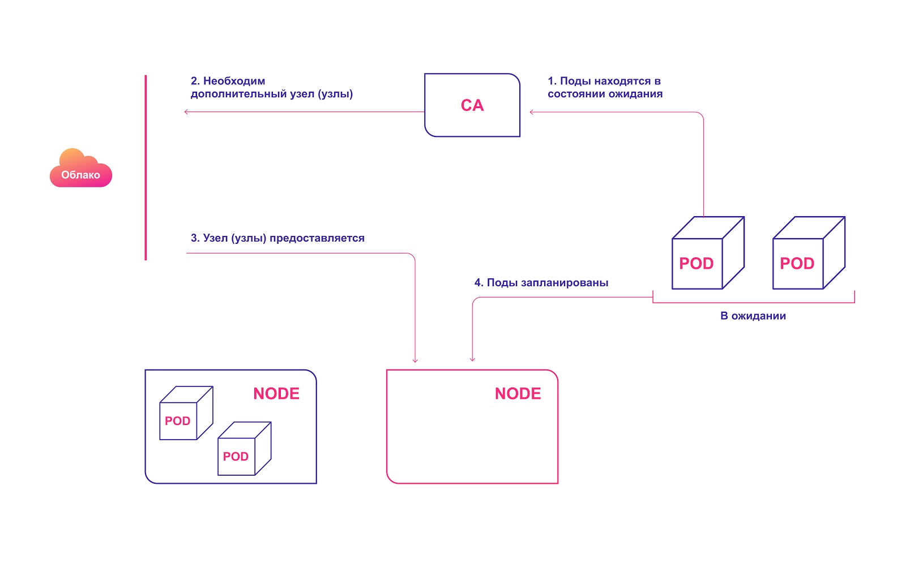
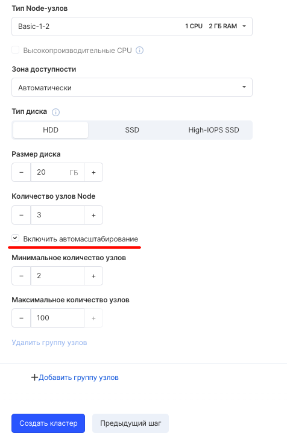
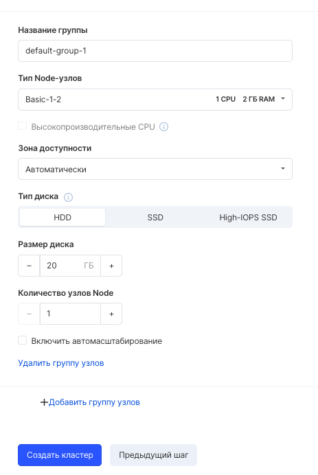
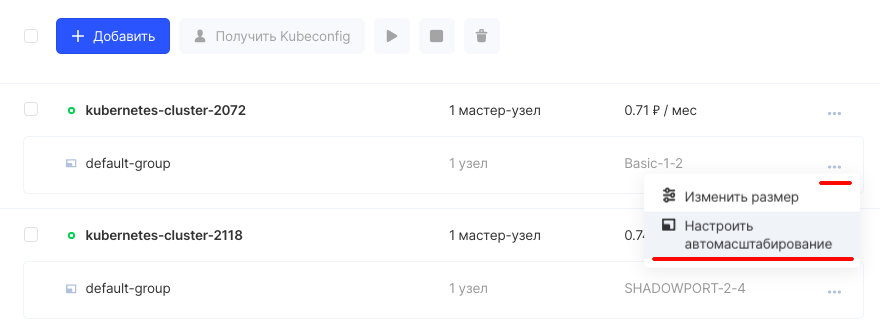
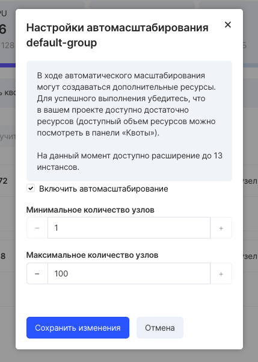

В сервисах VK CS есть возможность включить автомасштабирование кластера. Автоматическое масштабирование применяется при планировании динамической нагрузки на кластер.

В случае повышенной нагрузки на сервер кластер автоматически увеличит количество нод, а при отсутствии нагрузки - автоматически уменьшит их количество.

Для автоматического масштабирования кластера Kubernetes используется отдельная программа Cluster Autoscaler, которая регулирует размер кластера в соответствии с его текущими потребностями.

Автомасштабирование кластера (Cluster Autoscaler, CA) изменяет количество узлов, исходя из количества ожидающих модулей pod. Система периодически проверяет наличие ожидающих модулей — и увеличивает размер кластера, если требуется больше ресурсов и если кластер не выходит за пределы установленных лимитов. CA взаимодействует с поставщиком облачных услуг, запрашивает у него дополнительные узлы или освобождает бездействующие. Первая общедоступная версия CA была представлена в Kubernetes 1.8.

Высокоуровневая схема работы СA:

1.  CA проверяет наличие модулей в состоянии ожидания с интервалом по умолчанию 10 секунд.
2.  Если один или несколько модулей находятся в состоянии ожидания из-за того, что в кластере недостаточно доступных ресурсов для их распределения, он пытается подготовить один или несколько дополнительных узлов.
3.  Когда поставщик облачных услуг выделяет необходимый узел, тот присоединяется к кластеру и готов обслуживать модули pod.
4.  Планировщик Kubernetes распределяет ожидающие модули на новый узел. Если после этого некоторые модули все равно остаются в состоянии ожидания, процесс повторяется — и в кластер добавляются новые узлы.

_Автоматическое выделение узлов кластера в облаке_

Учитывайте следующее при использовании СA:

- CA гарантирует, что у всех модулей в кластере есть место для запуска, независимо от уровня нагрузки на процессор. Кроме того, он пытается гарантировать, что в кластере нет ненужных узлов.
- CA регистрирует необходимость масштабирования примерно через 30 секунд.
- После того как узел становится ненужным, CA по умолчанию ожидает 10 минут, прежде чем масштабировать систему.
- В системе автомасштабирования есть понятие расширителей (expanders). Это различные стратегии для выбора группы узлов, в которую будут добавлены новые.
- Ответственно применяйте опцию _cluster-autoscaler.kubernetes.io/safe-to-evict (true)_. Если установить много pod'ов или если многие из них будут разбросаны по всем узлам, вы в значительной степени потеряете возможность уменьшать масштаб кластера.
- Используйте [PodDisruptionBudgets](https://kubernetes.io/docs/concepts/workloads/pods/disruptions/), чтобы предотвратить удаление pod'ов, из-за чего часть вашего приложения может полностью выйти из строя.

## При создании кластера

Для включения опции автомасштабирования в мастере создания кластера следует поставить соответствующий флажок и выбрать минимальное и максимальное количество узлов.

В мастере также можно добавить группу узлов (Group node), нажав "Добавить группу узлов":

Для каждой группы узлов можно выбрать опцию автоматического масштабирования.

## На созданном кластере

Если кластер был создан без опции автоматического масштабирование, но возникла необходимость ее активировать, эту операцию можно выполнить на уже созданном кластере, опцией "Настроить автомасштабирование" в контекстном меню выбранного кластера в сервисе "Контейнеры" Панели VK CS:

Затем следует выбрать параметры автомасштабирования.

В окне настроек автомасштабирования можно увидеть заранее, до какого количества инстансов можно расширить кластер.
