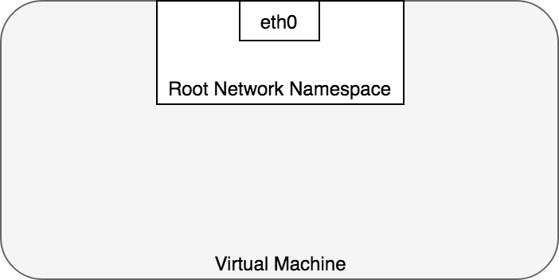
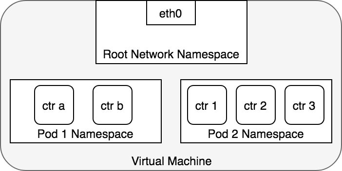
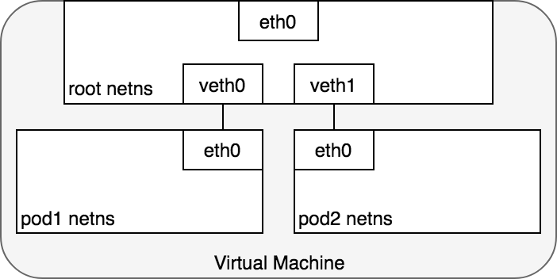
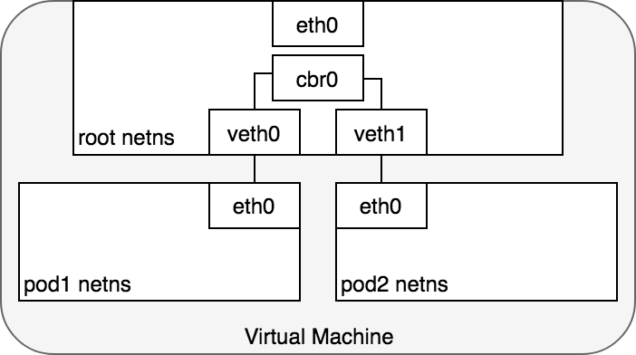

## Сетевая модель Kubernetes

Kubernetes предъявляет следующие требования к любой сетевой реализации:

- все модули могут взаимодействовать со всеми другими модулями без использования трансляции сетевых адресов (NAT).
- все узлы могут связываться со всеми модулями без NAT
- IP-адрес, который Pod видит в себе, - это тот же IP-адрес, которым его видят другие

Учитывая эти ограничения, остается решить следующие сетевые проблемы взаимодействия:

1.  Сеть контейнер-контейнер
2.  Сеть Pod-to-Pod

Рассмотрим по очереди эти проблемы и способы их решения.

## Сеть контейнер-контейнер

Обычно рассматривается сетевую связь на виртуальной машине как взаимодействие напрямую с устройством Ethernet, как показано на рисунке.


В Linux каждый запущенный процесс взаимодействует с сетевым пространством имен, которое обеспечивает логический сетевой стек со своими собственными маршрутами, правилами брандмауэра и сетевыми устройствами. Сетевое пространство имен предоставляет новый сетевой стек для всех процессов в пространстве имен.

Сетевые пространства имен могут быть созданы с помощью команды ip. Например, следующая команда создаст новое сетевое пространство имен с именем ns1.

```
ip netns add ns1
```

При создании пространства имен для него создается точка монтирования /var/run/netns, позволяющая пространству имен сохраняться, даже если к нему не привязан процесс.

Можно вывести список доступных пространств имен, перечислив все точки монтирования под /var/run/netns, используя команду ip.

```
ls /var/run/netns
ns1
ip netns
ns1
```

По умолчанию Linux назначает каждый процесс корневому сетевому пространству имен, чтобы обеспечить доступ к внешнему миру:



С точки зрения конструкций Docker, Pod моделируется как группа контейнеров Docker, которые совместно используют пространство имен сети. Все контейнеры внутри модуля имеют одинаковый IP-адрес и пространство портов, назначенное через сетевое пространство имен, назначенное модулю, и могут находить друг друга через localhost, поскольку они находятся в одном пространстве имен. Можно создать сетевое пространство имен для каждого модуля на виртуальной машине. Это реализовано с использованием Docker в качестве «контейнера Pod», который удерживает сетевое пространство имен открытым, в то время как «контейнеры приложений» (то, что указал пользователь) присоединяются к этому пространству имен с помощью Docker –net = container:функция.



Приложения внутри модуля также имеют доступ к общим томам, которые определены как часть модуля и доступны для монтирования в файловую систему каждого приложения.

## Сеть Pod-to-Pod

В Kubernetes у каждого модуля есть реальный IP-адрес, и каждый модуль взаимодействует с другими модулями, используя этот IP-адрес. Необходимо понять, как Kubernetes обеспечивает связь Pod-to-Pod с использованием реальных IP-адресов, независимо от того, развернут ли Pod на одном физическом узле или на другом узле в кластере. Рассмотрим модули, которые находятся на одном компьютере, чтобы избежать сложностей, связанных с переходом по внутренней сети для связи между узлами.

С точки зрения Pod он существует в собственном пространстве имен Ethernet, которому необходимо взаимодействовать с другими сетевыми пространствами имен на том же узле. К счастью, пространства имен могут быть связаны с помощью виртуального устройства Ethernet Linux или пары veth состоящей из двух виртуальных интерфейсов, которые могут быть распределены по нескольким пространствам имен. Чтобы связать пространства имен Pod, можем назначить одну сторону пары veth корневому сетевому пространству имен, а другую сторону - сетевому пространству имен Pod. Каждая пара veth работает как патч-кабель, соединяя две стороны и позволяя трафику течь между ними. Эту настройку можно воспроизвести для любого количества модулей, имеющихся на машине.

~~

На этом этапе настроены поды, чтобы у каждого было одно сетевое пространство имен, чтобы они считали, что у них есть собственное устройство Ethernet и IP-адрес, и они подключены к корневому пространству имен для Node. Теперь необходимо обеспечить общение подов друг с другом через корневое пространство имен, и для этого будет использован сетевой мост.

Мост Linux Ethernet - это виртуальное сетевое устройство уровня 2, используемое для объединения двух или более сетевых сегментов, работающее прозрачно для соединения двух сетей вместе. Мост работает, поддерживая таблицу пересылки между источниками и получателями, проверяя место назначения пакетов данных, которые проходят через него, и решая, передавать ли пакеты другим сегментам сети, подключенным к мосту. Мостовой код решает, передавать ли данные или отбрасывать их, просматривая MAC-адрес, уникальный для каждого устройства Ethernet в сети.

Мосты реализуют протокол ARP для обнаружения MAC-адреса канального уровня, связанного с заданным IP-адресом. Когда фрейм данных принимается мостом, мост передает фрейм всем подключенным устройствам (кроме исходного отправителя), а устройство, которое отвечает на фрейм, сохраняется в таблице поиска. Будущий трафик с тем же IP-адресом использует таблицу поиска для определения правильного MAC-адреса для пересылки пакета.


