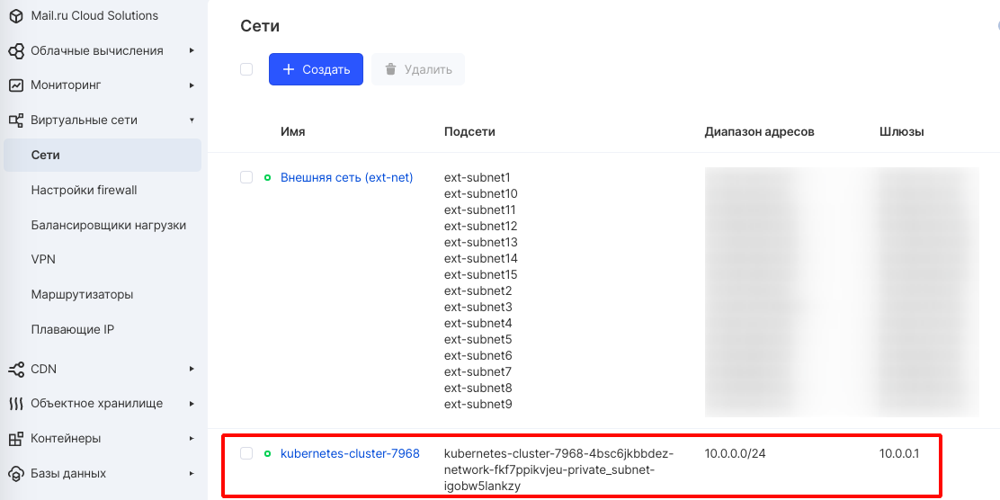
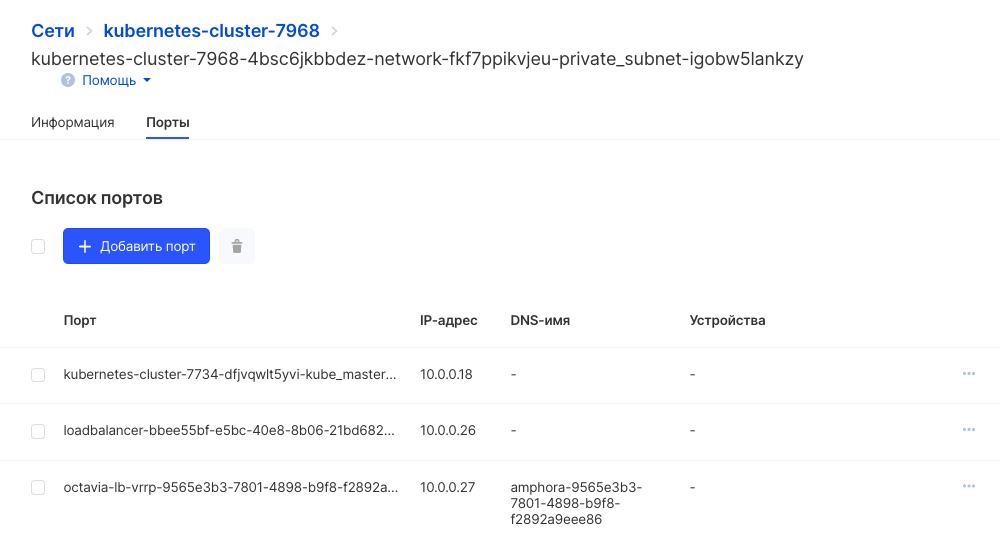

Kubernetes предназначен для совместного использования машин между приложениями. Как правило, для совместного использования компьютеров требуется, чтобы два приложения не пытались использовать одни и те же порты. Координация портов между несколькими разработчиками очень сложна в масштабе и подвергает пользователей проблемам на уровне кластера, которые они не могут контролировать.

Динамическое распределение портов создает множество сложностей для системы - каждое приложение должно принимать порты в качестве флагов, серверы API должны знать, как вставлять динамические номера портов в блоки конфигурации, службы должны знать, как находить друг друга и т. Д. Вместо того, чтобы заниматься этим, Kubernetes использует другой подход.

Сетевая модель Kubernetes
-------------------------

Каждый Pod получает свой IP-адрес. Это означает, что вам не нужно явно создавать ссылки между ними, Pods и вам почти никогда не нужно иметь дело с сопоставлением портов контейнера с портами хоста. Это создает чистую, обратно совместимую модель, с которой Pods можно работать как с виртуальными машинами или физическими хостами с точки зрения распределения портов, именования, обнаружения служб, балансировки нагрузки, конфигурации приложений и миграции.

Kubernetes предъявляет следующие фундаментальные требования к любой сетевой реализации (запрещая любые политики преднамеренной сегментации сети):

*   модули на узле могут связываться со всеми модулями на всех узлах без NAT
*   агенты на узле (например, системные демоны) могут связываться со всеми модулями на этом узле

**Примечание**

Для платформ, поддерживающих Pods работу в сети хоста (например, Linux), модули в хост-сети узла могут связываться со всеми модулями на всех узлах без NAT.

Эта модель не только менее сложна в целом, но и принципиально совместима с желанием Kubernetes обеспечить легкий перенос приложений с виртуальных машин в контейнеры. Если ваша работа ранее выполнялась на виртуальной машине, у вашей виртуальной машины был IP-адрес, и она могла общаться с другими виртуальными машинами в вашем проекте. Это та же базовая модель.

IP-адреса Kubernetes существуют в области Pod видимости - контейнеры в рамках общего доступа к Pod своим сетевым пространствам имен, включая их IP-адреса. Это означает, что все контейнеры внутри Pod могут достигать портов друг друга через localhost. Это также означает, что контейнеры внутри Pod должны координировать использование порта, но это не отличается от процессов в виртуальной машине. Это называется моделью «IP-per-pod».

То, как это реализовано, является деталью конкретной используемой среды выполнения контейнера.

Можно запрашивать порты на самих нодах, которые перенаправляют на ваш Pod (называемые портами хоста), но это очень редкая операция. Реализация этой пересылки также является деталью среды выполнения контейнера. Сама по себе программа не знает о существовании или отсутствии портов хоста.

Управление сетями
-----------------

Управление сетями осуществляется в [разделе личного кабинета "Сети"](https://mcs.mail.ru/app/services/server/networks/). При создании кластера, как правило, создаётся и сеть для этого кластера. 

Кликнув на название сети, можно попасть в настройки её подсетей:

и при необходимости добавить новую подсеть:

Если кликнуть на название подсети, можно попасть на информационную карточку подсети. Вкладка "Порты" наиболее интересна, так как вкладка "Информация" частично дублируется на карточках выше по иерархии.

На вкладке "Порты" можно увидеть сетевые подключения / сетевые сущности, подключенные к кластеру, и при необходимости добавить новые.

**Важно**

При создании кластера можно указать сеть, в которой будет развернут кластер, (если сеть уже создана). Если сети нет или она не указана, то для кластера создастся собственная приватная сеть.

Также можно выбрать создание кластера без внешнего IP (технология shadowport). Для включения возможности создания кластера с данной опцией, необходимо [сообщить в техническую поддержку](mailto:support@mcs.mail.ru), указав ID проекта.