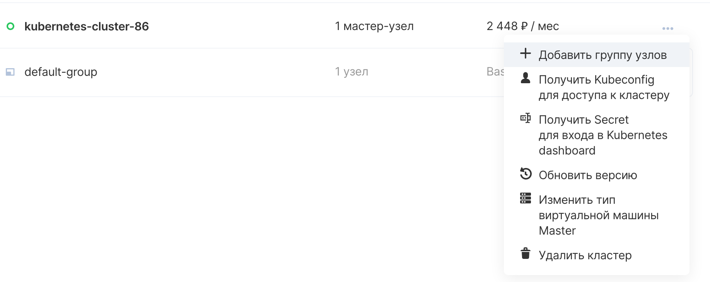
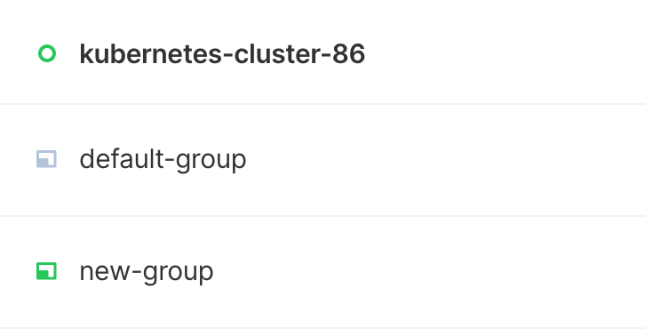

Нод-группа это множество нод с общим шаблоном (размером) виртуальной машины. Существует возможность создать несколько нод-групп с разными шаблонами/размерами и специальными именами для решения разных задач. Например можно создать нод-группу на базе большого размера ВМ для ресурсоёмких контейнеров. 

В панели VK CS
------------

Для нод-группы в личном кабинете VK CS следует:

1.  Перейти на страницу "Кластеры Kubernetes" раздела "Контейнеры".
2.  Открыть контекстное меню кластера, выбрать пункт "Добавить группу узлов"
    
    
3.  В появившемся меню нужно задать параметры:
    
    
    
    <table style="width: 100%;"><tbody><tr><td style="width: 28.5333%;">Название группы</td><td style="width: 71.3334%;">задать имя нод-группы</td></tr><tr><td style="width: 28.5333%;">Тип Node-узлов</td><td style="width: 71.3334%;">выбрать требуемый тип (размер нод, количество CPU/RAM)</td></tr><tr><td style="width: 28.5333%;">Высокопроизводительные CPU</td><td style="width: 71.3334%;">если требуются ноды с высокопроизводительными CPU, нужно поставить соответствующую галочку (соответствующие флейворы должны быть добавлены в проект, для их добавления обратитесь в поддержку)</td></tr><tr><td style="width: 28.5333%;">Зона доступности</td><td style="width: 71.3334%;">указать зону доступности</td></tr><tr><td style="width: 28.5333%;">Тип диска</td><td style="width: 71.3334%;">выбрать тип диска с подходящей производительностью, но мы не рекомендуем внутри подов писать/читать с дисков ноды, для таких целей лучше использовать PVC</td></tr><tr><td style="width: 28.5333%;">Размер диска</td><td style="width: 71.3334%;">задать размер диска</td></tr><tr><td style="width: 28.5333%;">Количество узлов Node</td><td style="width: 71.3334%;">количество рабочих нод</td></tr><tr><td style="width: 28.5333%;">Включить автомасштабирование</td><td style="width: 71.3334%;">добавляет в кластер специальный cluster autoscaler, который отслеживает состояние подов в кластере, и если из-за нехватки ресурсов поды имеют статус Pending, autoscaler создаёт новые ноды. Аналогично работает и в обратную сторону: если свободных ресурсов слишком много, лишние ноды будут удалены</td></tr><tr><td style="width: 28.5333%;">Минимальное количество узлов</td><td style="width: 71.3334%;">Число ниже которого количество нод не опустится (не может быть больше Количества узлов Node из предыдущего пункта). Имеет смысл при активированном авто-масштабировании</td></tr><tr><td style="width: 28.5333%;">Максимальное количество узлов</td><td style="width: 71.3334%;">Число выше которого количество нод не поднимется. Имеет смысл при активированном авто-масштабировании</td></tr></tbody></table>
    
4.  ### Важно
    
    Кластеры версии 1.15.3 и ниже уже не поддерживаются, а так же не получают обновления. Вместо добавления нод-групп в кластер старой версии мы рекомендуем создавать новый кластер более свежей версии.
    
5.  Нажать кнопку Добавить группу узлов, после чего начнётся масштабирование кластера
    
6.  Через некоторое время (до одного часа, в зависимости от количества добавляемых нод) кластер закончит масштабирование и нод-группа будет добавлена в кластер
7.  Изменить размер node-group и поменять настройки авто-масштабирования можно в любой момент после создания node group