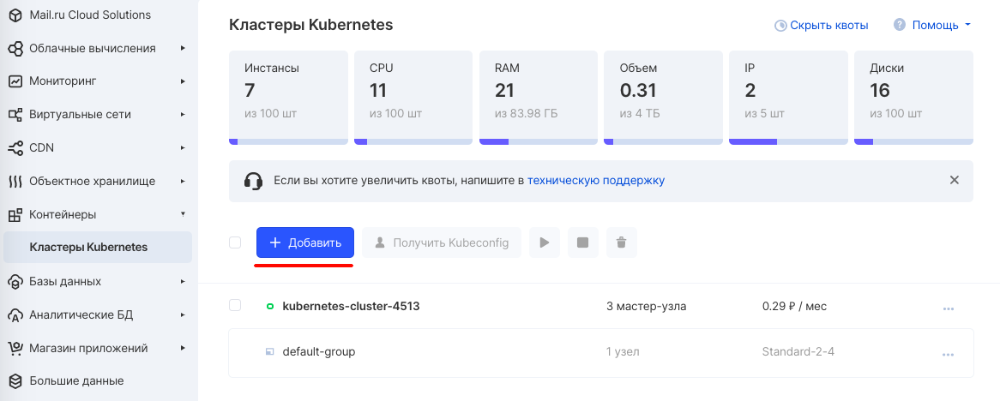
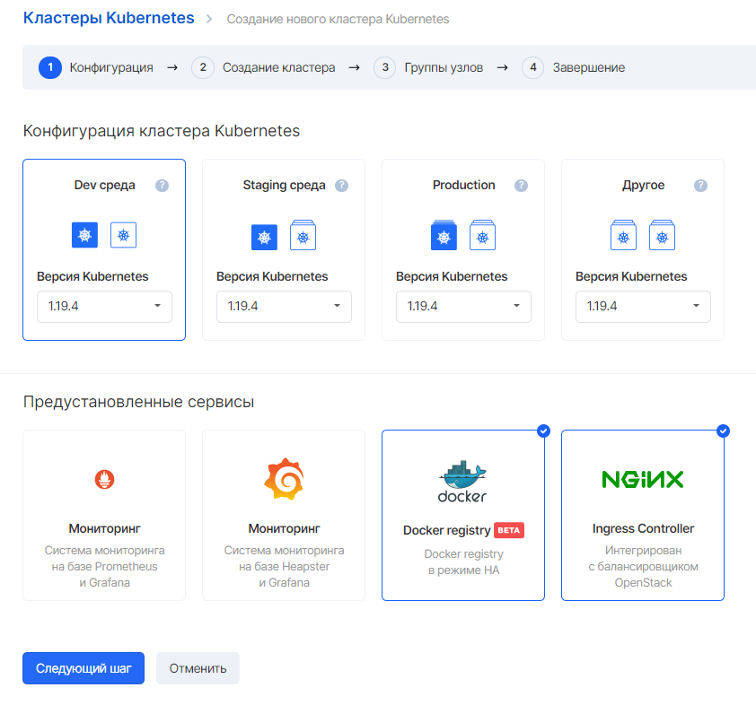
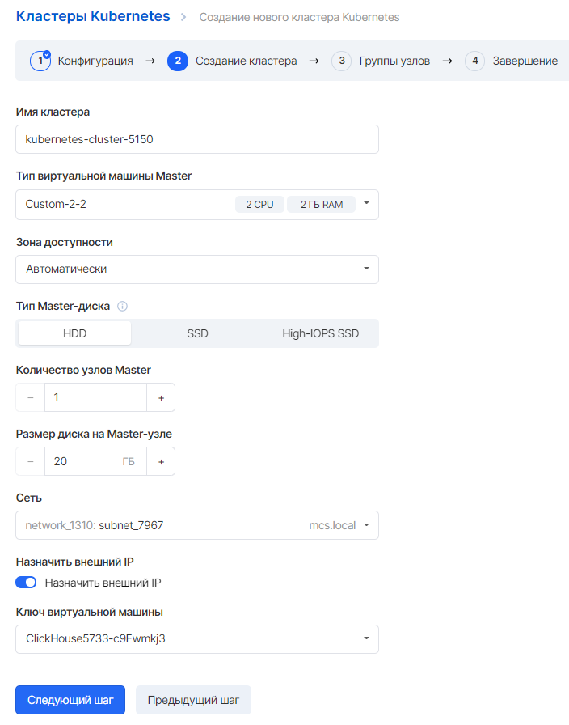
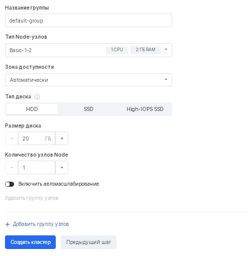
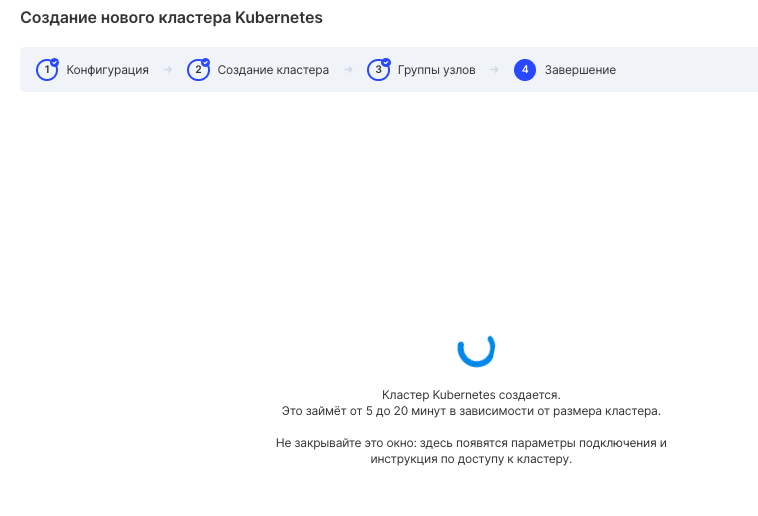

Описание
--------

Кластер Kubernetes состоит из набора машин, так называемых узлов (node's), которые запускают контейнеризированные приложения. Кластер должен иметь как минимум один рабочий узел.

На рабочих узлах размещены поды (pod's), являющиеся компонентами приложения. Внутренние сервисы Kubernetes управляют рабочими узлами и подами в кластере. В промышленных управляющие сервисы обычно запускается на нескольких компьютерах, а кластер, как правило, развёртывается на нескольких узлах, гарантируя отказоустойчивость и высокую надёжность.

Топология кластеров в VK CS включает в себя понятие мастер-узлов, на которых располагаются управляющие сервисы и групп рабочих узлов (Node Group), на которых запущены приложения пользователь. Каждый кластер Kubernetes может содержать несколько групп рабочих узлов, каждая из которых создана на базе определенного шаблона виртуальной машины.

Создание кластера
-----------------

Для создания кластера следует перейти в [раздел панели управления VK CS "Контейнеры"](https://mcs.mail.ru/app/services/containers/add/) и нажать кнопку "Добавить".

Затем следует выбрать желаемую конфигурацию кластера. Преднастроенные типы сред отличаются параметрами масштабирования и активированными расширениями:

*   Dev среда (разработка)
*   Staging среда (пред-релизная среда)
*   Production (боевое или живое окружение, для такой среды рекомендуется минимум 3 мастер-ноды)

Также вы можете выбрать какие предустановленные аддоны будут активированы в кластере:

*   Мониторинг на базе Prometheus Operator и Grafana
*   Docker Registry, хранящий данные images в объектном хранилище VK CS
*   Nginx Ingress Controller, для которого дополнительно создается балансировщик нагрузки 

После нажатия кнопки "Следующий шаг" необходимо выбрать конфигурацию кластера:

Мастер создания отражает следующие поля конфигурации:

<table border="0" cellpadding="0" cellspacing="0" style="margin-right: calc(0%); width: 100%;" width="568"><tbody><tr><td height="19" style="background-color: rgb(239, 239, 239); text-align: center;" width="35.2112676056338%"><strong>Поле</strong></td><td style="background-color: rgb(239, 239, 239); text-align: center;" width="64.78873239436619%"><strong>Описание</strong></td></tr><tr><td class="xl65" height="38" width="35.2112676056338%">Тип виртуальной машины Master</td><td class="xl65" width="64.78873239436619%">Конфигурация головного узла - количество CPU и оперативной памяти управляющей машины ("Master"). Для продуктивных сред, рекомендуется минимальная конфигурация CPU=2 RAM=4Gb.&nbsp;</td></tr><tr><td class="xl65" height="38" width="35.2112676056338%">Количество узлов Master</td><td class="xl65" width="64.78873239436619%">Количество управляющих машин (машин типа "Master"). Для production-сред рекомендуется минимум 3 мастер-ноды.&nbsp;</td></tr><tr><td class="xl65" height="38" width="35.2112676056338%">Размер диска на&nbsp;Master‑узле, GB</td><td class="xl65" width="64.78873239436619%">Объем диска на управляющих Master-нодах.&nbsp;</td></tr><tr><td class="xl65" height="38" width="35.2112676056338%">Тип виртуальной машины Node</td><td class="xl65" width="64.78873239436619%">Тип конфигурации для рабочего узла - количество CPU и оперативной памяти.</td></tr><tr><td class="xl65" height="19" width="35.2112676056338%">Количество узлов Node</td><td class="xl65" width="64.78873239436619%">Количество рабочих узлов.</td></tr><tr><td class="xl65" height="38" width="35.2112676056338%">Размер диска на&nbsp;Node‑узле, GB</td><td class="xl65" width="64.78873239436619%">Объем диска для рабочих узлов.</td></tr><tr><td class="xl65" height="58" width="35.2112676056338%">Тип дисков для Master и Node-узлов</td><td class="xl65" width="64.78873239436619%">Тип дисков (HDD/SSD).&nbsp;</td></tr><tr><td class="xl65" height="38" width="35.2112676056338%">Версия Kubernetes</td><td class="xl65" width="64.78873239436619%">Версия Kubernetes, которая будет установлена на ноды кластера.</td></tr><tr><td class="xl65" height="77" width="35.2112676056338%">Сеть</td><td class="xl65" width="64.78873239436619%">Сеть, в которой будет развернут кластер, если она создана. Если сети нет, то для кластера создастся собственная приватная сеть.</td></tr><tr><td>Назначить внешний IP</td><td class="currently-active">Если этот переключатель включен, то будет назначен публичный IPv4 адрес для балансировщика нагрузки, управляющего Kubernetes API Server, а также для балансировщика нагрузки, отвечающего за Ingress Controller. Также можно выбрать создание кластера без внешнего IP для обоих балансировщиков. В этом случае для доступа к кластеру потребуется создание VPN-соединения.&nbsp;</td></tr><tr><td class="xl65" height="19" width="35.2112676056338%">Имя кластера</td><td class="xl65" width="64.78873239436619%">Имя кластера.</td></tr><tr><td class="xl65" height="77" width="35.2112676056338%">Ключ виртуальной машины</td><td class="xl65" width="64.78873239436619%">Если ключевая пара уже создана, рекомендуется указать её. Необходимо убедиться, что файл от нее сохранен. Также можно создать новую ключевую пару - она нужна для подключения к нодам кластера по ssh.</td></tr></tbody></table>

На следующем шаге будет предложено выбрать количество узлов Node в Node Group по умолчанию. На этапе создания кластера вы можете добавить несколько Node Group разного размера с разными размерами рабочих узлов. Также для каждого Node Group можно активировать параметры автоматического масштабирования.

Для завершения создания кластера потребуется некоторое время.

Все операции, перечисленные выше могут быть выполнены с помощью [VK CS Terraform Provider.](https://mcs.mail.ru/docs/ru/base/k8s/k8s-terraform/k8s-terraform-mcs)