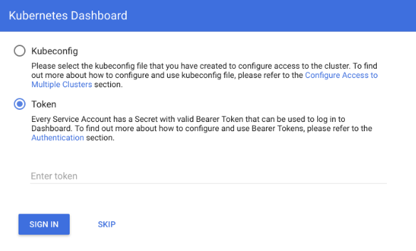

## Описание

Kubernetes Dashboard — это универсальный веб-интерфейс для кластеров Kubernetes. Он позволяет пользователям управлять приложениями, работающими в кластере, и устранять их неполадки, а также управлять самим кластером.

## Подключение

Прежде всего вам необходимо получить Secret для доступа к кластеру. Это можно сделать двумя способами: через графический интерфейс VK CS и с помощью kubectl.

1.  С помощью интерфейса VK CS перейдите к кластеру, в меню выберите пункт "Получить Secret для входа в Kubernetes dashboard". В качестве альтернативы с помощью kubectl. Необходимо выполнить команду и скопировать ее вывод:

```
kubectl get secret $(kubectl get sa dashboard-sa -o jsonpath='{.secrets[0].name}') -o jsonpath='{.data.token}' | base64 --decode
```

2.  Запустить kubectl proxy:

```
kubectl proxy
```

3.  Открыть браузер и перейти по ссылке:

```
[http://localhost:8001/api/v1/namespaces/kube-system/services/https:kubernetes-dashboard:/proxy/](http://localhost:8001/api/v1/namespaces/kube-system/services/https:kubernetes-dashboard:/proxy/)
```

4.  В открывшемся окне нужно выбрать опцию «Token».
5.  Вставить токен, полученный от предыдущей команды, и нажать «Sign In».

    

6.  Откроется окно Kubernetes Dashboard с правами суперадмина.
