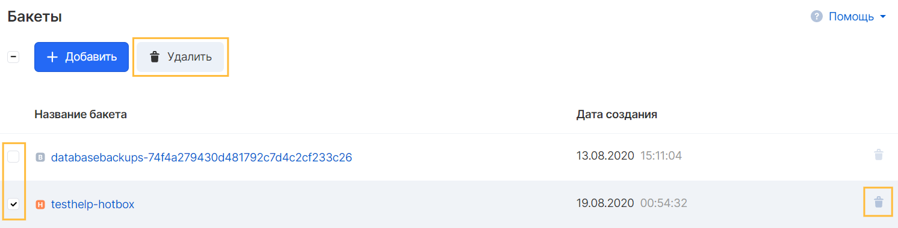

Бакеты – это контейнеры для объектов. В проекте может быть один или несколько бакетов. Доступом к каждому бакету можно управлять: указывать, какие проекты могут создавать и удалять объекты в бакете, а также отображать список объектов. Также на бакете можно настраивать политики управления объектами, например их жизненный цикл.

## Имя бакета

Название бакета используется для доступа к данным и его будут видеть другие пользователи при предоставлении доступа.

Названия бакетов должны быть уникальны для всех проектов сервиса "Объектное хранилие", т.е. нельзя создать два бакета с одинаковыми именами даже в разных проектах.

Имя бакета должно соответствовать условиям:

- Содержать от 4 до 63 символов
- Не содержать символы верхнего регистра (заглавные)
- Начинаться с символа в нижнем регистре (строчные) или цифры

Не рекомендуется в имени:

- Формат схожий с IP адресом (т.е. 192.168.5.4)
- Использование символа подчеркивание (\_), т.к. оно не является DNS-совместимым и такой бакет невозможно привязать к DNS имени
- Начинать с символов xn--

Рекомендуется избегать использования персональной информации, такой как номер проекта или аккаунт пользователя в названии бакета.

## Особенности использования

- Бакет нельзя переименовать
- Бакеты не могут быть вложенными
- Удалить бакет можно только при отсутствии в нем объектов
- Удалить бакет с типом "Backup" самостоятельно невозможно, этим типом хранилища управляет сервис резервного копирования инстансов

## Создание бакета

Для создания бакета в панели VK CS следует:

1.  Перейти на вкладку "Бакеты" сервиса Объектное хранилище в панели VK CS.
2.  Нажать кнопку "Добавить":
3.  Выбрать тип создаваемого бакета и ввести DNS-совместимое название:

## Удаление бакета

Удаление бакета после его очистки возможно в общем списке бакетов сервиса "Объектное хранилище". Для удаления одного бакета можно воспользоваться кнопкой удаления напортив бакета, а для удаления нескольких элементов можно выбрать с помощью чекбокса слева от бакетов:

**Внимание**

Бакет с классом хранения Backup недоступен к удалению. Удалить содержащиеся в нем объекты можно через сервис резервного копирования. Удаление резервных копий может происходить с задержкой, поэтому при наличии в нем объектов резервного копирования, следует дождаться выполнения операции удаления бэкапа.

После удаления резервных копий бакет Backup может остаться пустым. Он необходим объектному хранилищу для дальнейшей работы с планами резервного копирования в проекте.

## Управление доступом к бакету

На данный момент в Объектом хранилище реализована политика ACL, которая позволяет выдавать доступ другим проектам. Под проектом имеется ввиду именно проект сервиса VK CS, у которого включён сервис "Объектное хранилище".

Права можно выдать на

- чтение ( листинг объектов, но не чтение самих объектов )
- модификацию ( заливка объектов )
- чтение прав доступа ( получение информации о заданных правах доступа на бакет )
- модификацию прав доступа
- полный доступ ( включает все вышеперечисленные права )
