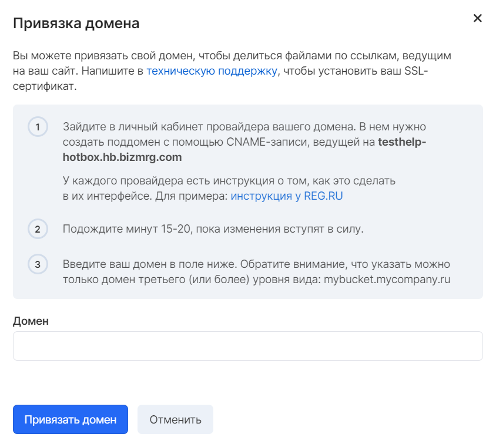

Сервис "Объектного хранилища" позволяет использовать ресурсы для хостинга статических сайтов, построенных на технологиях HTML, CSS и JavaScript. Хранилище также можно использовать для перенаправления запросов.

**Внимание**

Бакет, используемый для хостинга, невозможно использовать для размещения скриптов, требующих запуска на стороне веб-сервера.

## Привязка домена

Для предоставления доступа к объектам бакета по ссылкам, ведущим на уникальный сайт, можно привязать свой домен на вкладке "Привязать домен".

Предварительно потребуется:

1.  Зарегистрировать домен у любого хостинг-провайдера
2.  Создать поддомен, который будет использован для созданного бакета
3.  Выполнить привязку поддомена в панели VK CS



После привязки бакет будет доступен по ссылке вида:

```
http://<имя_бакета>.<адрес_вебсайта>.<доменная_зона>
```

**Примечание**

При создании бакета с символом точки (.) в имени он будет доступен только при использовании протокола HTTP. При необходимости использования HTTPS протокола следует установить SSL-сертификат.

## Установка SSL-сертификата

Для установки персонального SSL-сертификата следует [обратиться в техническую поддержку](mailto:support@mcs.mail.ru), указав данные проекта, бакета и предоставив SSL-сертификат для установки.

После установки сертификата бакет будет доступен по ссылке вида:

```
https://<имя_бакета>.<адрес_вебсайта>.<доменная_зона>
```
