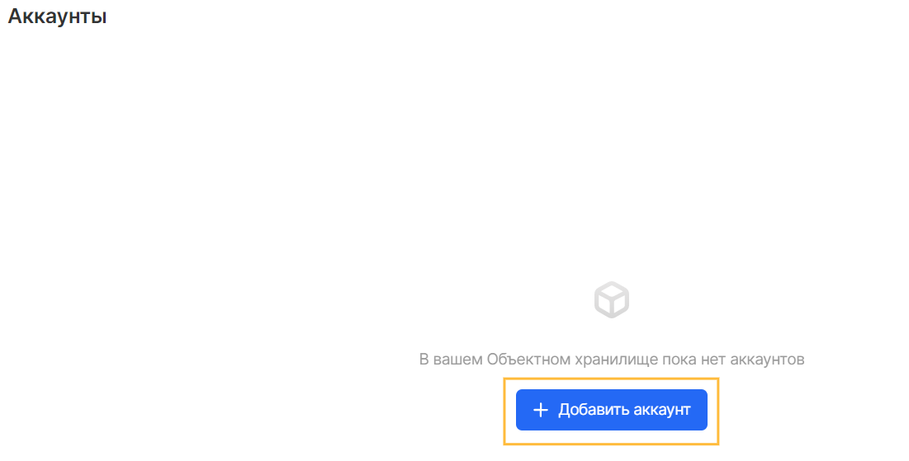
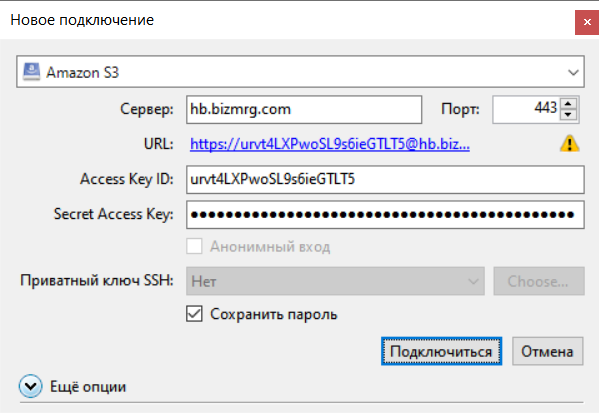
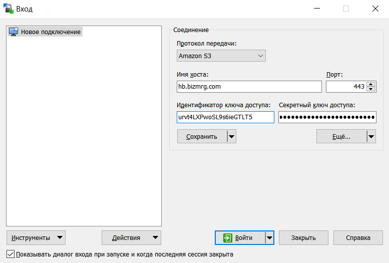
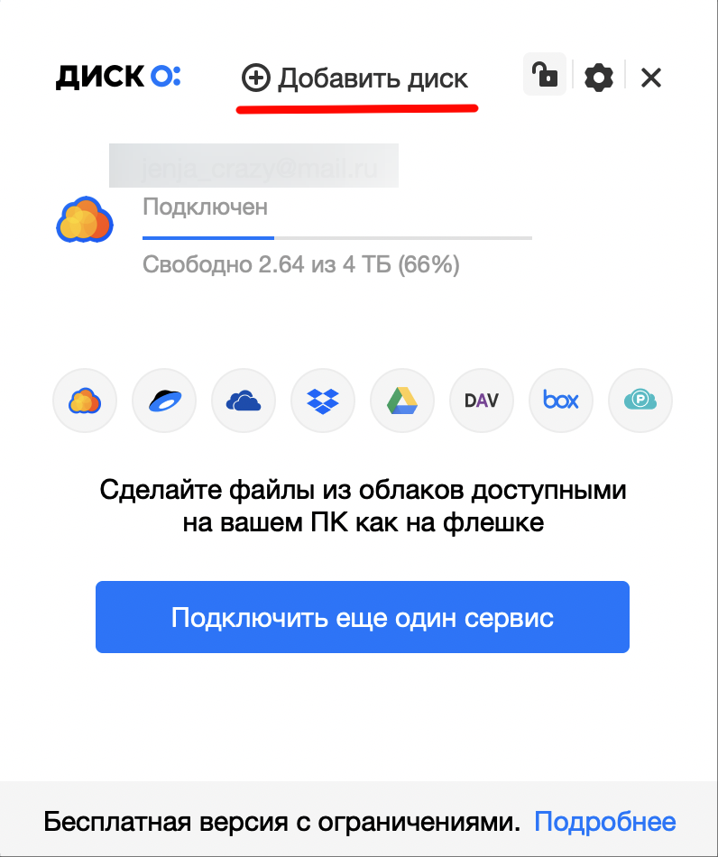
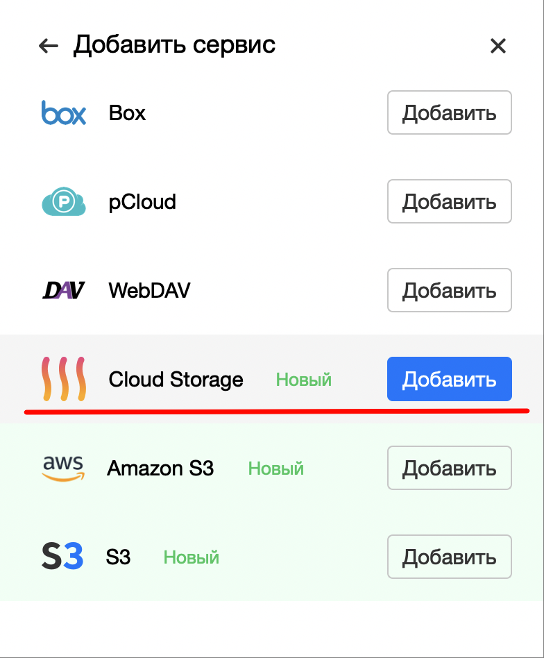
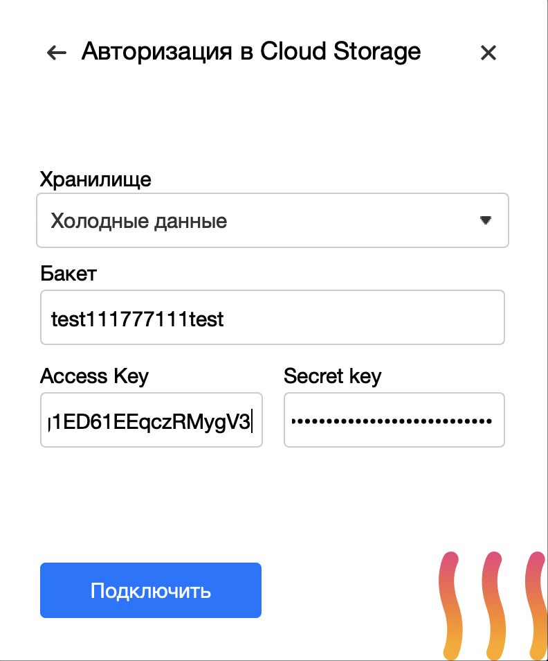

Графические инструменты, такие как файловые менеджеры, позволяют просмотреть объекты в бакете, имитируя иерархическую структуру каталогов.

## Перед началом работы

Прежде чем начинать работу с файловыми менеджерами, необходимо создать авторизованный аккаунт или убедиться в его наличии, а также доступности данных об идентификаторе ключа и секретном ключе.

Создать аккаунт можно в меню "Аккаунты" сервиса "Объектное хранилище" с помощью кнопки "Добавить аккаунт":



При создании аккаунта будут предоставлены данные, которые требуется сохранить. После закрытия окна восстановить Secret Key будет невозможно, однако при его утере можно создать новый аккаунт или добавить новый секретный ключ к существующему аккаунту:


## CyberDuck

Cyberduck - это бесплатный браузер облачного хранилища для Mac и Windows с поддержкой Объектного хранилища S3, а также многих других облачных платформ.

Установка производится с помощью [дистрибутива продукта](https://cyberduck.io/download) с официального сайта, а также классического пользовательского интерфейса операционной системы.

**Подключение**

Для подключения следует указать:

- Тип подключения: Amazon S3
- Сервер и порт: hb.bizmrg.com:443
- Access Key ID: индентификатор ключа, полученный при создании аккаунта Объектного хранилища
- Secret access key: секретный ключ, полученный при создании аккаунта Объектного хранилища



**Примечание**

CyberDuck работает с Объектным хранилищем VK CS как с иерархической файловой системой. Это значит что ключи объектов, загруженных через CyberDuck, будут иметь вид пути к файлу, например: prefix/subprefix/image.png.

## WinSCP

WinSCP - это графический клиент SFTP (SSH File Transfer Protocol) для Windows с открытым исходным кодом. Он также поддерживает протокол SCP (Secure Copy Protocol). Предназначен для защищённого копирования файлов между компьютером и серверами, поддерживающими эти протоколы.

Для настройки следует ввести следующие данные:

- Протолок передачи: Amazon S3
- Имя хоста: hb.bizmrg.com
- Порт: 443
- Идентификатор ключа доступа: индентификатор ключа, полученный при создании аккаунта Объектного хранилища
- Секретный ключ доступа: секретный ключ, полученный при создании аккаунта Объектного хранилища



**Примечание**

CyberDuck работает с Объектным хранилищем VK CS как с иерархической файловой системой. Это значит что ключи объектов, загруженных через CyberDuck, будут иметь вид пути к файлу, например: prefix/subprefix/image.png.

## S3FS

s3fs позволяет Linux и macOS монтировать бакет S3 через FUSE. s3fs сохраняет собственный объектный формат для файлов, позволяя использовать другие инструменты, такие как AWS CLI.

**Установка**

Многие системы предоставляют готовые пакеты:

Amazon Linux через EPEL:

```
sudo amazon-linux-extras install epel
sudo yum install s3fs-fuse
```

Arch Linux:

```
sudo pacman -S s3fs-fuse
```

Debian 9 и Ubuntu 16.04 или новее:

```
sudo apt install s3fs
```

Fedora 27 или новее:

```
sudo dnf install s3fs-fuse
```

Gentoo:

```
sudo emerge net-fs/s3fs
```

RHEL и CentOS 7 или новее через EPEL:

```
sudo yum install epel-release
sudo yum install s3fs-fuse
```

SUSE 12 и openSUSE 42.1 или новее:

```
sudo zypper install s3fs
```

macOS через Homebrew :

```
brew cask install osxfuse
brew install s3fs
```

**Подключение**

Для монтирования бакета в операционную систему следует:

1.  Сохранить идентификатор ключа и секретный ключ в файле ~/.passwd-s3fs в формате <идентификатор*ключа>:<секретный*ключ>, а также ограничьте доступ к файлу ~/.passwd-s3fs:

    ```
    echo <идентификатор_ключа>:<секретный_ключ> >  ~/.passwd-s3fs
    chmod 600  ~/.passwd-s3fs
    ```

2.  Выбрать каталог, в который будет монтироваться бакет и убедиться в наличии прав для операции монтирования.
3.  Выполнить команду вида:

    ```
    s3fs <имя_бакета> /mount/<путь_к_папке> -o passwd_file=~/.passwd-s3fs -o url=http://hb.bizmrg.com -o use_path_request_style
    ```

## Диск-О:

Диск-О: - программа, которая позволяет работать с облаками в одном месте - на компьютере. При этом файлы не занимают места на устройстве, потому что хранятся только на облаках. Программа работает с Объектным хранилищем VK CS, а также с платформами, такими как: Облако Mail.ru, Яндекс.Диск, Google Drive, Dropbox и другими хранилищами.

Установку программы следует произвести используя стандартный пользовательский интерфейс операционной системы, а также установочный файл с [официального сайта](https://disk-o.cloud/ru/).

**Подключение**

Для подключения следует добавить сервис Cloud Storage, затем ввести данные аккаунта и бакета:



Где:

- Хранилище: предустановленный класс хранения сервиса Объектное хранилище - Холодные данные или Горячие данные
- Бакет: название имеющегося бакета
- Access Key: индентификатор ключа, полученный при создании аккаунта Объектного хранилища
- Secret Key: секретный ключ, полученный при создании аккаунта Объектного хранилища

В результате бакет будет подключен как дополнительный диск в операционной системе и не будет использовать локальное пространство.

**Внимание**

В бесплатной версии программы Диск-О: доступен только один сервис. При подключении дополнительных дисков необходимо приобрести платную версию.
