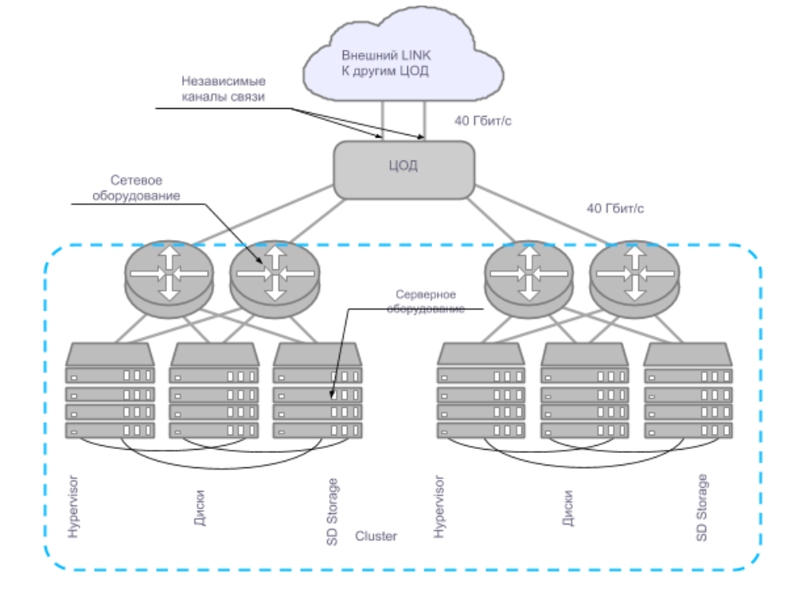

## Описание

Big Data или Большие данные - серия подходов, инструментов и методов обработки структурированных и неструктурированных данных огромных объемов и значительного многообразия для получения результатов, воспринимаемых человеком и эффективных в условиях непрерывного прироста, распределения по многочисленным узлам вычислительной сети.

Основные принципы работы с большими данными звучат следующим образом:

- **горизонтальная масштабируемость** - возможность расширения системы обработки больших данных при их кратном увеличении.
- **отказоустойчивость** - при увеличении количества машин в кластере возрастает вероятность выхода из строя их части. По этой причине методы работы с большими данными должны учитывать подобный сценарий и и переживать его без критических последствий.

На базе инфраструктуры сервиса VK Cloud Solutions создаются кластеры Hadoop и Spark. Кластеры Hadoop любых конфигураций предполагают наличие одного головного узла (head) и минимум одного рабочего узла (worker). Масштабирование кластера осуществляется при помощи увеличения количества рабочих узлов.

При создании кластера в облаке VK CS выделяются следующие ресурсы:

- одна виртуальная машина для головного узла;
- n виртуальных машин для рабочих узлов, где n - число узлов;
- n+1 дисков в кластере Ceph для каждого узла;
- две группы безопасности - одна для головного узла и одна для рабочих узлов;
- один плавающий IP-адрес для головного узла.

Все машины во внутренней сети облака VK CS связаны друг с другом сетью 10 Gbps в режиме высокой доступности: даже если выйдет из строя один из сетевых адаптеров физического сервера или один из внутренних маршрутизаторов, то сервер останется в сети. При этом внешнее соединение с сетью Интернет доступно на скорости до 1 Gbps.

Все виртуальные машины кластера объединяются в общую сеть на базе технологии VXLAN. На каждом узле настроен внутренний (приватный) IP-адрес, который используется для взаимодействия узлов кластера. При этом по умолчанию после запуска кластера разрешен полный доступ между узлами кластера в рамках внутренней сети. Головной узел также имеет плавающий IP-адрес, который может использоваться для доступа к веб-интерфейсу Ambari и подключения к машине по SSH. При необходимости SSH доступ к рабочим узлам осуществляется через головной узел.

## Шаблоны и компоновка кластеров

Для удобства развертывания и использования в рамках сервиса Hadoop VK CS предоставляются следующие предварительно настроенные шаблоны:

**Airflow** \- это набор библиотек для запуска и мониторинга задач, написанных на Python. Задачи должны иметь структуру направленного ацикличного графа. Airflow на кластере будет уже настроен на запуск задач на рабочих узлах, необходимо только самостоятельно разложить код задач по узлам. Стоит также отметить, что Airflow - как компонент - можно также установить на кластерах Hadoop и Spark.

**Airflow-HDP-v31** - В этом шаблоне установлен только компонент Airflow.

**Hadoop** \- Компоновка для решения широкого спектра задач по обработке больших данных при помощи технологии MapReduce. Шаблон ориентирован на пакетную (batch) обработку данных, когда допустимое время ожидания результата составляет 10 и более минут.

**Hadoop-HDP-v31** \- Минимальная компоновка компонентов для получения кластера Hadoop. Такой кластер может использоваться как HDFS хранилище и также для запуска MapReduce задач. Включены компоненты HDFS, Hive, YARN, MapReduce, ZooKeeper.

**Spark** \- Компоновка для параллельной обработки больших данных в памяти. Шаблон ориентирован на быструю обработку данных в приближенном к реальному времени режиме.

**Spark-HDP-v31** - Расширенная компоновка компонентов, дополнительно к Hadoop доступны Spark, Livy2, HBase, Oozie, Sqoop, Jupyter. Spark является инструментом обработки и хранения данных из условного второго поколения экосистемы Hadoop. Развитое community и огромное количество расширений и возможностей сделали Spark одним из самых популярных инструментов Big Data.

Также есть шаблон кластера **DataFlow-HDF-v34**, основанный на Hortonworks Data Flow. Этот кластер выполняет две большие задачи: управление потоками данных и потоковый процессинг или аналитика. После первичной установки управление осуществляется также через консоль Ambari.
