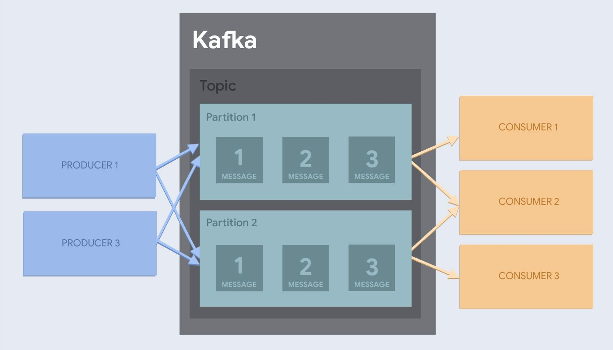

## Описание

В качестве шины данных в VK Cloud Big Data используется Apache Kafka.

На сегодняшний день Apache Kafka - это распределенная потоковая платформа. В данном случае предоставляется шина с колоссальной пропускной способностью, на которой можно в реальном времени обрабатывать абсолютно все проходящие через нее данные.

## Терминология

Для начала нужно разобраться с терминологией Kafka.

**Producers/производитель** - любой источник входящих данных. Это могут быть сервера, выводящие журналы, устройства IOT, скрипт, преобразующие данные.

**Topics/темы** - когда производители загружают данные, то они относятся к одной из доступных "тем", что является способом группировки связанных данных для обработки. Сами темы представляют собой журналы постоянно растущих каналов данных, где данные хранятся в простом формате "ключ-значение". Данные, поступающие от производителей, доставляют сообщения в конец журнала.

**Messages/сообщения** - это пара данных "ключ-значение".

Consumers/потребители - потребители воспринимают данные, предоставленные производителями. Потребители - это конечный пункт назначения, где хранятся данные, например, база данных.

**Partitions/разделы** - темы можно разбивать на разделы. Таким образом тему можно разделить на несколько компьютеров, что делает Kafka крайне масштабируемым.

Допустим, существует кластер подключенных машин, который может:

- принимать данные от нескольких производителей (producers).
- хранить полученные данные.
- разрешать потребителям читать сохраненные данные. Как правило, потребители читают одно сообщение за раз.
- порядковое чтение данных. Скажем, сообщение m1 получено кластером в момент времени t1; а сообщение m2 в момент времени T1+5. Потребитель прочитает сообщение m1 перед m2.
- обеспечивает однократную доставку данных. Это значит, что сообщение отправленное в кластер будет получено потребителем гарантированно хотя бы раз.

## Масштабирование

Как и большинство составляющих в экосистеме Hadoop, кластер Kafka способен масштабироваться на бесконечное число узлов.

Масштабирование до нескольких узлов работает в Kafka путем разделения тем на несколько разделов. Например, когда тема разделена на 2 раздела, это значит, что рабочая нагрузка одной темы разделена на 2 узла в кластере. Таким образом, появляется возможность не только выделять узел под тему; но и разделять тему на несколько узлов.

