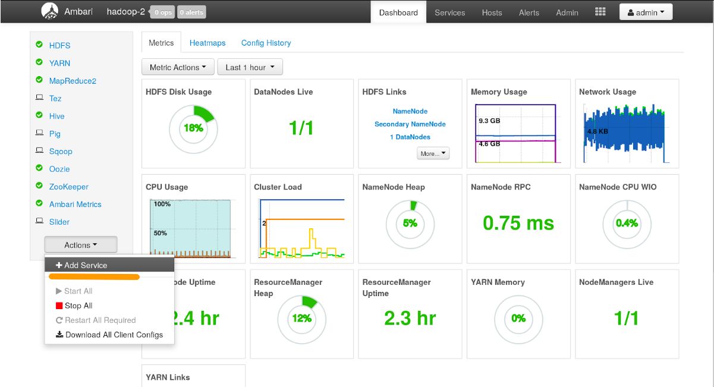
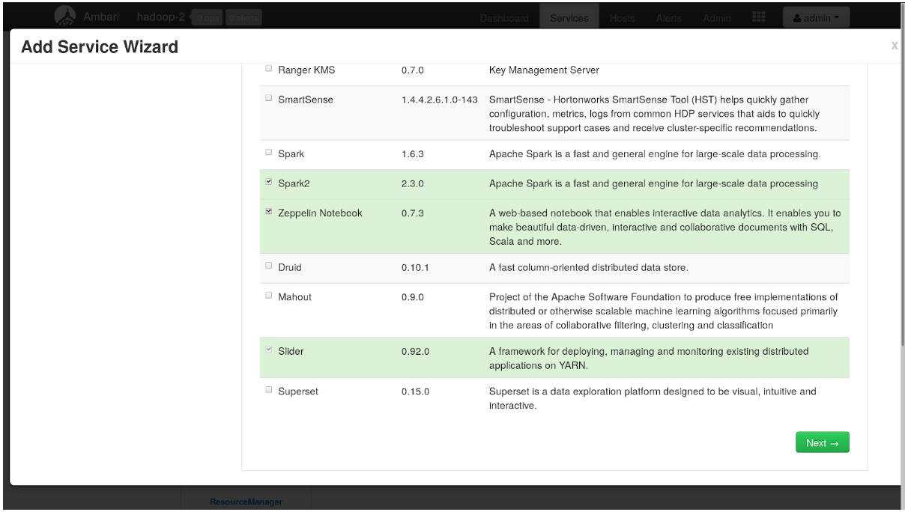
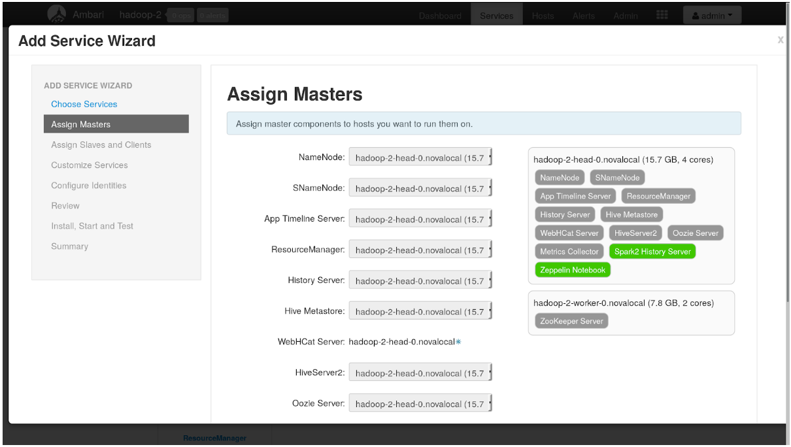
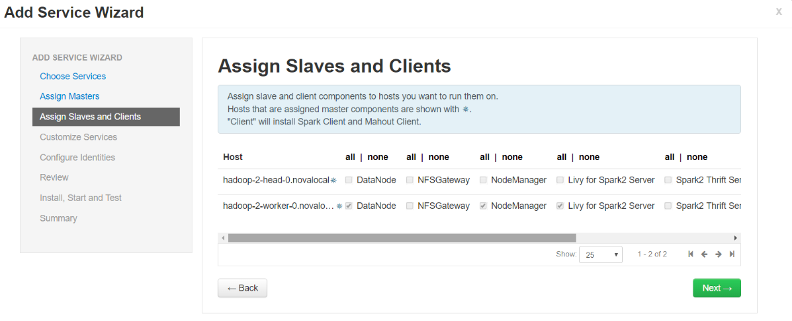
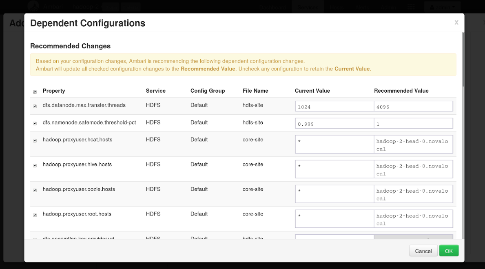
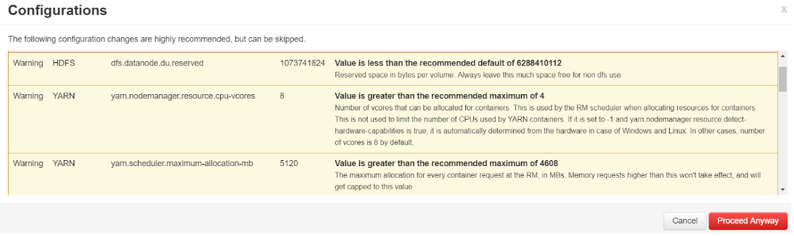
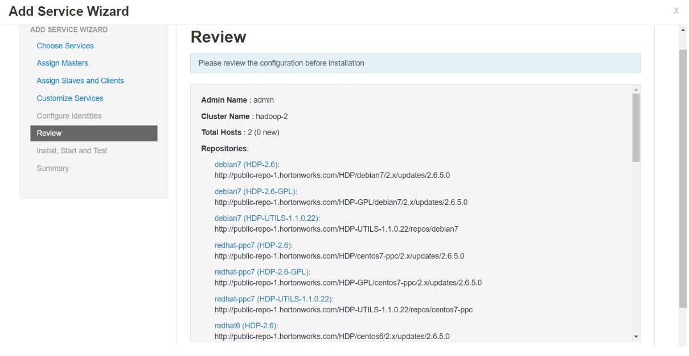
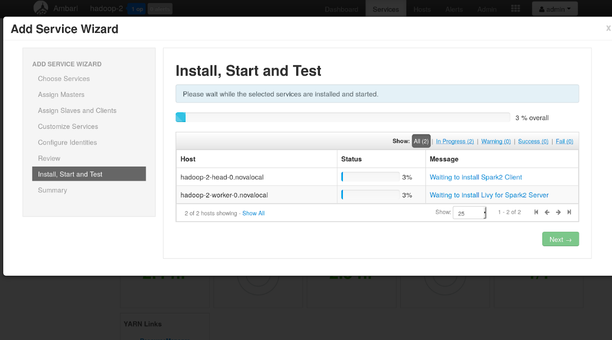
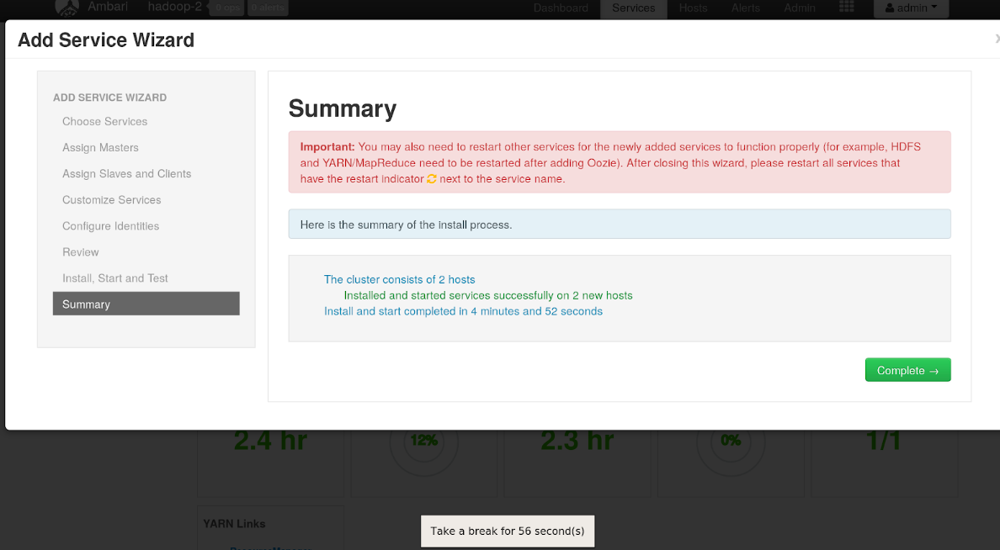
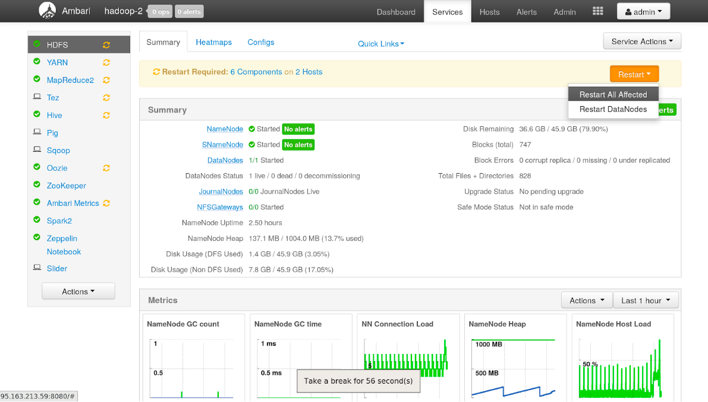

Существующие кластеры Hadoop и Spark в VK Cloud могут быть расширены новыми компонентами. В данном разделе вы узнаете, как установить новые компоненты и сервисы экосистемы Hadoop в существующие кластеры.Рассмотрим пример с добавлением Spark2 в существующий кластер Hadoop.

- Зайдите в интерфейс [Ambari](https://ambari.apache.org/). На вкладке «Dashboard»в нижнем левом углу панели сервисов кликните «Action»→ «Add Service».

  

- Выберите сервисы, которые вы хотите установить. Например,Spark2иZeppelin Notebook. Кликните «Next»внизу страницы.

  

- В открывшемся окне выберите рабочие и головные узлы для установки основных компонентов сервисов и кликните «Next»внизу страницы.

  

- ### Важно

  При установке некоторых сервисов может быть необходимо задать авторизационные данные.

- В открывшемся окне выберите рабочие и головные узлы для установки вспомогательных и клиентских компонентов сервисов.При необходимости измените рекомендуемые настройки в окнеCustomize Servicesи кликните «Next»внизу страницы.

  

- В окне «Dependent Configurations»просмотрите список зависимых изменений, которые рекомендуется внести в настройки сервисов во избежание возможных конфликтов. При необходимости снимите выделение с тех параметров, значение которых необходимо оставить неизменным. По умолчанию все выделенные параметры примут значения, указанные в столбце «Recommended Value».

  Установив требуемые значения, кликните «OK».

  

- В появившемся окне «Configurations»кликните «Proceed Anyway».

  

- В окне «Review»внимательно изучите краткую сводку по выбранной конфигурации и кликните «Deploy»внизу страницы, чтобы начать установку указанных сервисов.

  

- Начнется установка новых компонентов. По завершении процесса кликните «Next».

  

- В окне «Summary»появится краткое описание результатов установки. Кликните «Complete», чтобы завершить процесс.

  

- Для применения изменений может потребоваться перезапуск существующих сервисов. В интерфейсе Ambari перейдите на вкладку «Services» и кликните «Restart» → «Restart All Affected», чтобы перезапустить все зависимые сервисы. После перезапуска новые сервисы начнут работать в штатном режиме и будут доступны в интерфейсе Ambari в меню слева.

  
