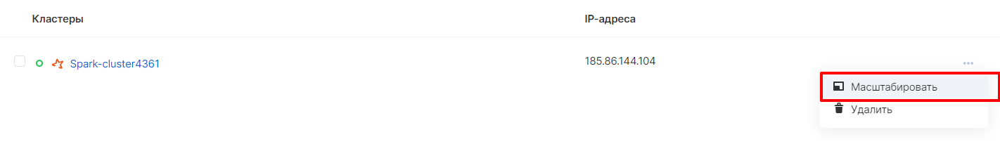
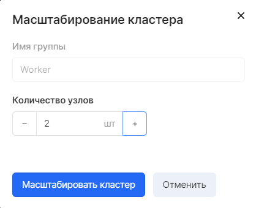
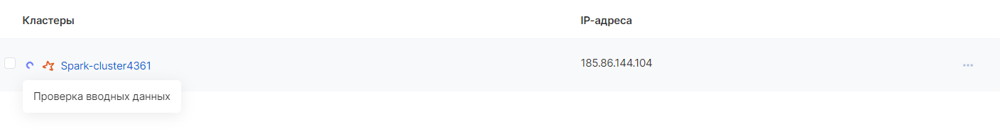
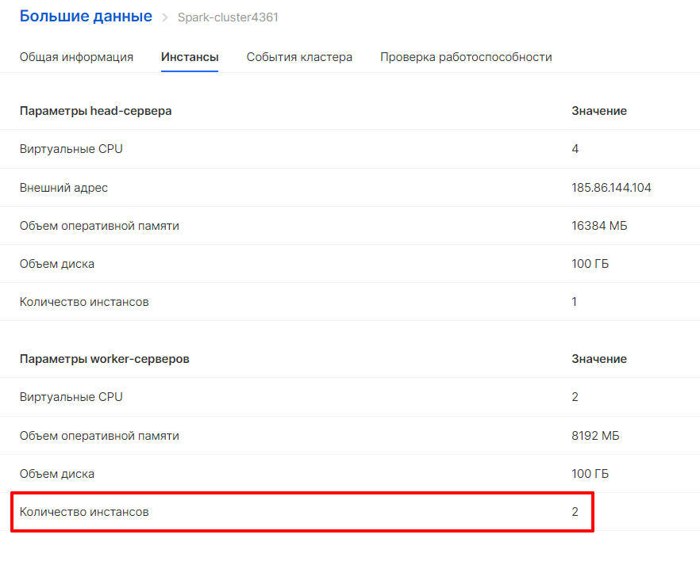

## Масштабирование кластера

Масштабирование кластера осуществляется в панели управления VK CS.

В разделе "Большие данные" - "Кластеры" в строке меню выбранного кластера необходимо выбрать опцию "Масштабировать":

Далее, в открывшемся окне появляется возможность увеличения/уменьшения количества Worker-узлов:

Процесс масштабирования кластера Больших данных занимает некоторое время, в течение которого кластер будет отображаться с информационным сообщением описывающим происходящее действие прямо сейчас:

В результате в разделе кластеров Big Data, во вкладке "Инстансы" будет изменено количество worker-серверов:

Кроме увеличения количества worker-узлов, в личном кабинете также можно произвести их уменьшение.

Процедура уменьшения выполняется по аналогии с увеличением. В открывшемся окне изменения количества узлов необходимо проставить подходящее значение. В течение 5-10 минут кластер будет уменьшен.
