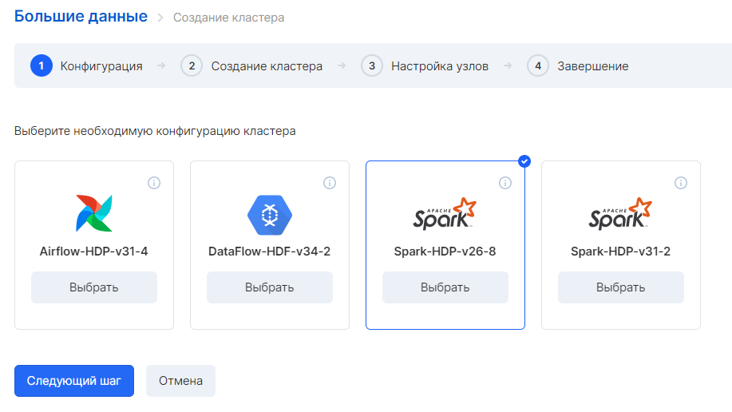
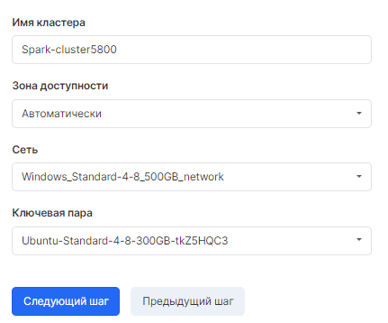
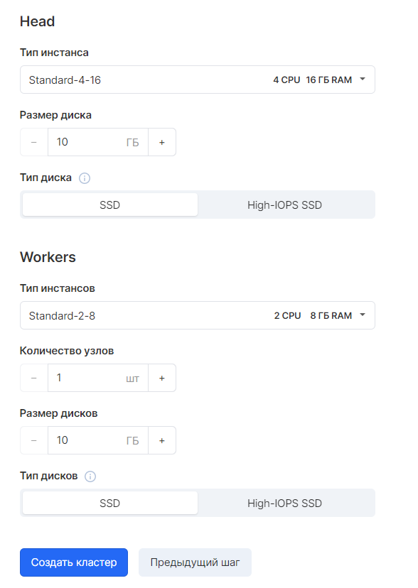
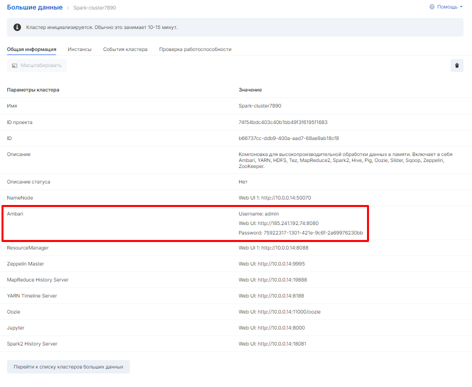
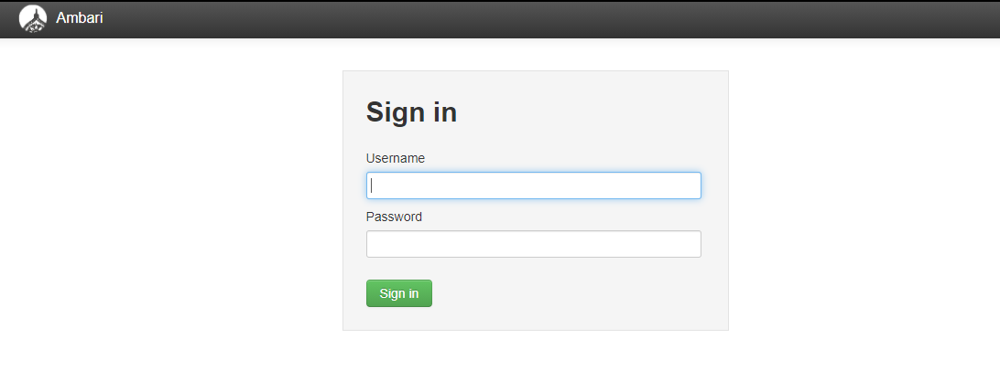
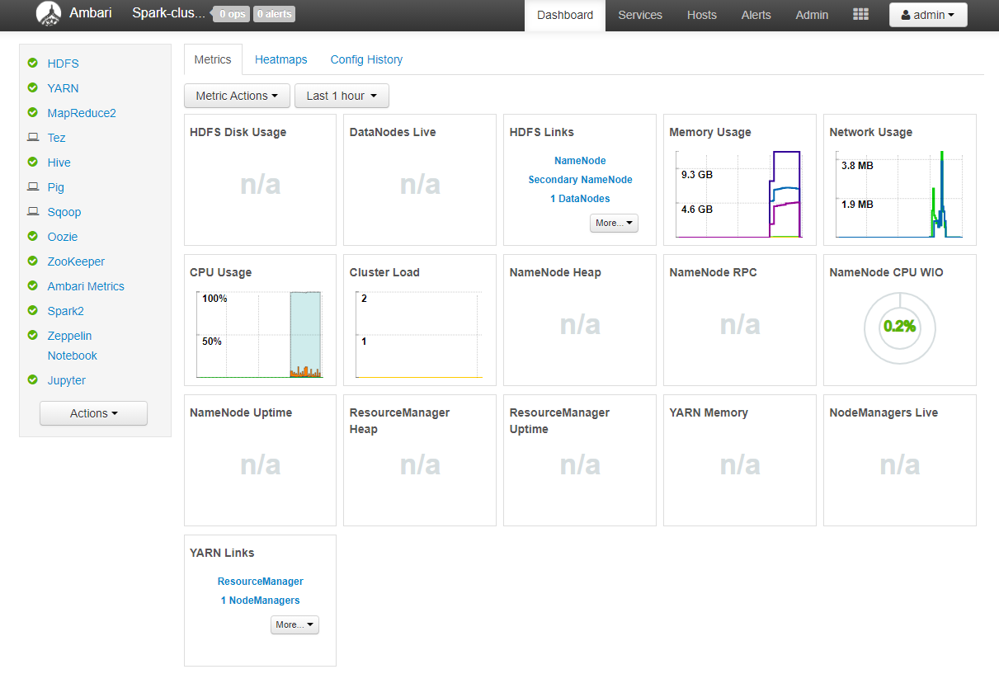
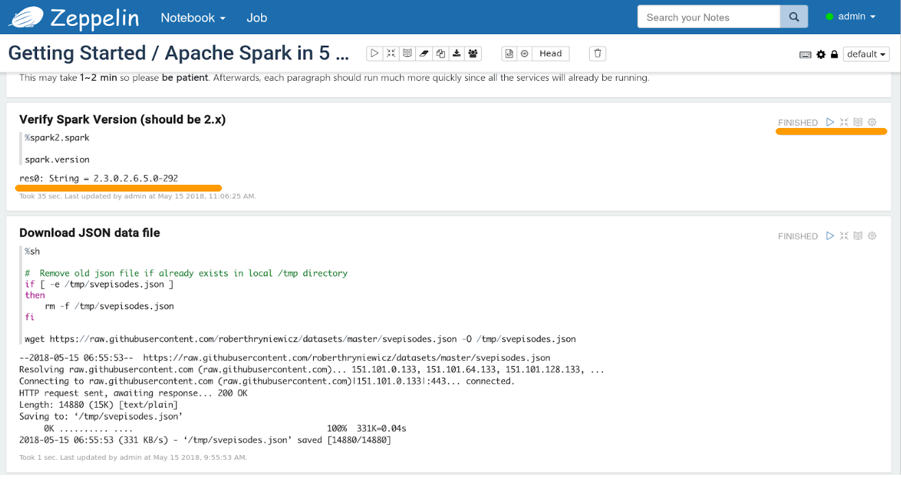

Apache Spark это Big Data фреймворк с открытым исходным кодом для распределённой пакетной и потоковой обработки неструктурированных и слабоструктурированных данных, входящий в экосистему проектов Hadoop.

## Работа со Spark в интерфейсе Ambari

Для создания кластера Spark необходимо следовать инструкции, задавая требуемые параметры.

Шаг 1.



Шаг 2.



Шаг 3.



После создания в кластере во вкладке "Общая информация" будет опубликована ссылка, логин и пароль на интерфейс Ambari для управления кластером:



Чтобы зайти в интерфейс Ambari нужно в поисковой строке браузера ввести Web UI, в открывшемся окне ввести логин и пароль:



После откроется интерфейс Ambari для управления кластером Spark и его компонентами:



## Работа со Spark в Zeppelin

Apache Zeppelin - это многоцелевой блокнот (web-notebook), который позволяет обрабатывать, анализировать и визуализировать данные на платформе Hadoop. Кластеры Spark в VK Cloud включают в себя блокноты Zeppelin, которые можно использовать для выполнения задач Spark.

Для доступа к веб-интерфейсу Zeppelin существует несколько способов, описанных ниже.

Большинство сервисов экосистемы Hadoop не имеет авторизации, поэтому по умолчанию доступ к ним разрешен исключительно из внутренней сети. По умолчанию после старта кластера группы безопасности настроены следующим образом:

<table><tbody><tr><td><span>Исходящий трафик</span></td><td><span><span>Без ограничений</span></span></td></tr><tr><td><span>Входящий и исходящий трафик между узлами кластера в рамках внутренней сети</span></td><td>Без ограничений</td></tr><tr><td><span>Входящий трафик на TCP-порт 8080 головного узла</span></td><td><span><span>Без ограничений, используется для доступа в интерфейс Ambari (авторизация по логину и паролю).</span></span></td></tr><tr><td><span>Входящий трафик на TCP-порт 22 головного узла</span></td><td><span><span>Без ограничений, используется для доступа по SSH (авторизация по SSH-ключу).</span></span></td></tr><tr><td><span>Входящий ICMP-трафик на головной узел</span></td><td><span><span>Без ограничений</span></span></td></tr><tr><td><span>Остальной трафик</span></td><td>Запрещен</td></tr></tbody></table>

Таким образом, конфигурация по умолчанию обеспечивает доступ только к веб-интерфейсу Ambari и SSH-доступ к головному узлу. Доступ к внутренним веб-интерфейсам и API-сервисам возможен только из внутренней сети, изолированной от публичной сети Интернет. Для обеспечения доступа возможны следующие варианты:

- Настройка VPN-доступа к ресурсам VK Cloud из сети организации.
- Использование главного узла в качестве прокси-сервера.
- Открытие доступа к определенным диапазонам IP-адресов через группы безопасности.

## Организация VPN-доступа

Для предоставления доступа ко всем ресурсам кластера Hadoop рекомендовано именно создание VPN-подключения от сети организации к сети VK Cloud. При этом ресурсы VK Cloud будут доступны, как если бы они находились в рамках внутренней сети организации.

Для использования VPN с кластером Hadoop необходимо сделать следующее:

1.  Создать в рамках проекта новую внутреннюю сеть и маршрутизатор.
2.  Запустить кластер Hadoop, используя созданную сеть в качестве внутренней сети кластера.
3.  Настроить VPN-подключение к сервисам VK Cloud.

## Использование головного узла как proxy

В качестве альтернативного варианта можно использовать SSH-туннель до главного узла. Для организации SSH-туннеля требуется машина с OpenSSH-клиентом любой версии. SSH-клиент запускается с опцией -D, которая запускает прокси-сервер SOCKS5, используя SSH-туннель до удалённого сервера:

```
ssh -D 3128 -C -q -N -f centos@<хост>
```

- опция -D 3128 говорит о том, что следует запустить прокси-сервер SOCKS5;
- опция -C запрашивает компрессию данных;
- опция -q минимизирует вывод статусных сообщений в консоль;
- опция -N говорит о том, что при подключении не следует запускать никакие команды и использовать SSH-соединение исключительно для туннеля;
- опция -f отправляет SSH-клиент в фон (background).

При необходимости SSH-SOCKS5-туннель может быть автоматически создан при загрузке системы. Для этого следует создать .service-файл для systemd.

```
/etc/systemd/system/mcs-proxy.service:

[Unit]
Description=Setup SOCKS Proxy
After=network.target

[Service]
Type=simple
ExecStart=/usr/bin/ssh -D 8123 -C -q -N centos@ХОСТ -i /home/user/.ssh/id_rsa

[Install]
WantedBy=multi-user.target
```

После создания файла перезагрузите конфигурацию systemd и запустите сервис:

```
systemctl daemon-reload
systemctl start mcs-proxy
```

**Примечание**

Для работы SSH-туннеля необходимо наличие SSH-ключа без passphrase либо добавление ключа с passphrase в SSH-агент

После запуска SSH-SOCKS5-прокси можно будет использовать адрес 127.0.0.1:3128 в качестве SOCKS5-прокси в браузере или других утилитах.

Более подробную информацию по включению SOCKS5-прокси в браузере можно найти в документации Firefox и Chrome. Подробная информация о процедуре и параметрах настройки самого туннеля содержится в документации SSH-клиента.

## Настройка групп безопасности

Доступ к сервисам также можно обеспечить через изменение настроек групп безопасности. Для этого в раздел "Виртуальные сети" - "Настройки Firewall" интерфейса VK Cloud необходимо выбрать соответствующую группу безопасности, содержащую в названии имя кластера и тип узла (head или worker).

Например, если кластер называется test1, то группа безопасности для главного узла будет иметь в названии строку test1-hadoop-head, а группа безопасности для рабочего узла — test1-hadoop-worker. Данные группы создаются автоматически для каждого нового кластера.

Итак, для организации доступа в Zeppelin необходимо использовать следующие данные:

- Логин: admin
- Пароль: admin

Используйте панель управления в правом верхнем углу ячейки для выполнения кода внутри данной ячейки. Результат выводится сразу под исполняемым кодом:



## Работа со Spark в консоли

Кластеры Spark VK Cloud включают в себя консольные утилиты для работы со Spark.

Подключение к главному узлу кластера осуществляется по SSH. Далее следует запуск одной из доступных утилит в зависимости от используемого языка.

Для подключения к Spark2 необходимо установить переменную окружения SPARK_MAJOR_VERSION=2.

1\. Для выполнения задач на Scala производится запуск spark-shell:

```
SPARK_MAJOR_VERSION=2 spark-shell
SPARK_MAJOR_VERSION is set to 2, using Spark2
Setting default log level to "WARN".
To adjust logging level use sc.setLogLevel(newLevel). For SparkR, use setLogLevel(newLevel).
Spark context Web UI available at http://spark-1-spark-head-0.novalocal:4041
Spark context available as 'sc' (master = local[\*], app id = local-1526372942530).
Spark session available as 'spark'.
Welcome to
    ____              __
   / __/__  ___ _____/ /__
  _\ \/ _ \/ _ \`/ __/  '_/
 /___/ .__/_,_/_/ /_/_\   version 2.3.0.2.6.5.0-292
    /_/

Using Scala version 2.11.8 (OpenJDK 64-Bit Server VM, Java 1.8.0_161)
Type in expressions to have them evaluated.
Type :help for more information.
```

2\. Для выполнения задач на Python производится запуск pyspark:

```
SPARK_MAJOR_VERSION=2 pyspark
SPARK_MAJOR_VERSION is set to 2, using Spark2
Python 2.7.5 (default, Aug  4 2017, 00:39:18)
[GCC 4.8.5 20150623 (Red Hat 4.8.5-16)] on linux2
Type "help", "copyright", "credits" or "license" for more information.
Setting default log level to "WARN".
To adjust logging level use sc.setLogLevel(newLevel). For SparkR, use setLogLevel(newLevel).
18/05/15 08:31:25 WARN Utils: Service 'SparkUI' could not bind on port 4040. Attempting port 4041.

 Welcome to
    ____              __
   / __/__  ___ _____/ /__
  _\ \/ _ \/ _ \`/ __/  '_/
 /___/ .__/_,_/_/ /_/_\   version 2.3.0.2.6.5.0-292
    /_/

Using Python version 2.7.5 (default, Aug  4 2017 00:39:18)
SparkSession available as 'spark'.
```

3\. Для выполнения задач на R производится установка интерпретатора языка R на главном узле и всех рабочих узлах. Для этого подключается репозиторий EPEL и устанавливается пакет R:

```
yum install epel-release
yum install R
```

Далее производится запуск sparkR:

```
SPARK_MAJOR_VERSION=2 sparkR
SPARK_MAJOR_VERSION is set to 2, using Spark2

R version 3.4.4 (2018-03-15) -- "Someone to Lean On"
Copyright (C) 2018 The R Foundation for Statistical Computing
Platform: x86_64-redhat-linux-gnu (64-bit)

R is free software and comes with ABSOLUTELY NO WARRANTY.
You are welcome to redistribute it under certain conditions.
Type 'license()' or 'licence()' for distribution details.

Natural language support but running in an English locale

R is a collaborative project with many contributors.
Type 'contributors()' for more information and
'citation()' on how to cite R or R packages in publications.

Type 'demo()' for some demos, 'help()' for on-line help, or
'help.start()' for an HTML browser interface to help.
Type 'q()' to quit R.

Launching java with spark-submit command /usr/hdp/current/spark2-client/bin/spark-submit   "sparkr-shell" /tmp/Rtmpu2FF4v/backend_port26c2218284a
Setting default log level to "WARN".
To adjust logging level use sc.setLogLevel(newLevel). For SparkR, use setLogLevel(newLevel).

 Welcome to
    ____              __
   / __/__  ___ _____/ /__
  _\ \/ _ \/ _ \`/ __/  '_/
 /___/ .__/_,_/_/ /_/_\   version 2.3.0.2.6.5.0-292
    /_/

 SparkSession available as 'spark'.
```
