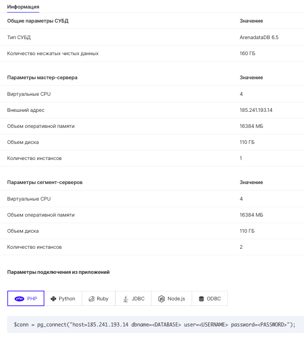

## Подключение к инстансу

Увидеть способы подключения к базе данных можно кликнув по названию инстанса в списке или наведя курсор на значок информации.

В разделе «Параметры подключения» приведены примеры кода из популярных языков.

При использовании примеров следует заменить макросы <DATABASE>,<USERNAME>,<PASSWORD>на актуальные значения:

- <DATABASE> - название базы данных, указанное при создании.
- <USERNAME> - имя пользователя (указывается при создании).
- <PASSWORD> - пароль пользователя (указывается при создании).
- <HOST> - IP-адрес виртуальной машины, на которой расположена база данных. В примере выше это адрес 185.241.193.14, то есть внешний IP.

Дополнительную информацию можно найти в документации по используемому коннектору (коннектор - сущность, с помощью которой выполняется подключение к БД).
