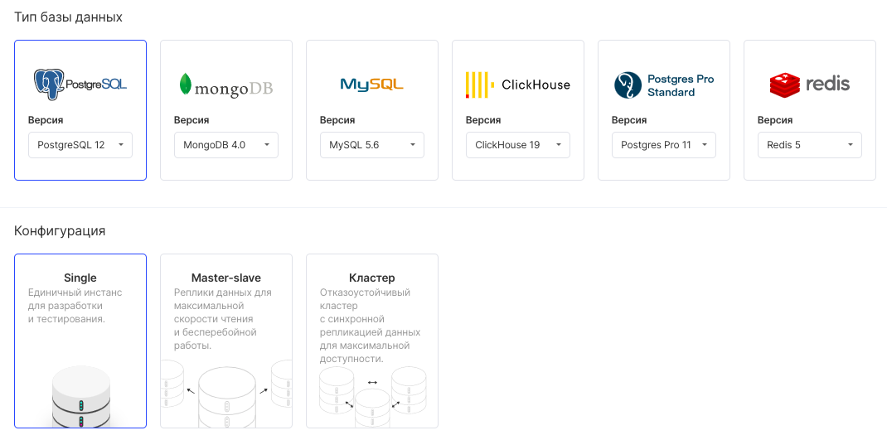
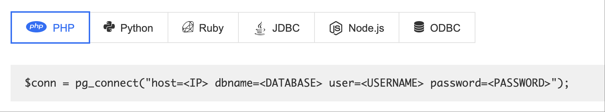

## О сервисе

Cloud Database – это сервис для создания облачных баз данных.

Перенесите базу данных в облако, избавьтесь от рутинной поддержки инфраструктуры и сфокусируйтесь на бизнесе.

## Преимущества

Запуск СУБД PostgreSQL, MySQL, MongoDB и ClickHouse за пару минут.

- Гибкое масштабирование базы данных по мере роста бизнеса.
- Оплата за использованные вычислительные мощности, посекундная тарификация.
- Геораспределённые реплики для большей надежности и меньшей задержки ответа.
- Резервное копирование в отказоустойчивое хранилище в один клик.
- SLA 99.95% с финансовыми гарантиями.

Сейчас для создания доступны следующие базы (некоторые доступны в конфигурациях Master-Slave и Кластер):

После создания база данных становится доступна по определённым параметрам для любого вашего приложения с помощью коннекторов, ниже пример для PHP:

