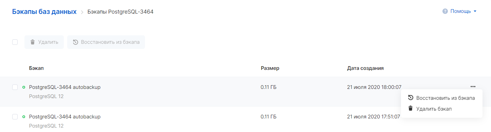
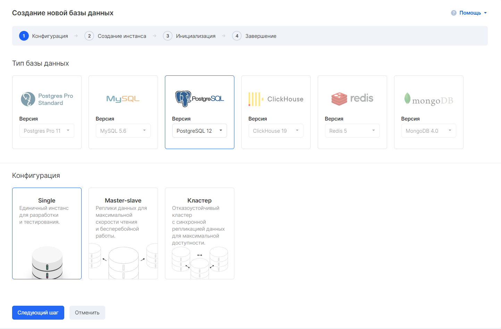
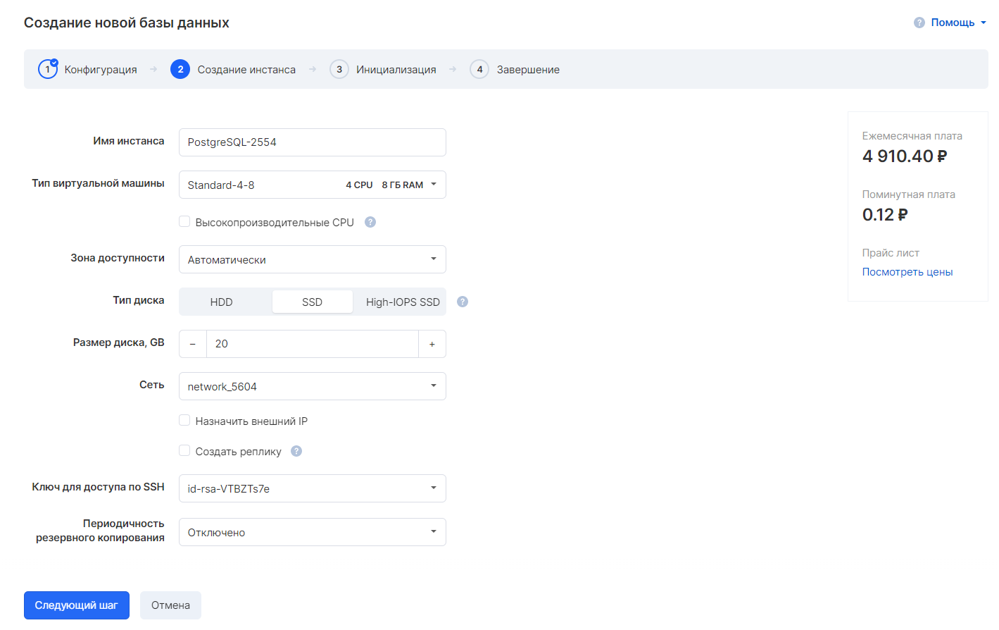

Чтобы восстановить инстанс из резервной копии:

1.  Нужно перейти в раздел "Базы данных" → "Бэкапы".
2.  Открыть требуемый план резервного копирования.
3.  Выбрать бэкап и открыть его контекстное меню.
4.  Нажать "Восстановить из бэкапа".
5.  Выбрать нужную конфигурацию инстанса баз данных:
6.  На следующем шаге нужно настроить параметры инстанса:
7.  На шаге 3 нужно указать необходимую резервную копию и нажать на кнопку "Создать базу данных". Запустится процесс создания нового инстанса, а статус создания можно увидеть на странице "Инстансы баз данных".
