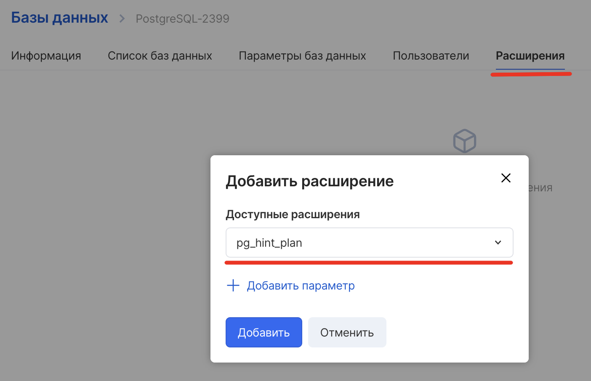
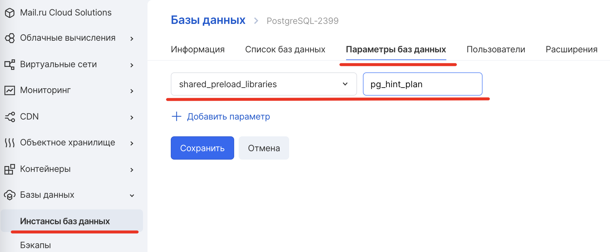

Что такое pg_hint_plan?
-------------------------

pg_hint_plan - управление планом выполнения запроса с помощью указаний, записываемых в комментариях особого вида. 

Подробнее о расширении (в том числе синтаксис, подзапросы, ошибки и т.д.) можно прочитать на официальной странице [Postgres](https://postgrespro.ru/docs/enterprise/12/pg-hint-plan).

Порядок установки
-----------------

*   установить расширение ( [в этой статье приведён пример установки любого расширения](https://mcs.mail.ru/help/ru_RU/db-extensions/postgis-pgcrypto) )
*   установить параметр базы данных ( [в этой статье написано, как это можно сделать](https://mcs.mail.ru/help/ru_RU/manage-db/db-flags-options) ) **shared_preload_libraries** = pg_hint_plan

Если БД восстанавливается из резервной копии, то будет нужно снова установить параметр базы данных **shared_preload_libraries** = pg_hint_plan.

Параметры
---------

<table><tbody><tr><td style="width: 21.5318%; background-color: rgb(239, 239, 239);"><strong>Название</strong></td><td style="width: 57.7135%; background-color: rgb(239, 239, 239);"><strong>Описание</strong></td><td style="width: 20.5273%; background-color: rgb(239, 239, 239);"><strong>Значение по умолчанию</strong></td></tr><tr><td style="width: 21.5318%;">enable_hint_table&nbsp;</td><td style="width: 57.7135%;">Значение True включает использование указаний из таблицы.</td><td style="width: 20.5273%;">на (вкл.)</td></tr><tr><td style="width: 21.5318%;">parse_messages&nbsp;</td><td style="width: 57.7135%;">Задаёт уровень, которым будут попадать в журнал ошибки разбора указаний.&nbsp;Допустимые значения: ошибка (ошибка), предупреждение (предупреждение), уведомление (уведомление), информация (информация), протокол (протоколирование), отладка (отладка).</td><td style="width: 20.5273%;">Информация</td></tr><tr><td style="width: 21.5318%;">debug_print&nbsp;</td><td style="width: 57.7135%;">Управляет выводом и детализацией отладочной информации.&nbsp;Допустимые значения: выкл., Вкл., Подробный и подробный.</td><td style="width: 20.5273%;">выкл. (выкл.)</td></tr><tr><td style="width: 21.5318%;">message_level</td><td style="width: 57.7135%;">Задаёт уровень, которым будут попадать в журнал отладочные сообщения.&nbsp;Допустимые значения: ошибка, предупреждение, уведомление, информация, журнал, отладка.</td><td style="width: 20.5273%;">Информация</td></tr></tbody></table>