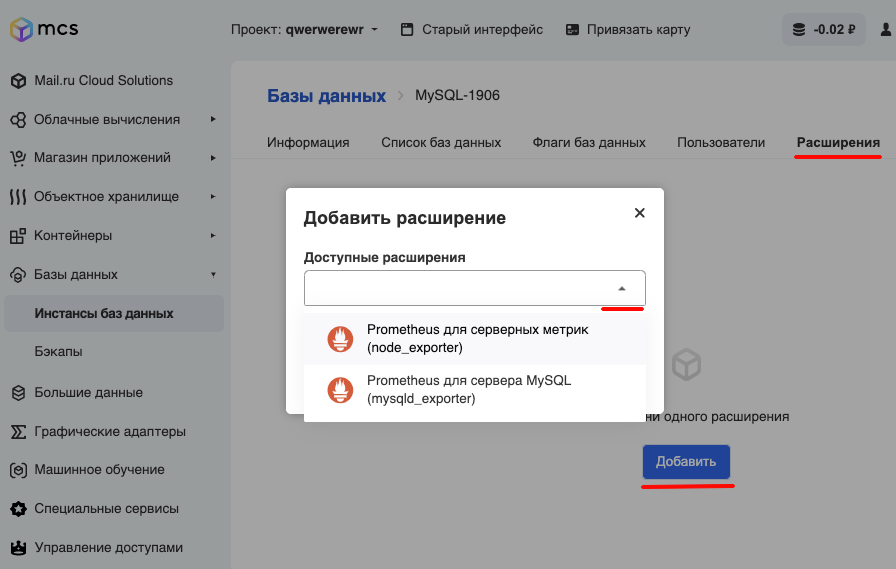

## Описание

Расширения увеличивают функциональность баз данных и могут быть установлены в любое время.

Prometheus - центральный сервер, предназначенный для сбора и хранения данных. Данные постоянно изменяются во времени (например, уровень заполненности диска, трафик через сетевой интерфейс, время отклика сайта). Элементы данных называются метриками. Сервер Prometheus с заданной периодичностью считывает метрики и помещает полученные данные в Time Series DB. Time Series DB - это разновидность баз данных, предназначенная для хранения временных рядов (значений с привязкой ко времени). Кроме того, Prometheus предоставляет интерфейс для выполнения запросов и визуализации полученных данных. Язык запросов Prometheus называется PromQL. Prometheus работает по модели Pull, то есть он сам опрашивает endpoints с целью получения данных.

Exporters - процессы, обеспечивающие сбор и их передачу серверу Prometheus. Существует много разных exporters, например:

- Node_exporter - сбор системных метрик (процессор, память, и т.д.).
- Mysqld_exporter - сбор метрик работы сервера MySQL.

## Prometheus для серверных метрик (node_exporter)

Существует разная поддержка для сборщиков в каждой операционной системе.В таблицах ниже перечислены некоторые сборщики и поддерживаемые системы.

| Name       | Description                                                              | OS                                         |
| ---------- | ------------------------------------------------------------------------ | ------------------------------------------ |
| cpu        | Собирает статистику использования процессора                             | Darwin, Dragonfly, FreeBSD, Linux, Solaris |
| cpufreq    | Собирает статистику частоты процессора                                   | Linux, Solaris                             |
| diskstats  | Собираетстатистику дискового ввода-вывода (I/O).                         | Darwin, Linux, OpenBSD                     |
| filesystem | Собирает статистикуфайловой системы, например, занятого места на дисках. | Darwin, Dragonfly, FreeBSD, Linux, OpenBSD |
| meminfo    | Собирает статистику использования оперативной памяти.                    | Darwin, Dragonfly, FreeBSD, Linux, OpenBSD |
| vmstat     | Собирает статистику процессов из /proc/vmstat.                           | Linux                                      |

Полный список всех сборщиков вы можете увидеть на [официальном ресурсе по этой ссылке](https://github.com/prometheus/node_exporter#collectors).

## Установка расширения

Установить расширения довольно просто. Для этого на карточке виртуальной машины на вкладке "Расширения" нажмите кнопку "Добавить":

### **Важно**

Установить другие расширения, кроме предлагаемых по умолчанию, пока нельзя.

---

Также рекомендуем статьи:

- [Официальный ресурс node_exporter на Гитхабе](https://prometheus.io/download/#node_exporter)
