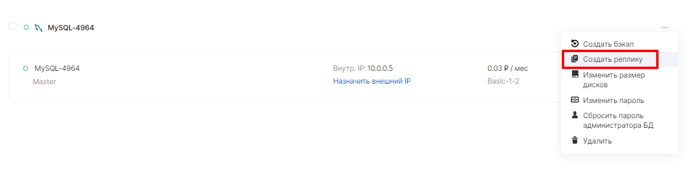
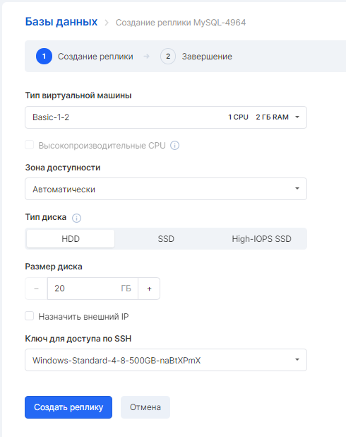

Сервис VK Cloud Solutions Databases позволяет добавить реплики к уже существующим Базам данных, созданным в конфигурации master-slave.

На странице уже созданной Базы данных необходимо навести курсор на три точки (меню настройки). В выпадающем списке выбрать соответствующий пункт - "Создать реплику":

Обратите внимание
-----------------

Функция доступна только из раздела "Базы данных"

В открывшемся окне необходимо указать характеристики и параметры реплики:

