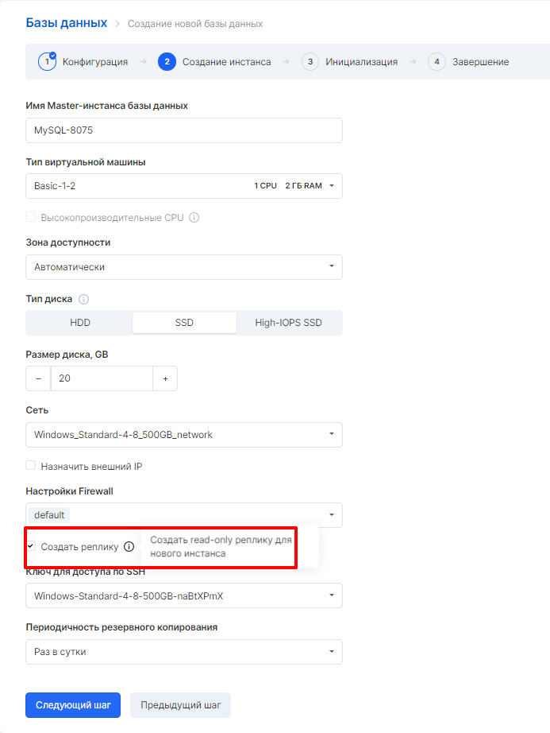

Репликация - одна из техник масштабирования баз данных. Состоит техника в том, что данные с одного сервера базы данных постоянно копируются (реплицируются) на один или несколько других. Появляется возможность использовать не один сервер для обработки запросов, а несколько. Таким образом, появляется возможность распределить нагрузку с одного сервера на несколько.

В сервисе VK Cloud Solutions есть возможность создать реплику на этапе создания инстанса Баз данных, либо добавить ее.

При создании конфигурации в режиме master-slave в момент выбора параметров появляется возможность добавления реплики:

