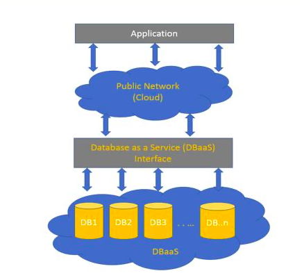

В упрощённом виде архитектура DBaaS (база данных как сервис) представлена на картинке ниже:

В панели управления VK CS разворачивается виртуальная машина или кластер с предустановленными средствами управления базой данных. При создании виртуальной машины или кластера можно выбрать, создавать ли реплику (для конфигурации Master-Slave), или количество узлов (для конфигурации "Кластер").

Далее клиентские приложения через сетевой интерфейс (IP-адрес, коннектор, API) взаимодействуют с базой данных - как с обычной локальной базой, с поправкой на скорость сетевого подключения.