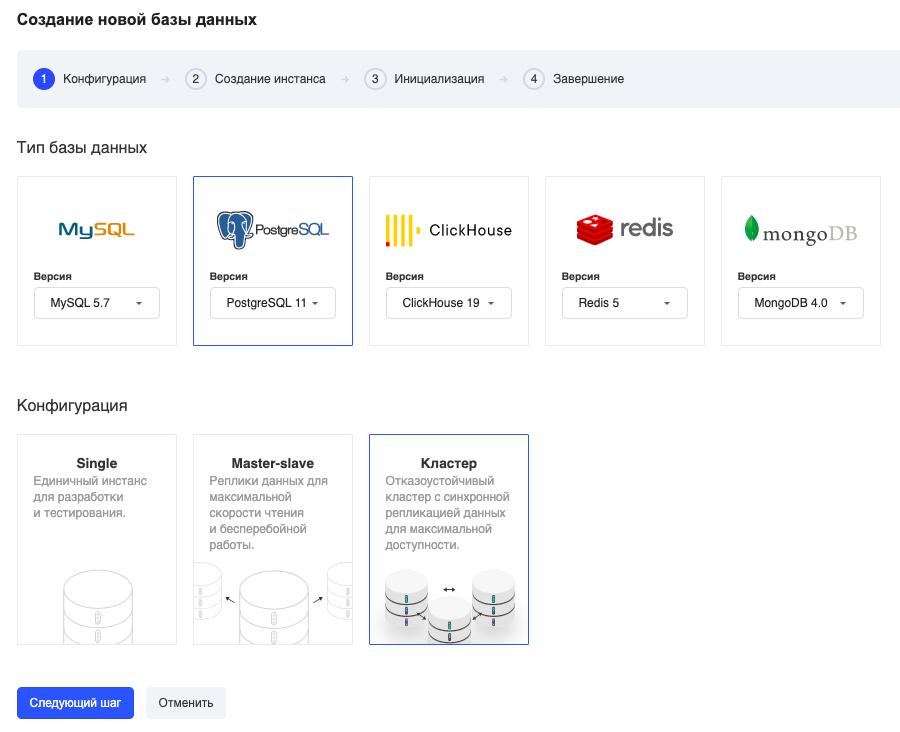
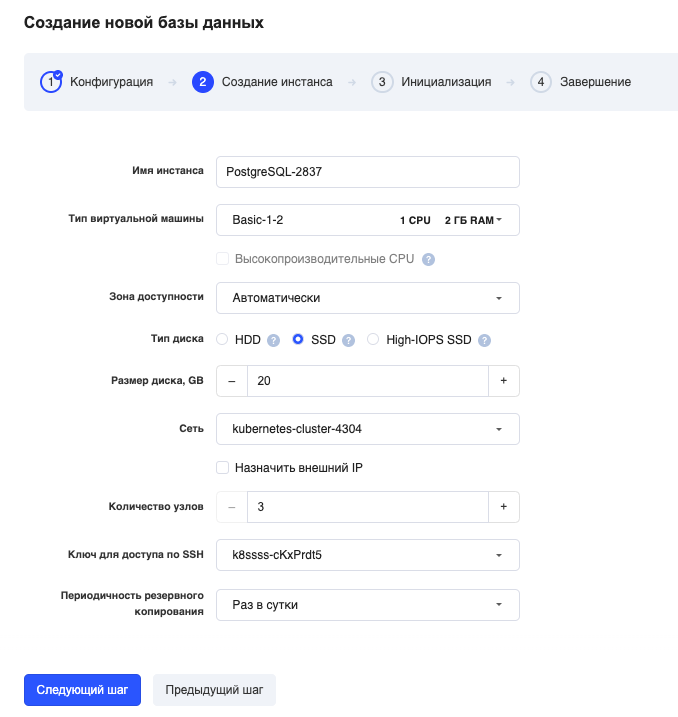
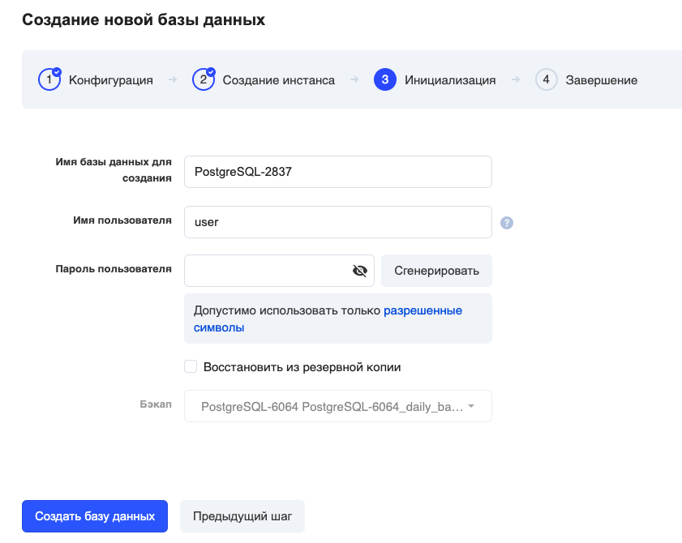
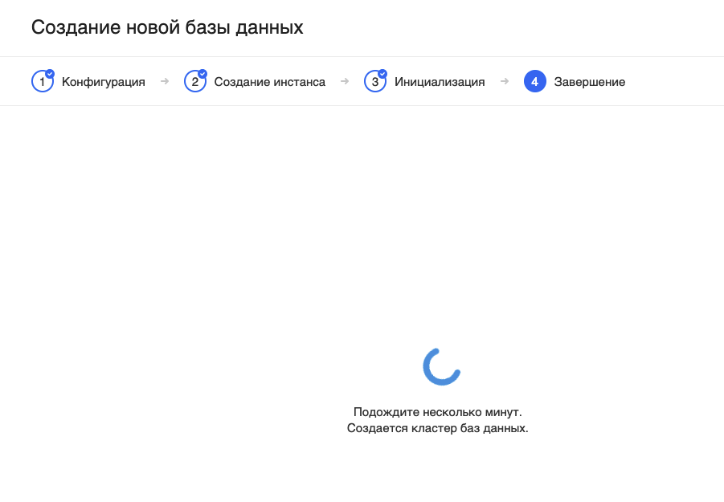
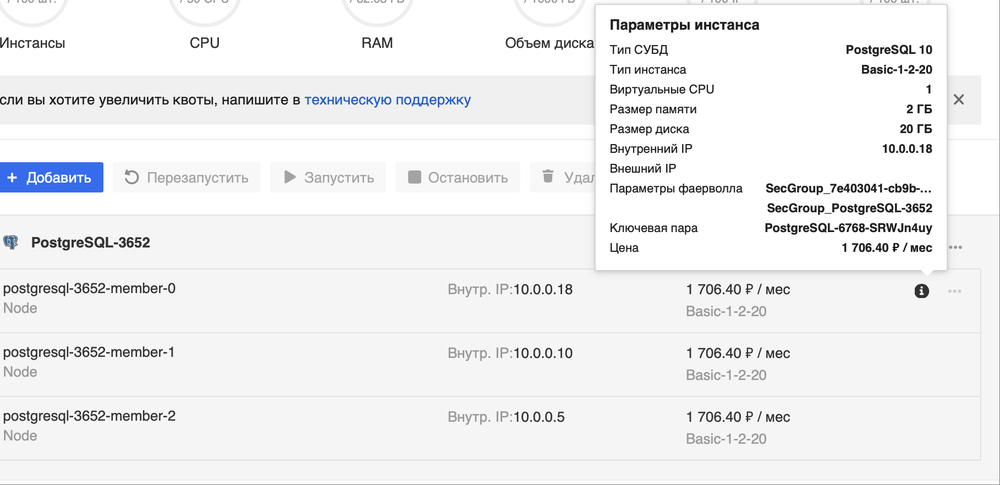
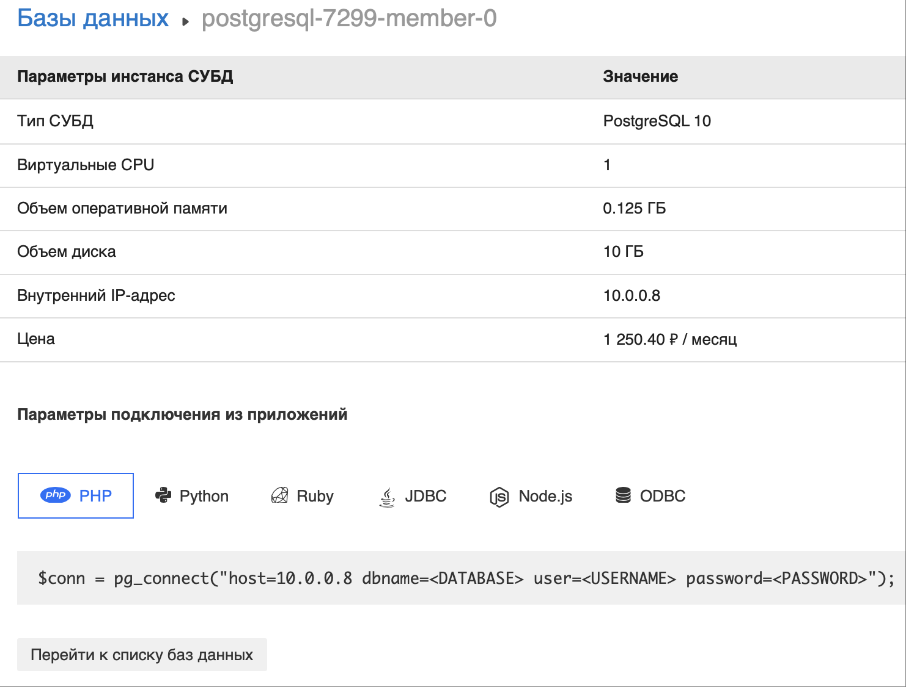
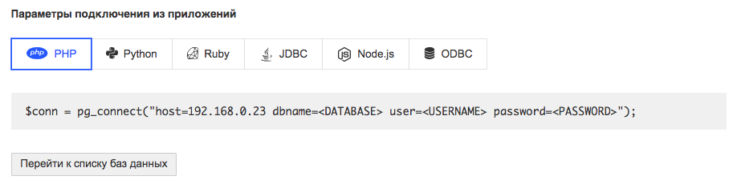

## Запуск кластера

1\. В разделе личного кабинета [«Базы данных»](https://mcs.mail.ru/app/services/databases/add/) нажмите "**Добавить**"

2\. В открывшемся окне выберите базу данных для запуска, а также шаблон конфигурации "**Кластер**".

Доступность шаблонов конфигурации зависит от типа выбранной СУБД.

- **Single** — единичный инстанс СУБД без реплики. Рекомендуется использовать исключительно для целей разработки и тестирования.
- **Master-slave** (**Master-Replica**) — два инстанса СУБД в разных ЦОД с репликацией в режиме master-slave (active-passive). Используйте для промышленной эксплуатации.
- **Кластер** — кластер с синхронной репликацией данных. Используйте при наличии повышенных требований к надежности и отказоустойчивости системы.

На втором шаге выберите необходимые параметры инстанса.

### Загрузка своего SSH-ключа

Обратите внимание, что теперь можно не только сгенерировать новый, использовать старый, но и загрузить свой SSH-ключ

| Тип инстанса  | Выберите из списка предложенных конфигурацию инстанса (объём оперативной памяти, количество CPU). Объем жесткого диcка вы можете изменить в следующем пункте. |
|-------|------|
| Размер диска| По умолчанию подставляется объем из выбранной вами конфигурации. Но вы можете увеличить или уменьшить размер.|
| Имя инстанса| Оставьте имя по умолчанию или введите свое название. Латинскими символами.|
| Зона доступности| укажите зону доступности (рекомендуем DP1 или MS1).|
| Сеть | Оставьте по умолчанию или выберите свою приватную сеть. Если у вас не создано ни одной сети, вам будет предложено её создать.|
| Доступ из интернет | Установите для организации доступа к базе данных из Интернет через плавающий IP-адрес.|
| Количество узлов  | Выберите нужное вам количество узлов кластера.|
| Ключ для доступа по SSH | Выберите из уже созданных вами или создайте новый. Он понадобится для подключения к серверу.|

На следующем шаге задайте параметры инициализации базы данных.

| Название | Описание |
|------------------------------|-------------------------------------------------------|
| Имя базы данных для создания | Оставьте по умолчанию или введите свое.               |
| Имя пользователя             | Укажите имя администратора для удаленного доступа.    |
| Пароль администратора        | Задайте пароль администратора для удаленного доступа. |
| Резервная копия              | Имя бэкапа для восстановления.                        |

<info>

Для PostgreSQL в конфигурациях «Single» или «Master-Replica» по умолчанию включен [мониторинг](../../db-monitoring/postgresql). При необходимости эту опцию можно отключить.

</info>

<warn>

Кластер создаётся в течение нескольких минут. После чего появится информация об инстансе и способы подключения.

</warn>

Не прерывайте процесс создания и не закрывайте браузер.

## Подключение к кластеру

Увидеть способы подключения также можно кликнув по названию конкретного инстанса в списке или наведя курсор на значок информации.

В разделе «Параметры подключения из приложений» приведены примеры кода из популярных языков.

При использовании примеров следует заменить макросы **<DATABASE>**, **<USERNAME>**, **<PASSWORD>** на актуальные значения:

- <DATABASE> - название базы данных, указанное при создании.
- <USERNAME> - имя пользователя (указывается при создании).
- <PASSWORD> - пароль пользователя (указывается при создании).

Дополнительную информацию можно найти в документации по используемому коннектору (приложению для подключения к БД).

## Patroni

### Установка

Patroni предустановлен в вашей системе.

Patroni - это служба для создания высокодоступных PostgreSQL кластеров на основе стандартной потоковой репликации. Это решение используется такими компаниями как Red Hat, IBM Compose, Zalando и многими другими. С его помощью можно преобразовать систему из ведущего и ведомых узлов (primary - replica) в высокодоступный кластер с поддержкой автоматического контролируемого (switchover) и аварийного (failover) переключения. Patroni позволяет легко добавлять новые реплики в существующий кластер, поддерживает динамическое изменение конфигурации PostgreSQL одновременно на всех узлах кластера и множество других возможностей.

## Балансер

Для каждого кластера создается TCP-балансер, который имеет 3 порта. Они указывают на:

1.  \- мастер
2.  \- синхронную реплику
3.  \- асинхронную реплику

---

Официальная [документация Patroni находится тут](https://patroni.readthedocs.io/en/latest/index.html).
