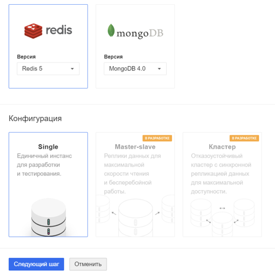
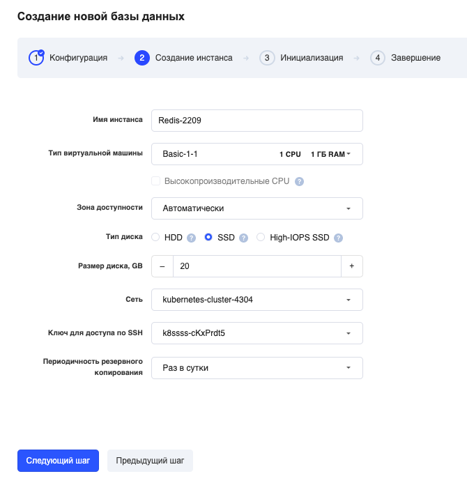
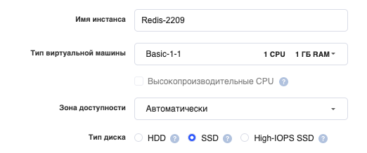
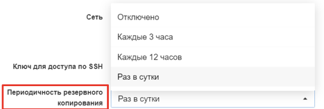

## Почему Redis?

Redis (Remote Dictionary Server) – это быстрое хранилище данных типа «ключ‑значение» в памяти с открытым исходным кодом для использования в качестве базы данных, кэша, брокера сообщений или очереди. Redis обеспечивает время отклика на уровне долей миллисекунды и позволяет приложениям, работающим в режиме реального времени, выполнять миллионы запросов в секунду.

Все данные в Redis хранятся в памяти, а не на дисках или твердотельных накопителях, как в других базах данных. Поскольку Redis, как и другие хранилища данных в памяти, не нуждается в доступе к диску, это исключает задержки, связанные с поиском, и обеспечивает доступ к данным за микросекунды. В число возможностей Redis входит поддержка разнообразных структур данных, обеспечение высокой доступности, работа с геопространственными данными, создание скриптов Lua, проведение транзакций, постоянное хранение данных на диске и поддержка кластеров.

В отличие от упрощенных хранилищ на основе пар «ключ – значение», которые поддерживают ограниченный набор структур данных, Redis поддерживает огромное разнообразие структур данных, позволяющее удовлетворить потребности разнообразных приложений. Типы данных Redis включают строки, списки, множества, сортированные множества, хэш‑таблицы, битовые массивы и так далее.

Redis упрощает код, позволяя писать меньше строк для хранения, использования данных и организации доступа к данным в приложениях. К примеру, если приложение содержит данные, хранящиеся в хэш‑таблице, и требуется сохранить эти данные в хранилище, можно просто использовать структуру данных хэш‑таблицы Redis. Решение подобной задачи с использованием хранилища данных, не поддерживающего структуры хэш‑таблиц, потребует написания серьезного объема кода для преобразования данных из одного формата в другой.

Redis уже оснащен встроенными структурами данных и предоставляет множество возможностей их комбинирования и взаимодействия с данными клиента. Разработчикам под Redis доступны более ста клиентов с открытым исходным кодом. Поддерживаемые языки программирования включают Java, Python, PHP, C, C++, C#, JavaScript, Node.js, Ruby, R, Go и многие другие.

## Запуск инстанса

Для создания БД Redis необходимо в [панели управления VK Cloud](https://mcs.mail.ru/app/services/databases/list/) зайти во вкладку «Инстансы Баз Данных», и нажать «Создать базу данных».

На открывшейся странице выбрать Redis:


В настоящее время доступна к использованию конфигурация Single:



Нажав кнопку «Следующий шаг» необходимо выбрать параметры - конфигурацию инстанса баз данных:



Далее, «Зона доступности». Напомним, что зона доступности - это логическое объединение гипервизоров для обеспечения отказоустойчивости. MS1 и DP1 — зоны, физически расположенные в разных дата-центрах:


При создании базы Redis также можно выбрать тип диска, указать размер диска и назначить имя инстанса:



Последним шагом к созданию инстанса Redis будет выбор периодичности автоматического резервного копирования:



## Подключение

Подключиться к созданной виртуальной машине можно из приложений, например для Python это коннектор:

```
import red conn =" redis.Redis(host='**IP_АДРЕС_ИНСТАНСА**', "port=6379, db=0)
```

---

Подробную документацию по Redis вы можете прочитать на [его официальном ресурсе](https://redis.io/documentation).

Также см. статью ["Ставим свои флаги БД"](https://mcs.mail.ru/help/db-faq/flags).
