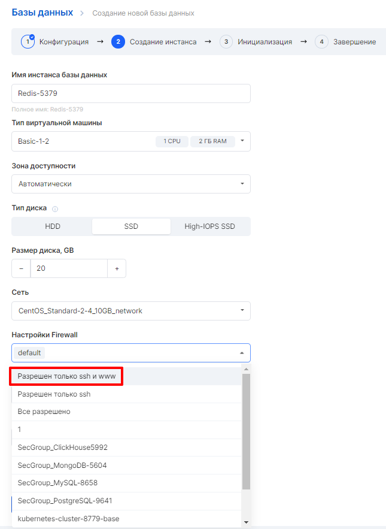
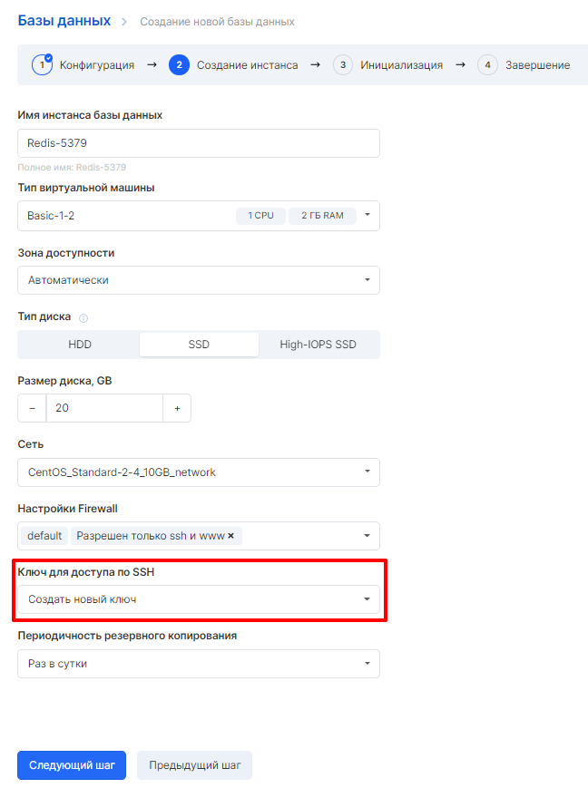
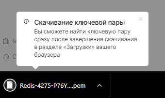

### Подключение к инстансу Базы данных по SSH

Для успешного подключения к БД по SSH необходимо на этапе создания Базы данных установить указанные ниже настройки.

При создании Базы данных необходимо в настройках Firewall добавить правило "ssh+www", которое открывает 22 порт для успешного подключения:



Далее, в меню "Ключ для доступа по SSH" в выпадающем списке выбрать создание нового ключа:



После нажатия кнопки "Создать базу данных" начнется скачивание ключа в формате .pem на локальный ПК:



Подключение к Базе данных по SSH происходит на локальном ПК в командной строке.

Для подключения в строке необходимо ввести 

```
ssh -i <путь к ключу> admin@<внешний ip-адрес>
```

При успешном подключении ответ будет выглядеть следующим образом:

```
[admin@redis-4275 ~]$
```