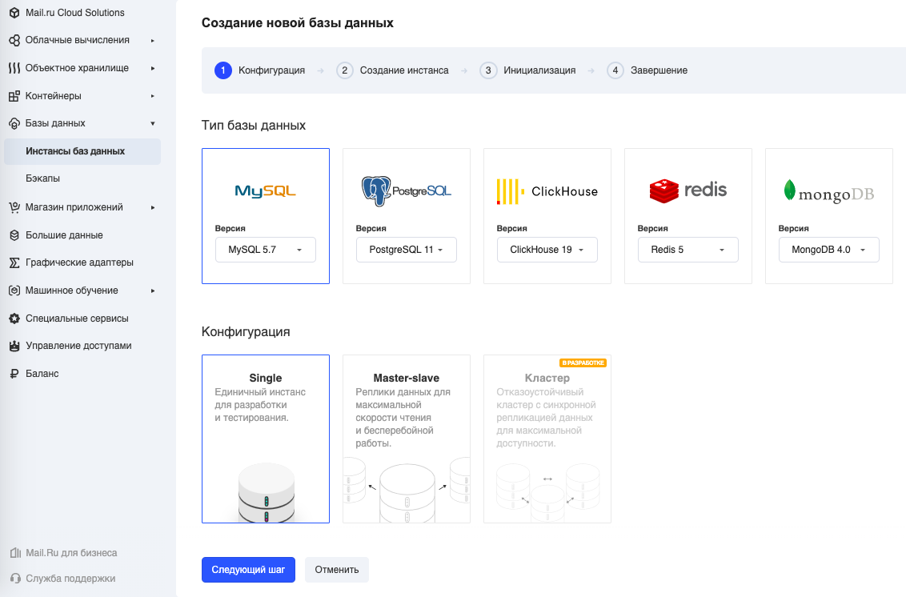
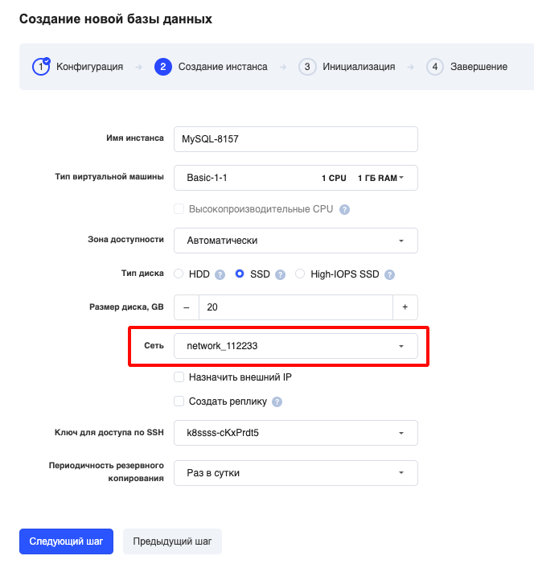
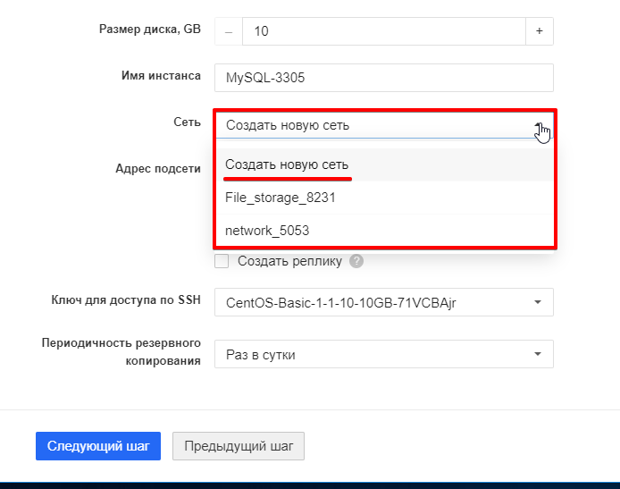
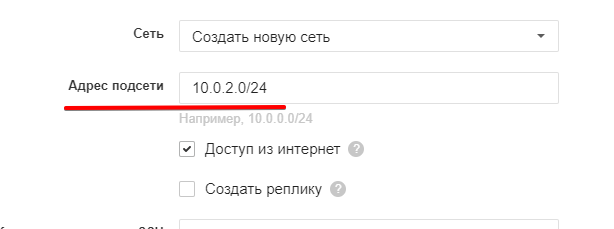

## Какой вариант создания сети лучше?

При выборе "Создать новую сеть" на этапе создания инстанса тоже создаётся сеть, но:

- каждый раз с новым шлюзом
- появляется возможность "на ходу" указать адрес подсети.

Поэтому если вам необходимо объединить несколько инстансов БД в одну сеть, то лучше создать сеть заранее с нужной вам конфигурацией, а затем указывать её при создании новых инстансов БД.

## Создание сети заранее

Для того, чтобы при создании БД выбрать сеть, необходимо сделать следующие действия:

1\. Зайти в панель управления и выбрать вкладку "[Сети](https://mcs.mail.ru/app/services/server/networks/)".

2\. Создать новую сеть.

3\. Зайти во вкладку "[Базы данных](https://mcs.mail.ru/app/services/databases/list/)" и начать создание новой базы.

4\. На карточке создания инстанса выбрать новую созданную сеть:

## Создание сети и подсети "на ходу"

Для выбора подсети достаточно в том же выпадающем меню "Сеть" выбрать "Создать новую сеть":

При этом тоже создастся сеть, но появится возможность "на ходу" указать адрес подсети:

