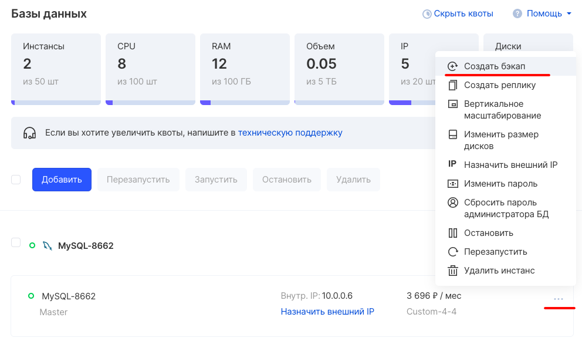
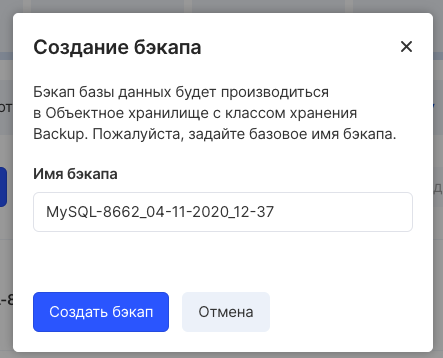
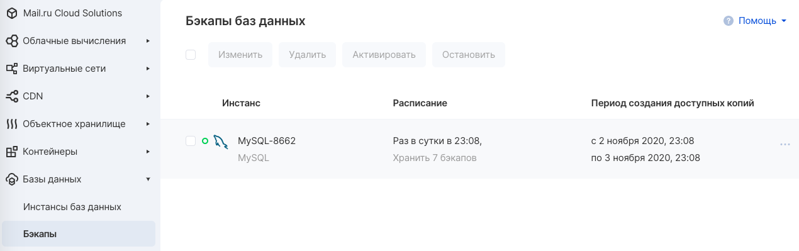
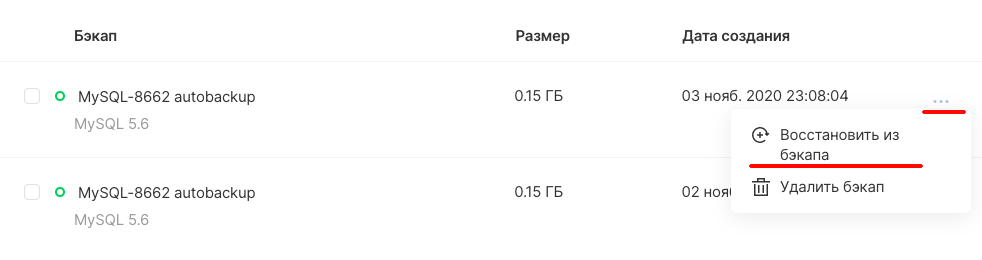

## Создание бэкапов

Для создания резервной копии инстанса перейдите в список инстансов, кликните на знак в конце строки и в контекстном меню выберите «Создать бэкап».

В открывшемся окне введите название бэкапа или оставьте поле заполненным по умолчанию:

И кликните «Создать бекап».

Резервное копирование производится в объектное хранилище. После окончания создания бэкапа он станет доступен в виде файла в объектном хранилище:

## Управление бэкапами и их расписание

В [разделе "Бэкапы"](https://mcs.mail.ru/app/services/databases/backups/) панели управления можно увидеть статус и даты резервного копирования для инстансов баз данных:

## Восстановление из бэкапов

1\. Перейдите в раздел Базы данных - Бэкапы.

2\. Выберите бэкап и кликните в правом углу для открытия контекстного меню.

3\. Выберите «Восстановить из бэкапа».

Запустится мастер создания нового инстанса СУБД (копии инстанса из бэкапа).

Пароль для входа при этом останется тот же, который вы задавали при создании изначального инстанса.
