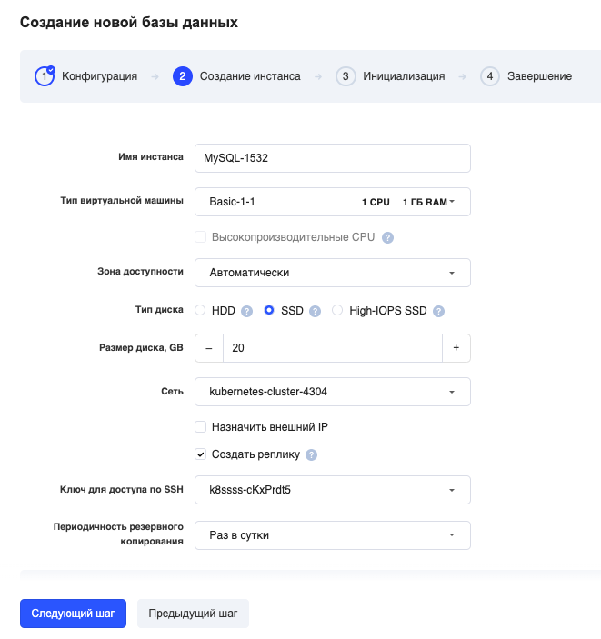
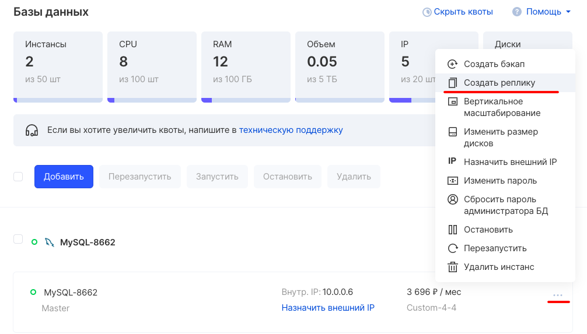
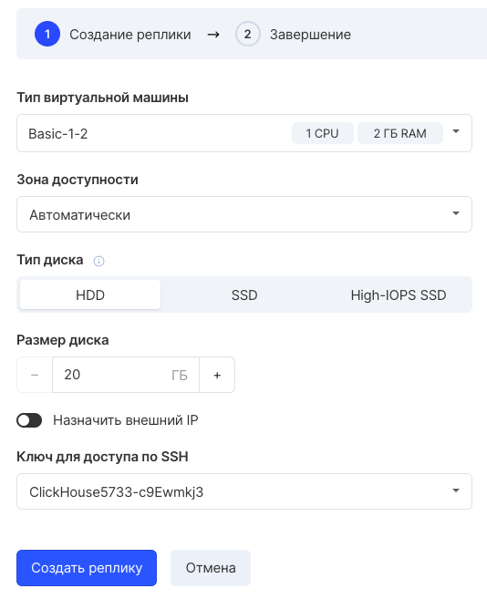

## Создание реплики при запуске инстанса

Создать конфигурацию в режиме master"-slave можно при запуске инстанса, на шаге 2.

## Добавление реплики к существующему инстансу

1\. Выберите в контекстном меню команду «Создать реплику»:

Обратите внимание: эта функция доступна только из раздела «Базы данных».

2\. В открывшемся окне укажите необходимые параметры:

<table><tbody><tr><td>Тип виртуальной машины</td><td>Выберите из списка предложенных конфигурацию инстанса. Объем жесткого диска вы можете изменить в следующем пункте</td></tr><tr><td>Размер диска</td><td>По умолчанию подставляется объем из выбранной вами конфигурации. Но вы можете увеличить или уменьшить размер.</td></tr><tr><td>Имя инстанса</td><td>Оставьте имя по умолчанию или введите свое название. Латинскими символами.</td></tr><tr><td>Зона доступности</td><td>укажите зону доступности (рекомендуем DP1 или MS1).</td></tr><tr><td>Сеть</td><td>Оставьте по умолчанию или выберите свою приватную сеть.</td></tr><tr><td>Доступ из интернет</td><td>Установите для организации доступа к базе данных из Интернет через плавающий IP-адрес</td></tr><tr><td>Создать реплику</td><td>Установите для создания мастера и read-only реплики.</td></tr><tr><td>Ключ для доступа по SSH</td><td>Выберите из уже созданных вами или создайте новый. Он понадобится для подключения к серверу.</td></tr></tbody></table>

3\. Нажмите .
