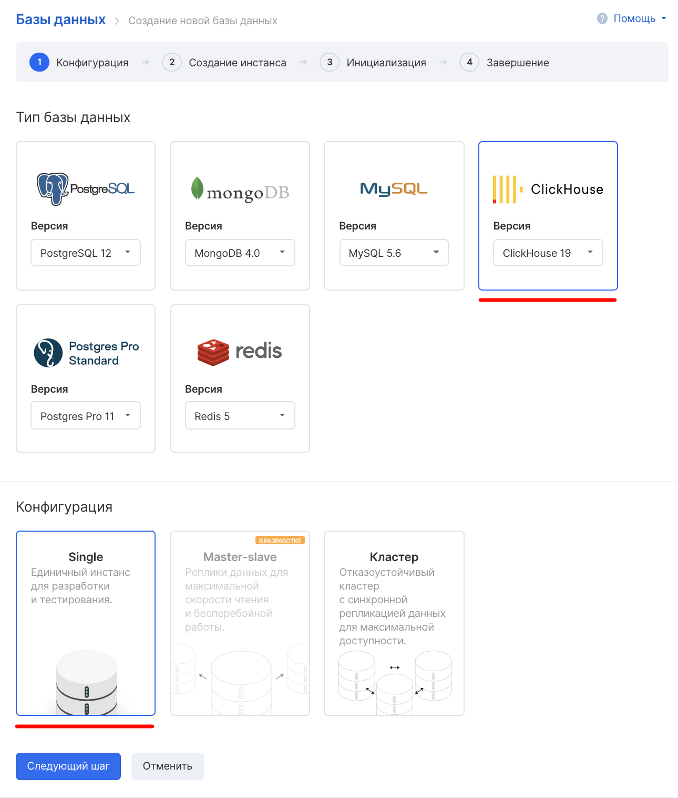
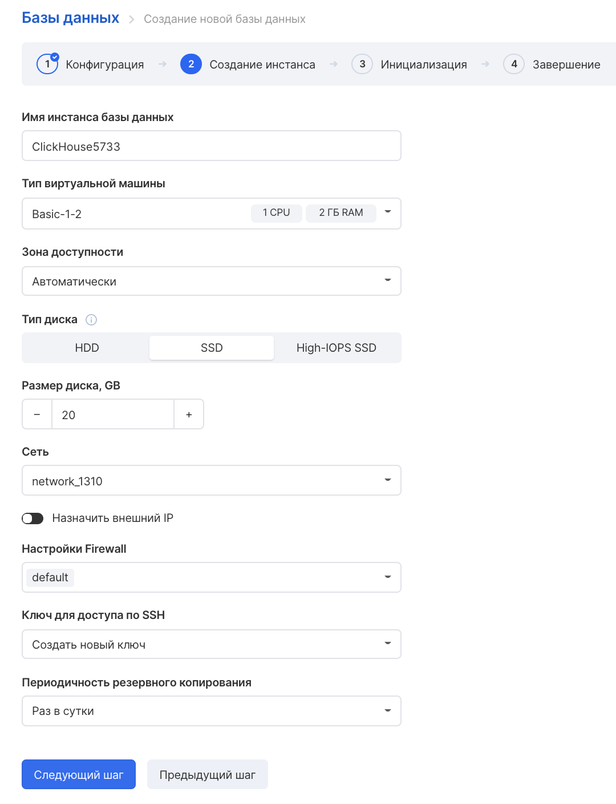
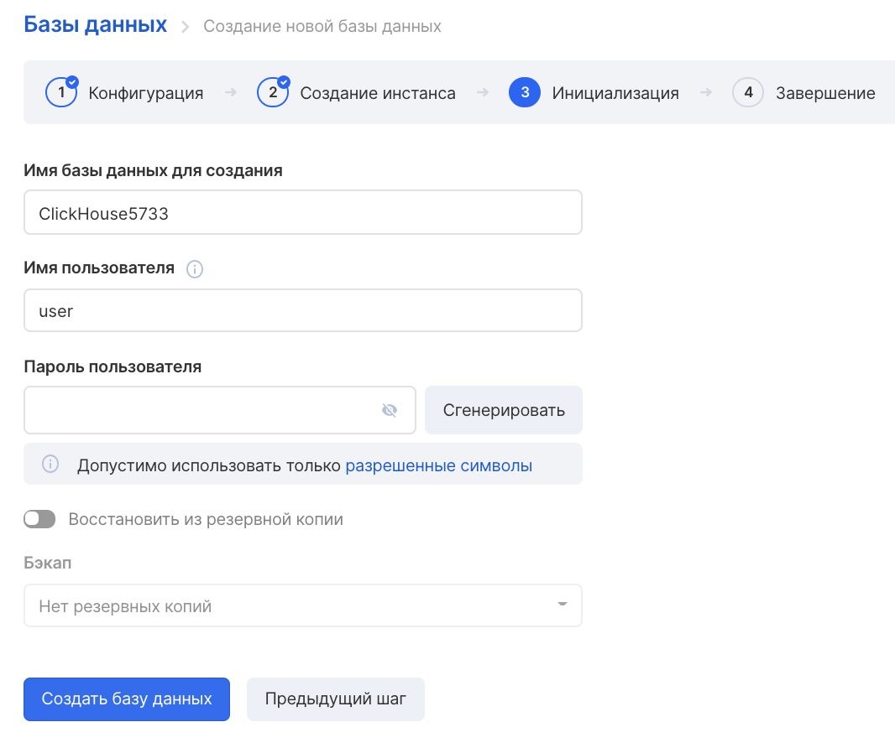
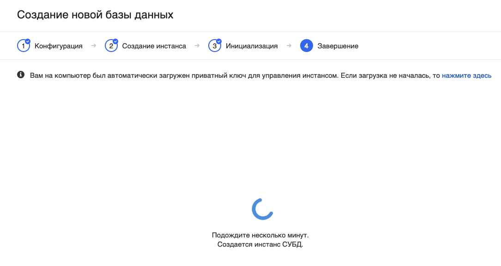
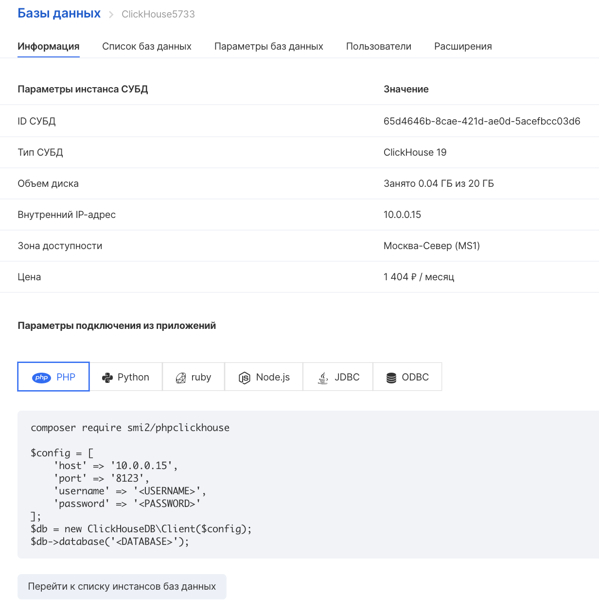
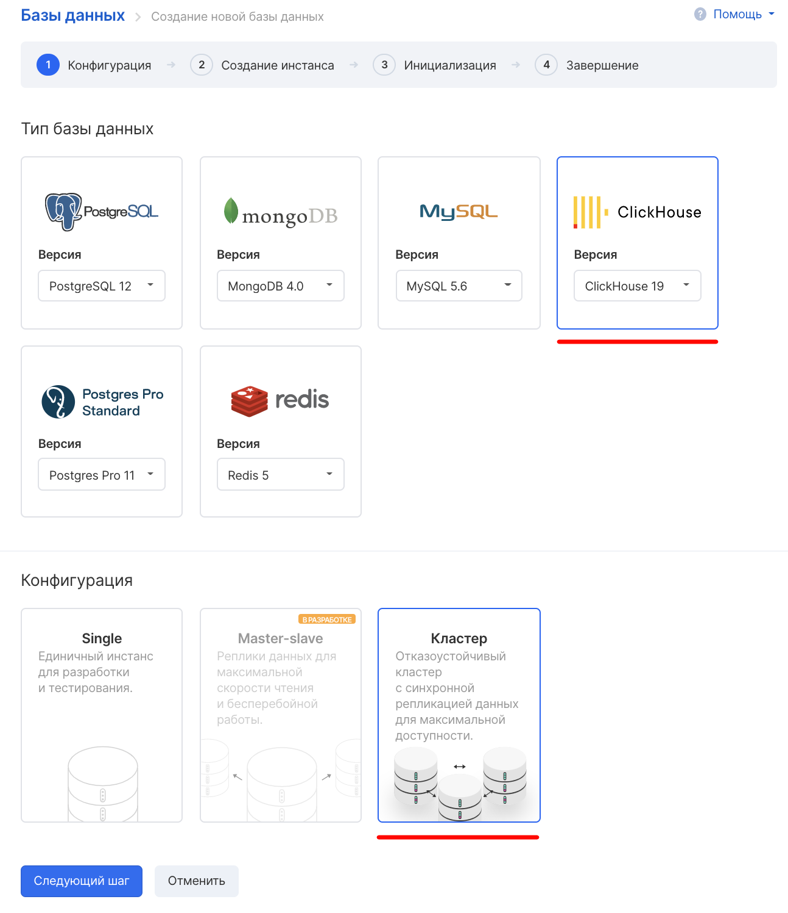
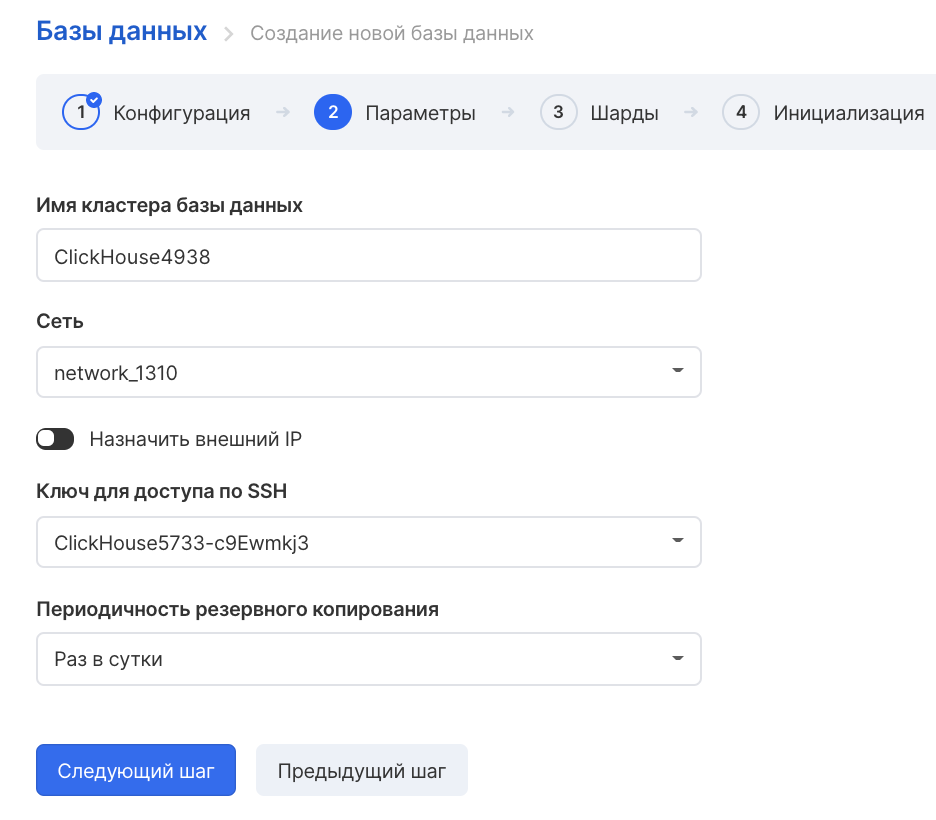
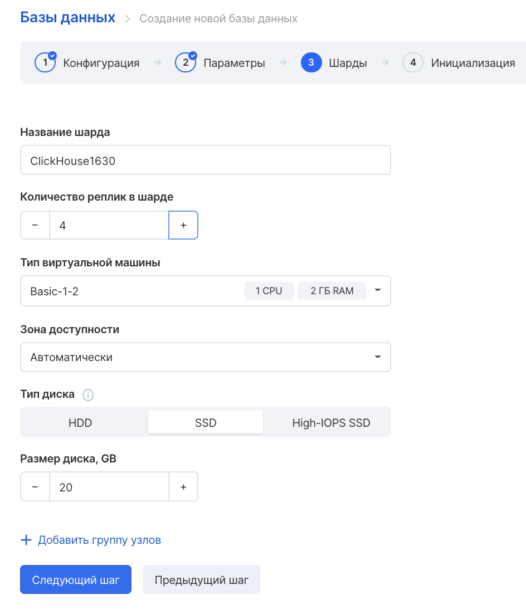

## Описание

**ClickHouse** — это колоночная аналитическая СУБД с открытым кодом, позволяющая выполнять аналитические запросы в режиме реального времени на структурированных больших данных.

ClickHouse использует собственный диалект SQL, близкий к стандартному, но содержащий различные расширения:

- массивы и вложенные структуры данных
- функции высшего порядка
- вероятностные структуры
- функции для работы с URI
- возможность для работы с внешними key-value хранилищами («словарями»)
- специализированные агрегатные функции
- функциональности для семплирования, приблизительных вычислений
- возможность создания хранимых представлений с агрегацией
- возможность наполнения таблицы из потока сообщений Apache Kafka и многие другие.

## Ограничения

- отсутствие транзакций
- отсутствие точечных UPDATE/DELETE (пакетный UPDATE/DELETE был введен в июне 2018 года)
- ограниченная поддержка синтаксиса JOIN
- строгие типы с необходимостью явного приведения
- для некоторых операций промежуточные данные должны помещаться в оперативную память
- отсутствие оконных функций
- отсутствие полноценного оптимизатора запросов, отсутствие точечного чтения
- присутствие ограничений в реализации некоторых функций

СУБД оптимизирована для хранения данных на жестких дисках (используются преимущества линейного чтения и сжатия данных). Для обеспечения отказоустойчивости и масштабируемости ClickHouse может быть развернут на кластере, а для координации процесса репликации используется Apache ZooKeeper.

Для работы с базой данных существует консольный клиент, веб-клиент, HTTP интерфейс, ODBC и JDBC-драйверы, а также готовые библиотеки для интеграции со многими популярными языками программирования и библиотеками.

## Запуск инстанса с ClickHouse

Для запуска инстанса с ClickHouse нужно в [разделе личного кабинета "Инстансы баз данных"](https://mcs.mail.ru/app/services/databases/) нажать "Создать базу данных", затем выбрать тип базы данных "ClickHouse" и тип конфигурации инстанса "Single".

Далее нужно нажать "Следующий шаг" и указать параметры инстанса:

На следующем этапе надо указать название инстанса и ввести уникальную пару логин+пароль:

### Важно

(если вы случайно оставили в выборе по умолчанию (**Ключ для доступа по SSH**) ключ, к которому у вас нет доступа - вернитесь на шаг назад и выберите "**Сгенерировать новый SSH\*\***\-\***\*ключ**").

Затем нужно подождать несколько минут, пока инстанс создаётся:

После создания на экране отобразятся параметры подключения к инстансу:

## Запуск кластера ClickHouse

Запуск кластера ClickHouse от единичной виртуальной машины (инстанса) отличается некоторыми параметрами в шагах создания.

Следует выбрать тип конфигурации "Кластер":

Затем выбрать имя кластера, используемую сеть и периодичность резервного копирования:

На этом шаге можно выбрать параметры шардирования - разделения частей базы данных по разным серверам. Можно указать количество шардов и групп узлов, нажав "Добавить группу узлов":

Остальные шаги аналогичны созданию обычного инстанса ClickHouse.

## Дополнительная документация

- [Официальная документация по ClickHouse](https://clickhouse.yandex/docs/ru/)
- [Хайлоад-документация](https://ruhighload.com/doc/clickhouse/)
- [Национальная библиотека имени Баумана](https://ru.bmstu.wiki/ClickHouse)
