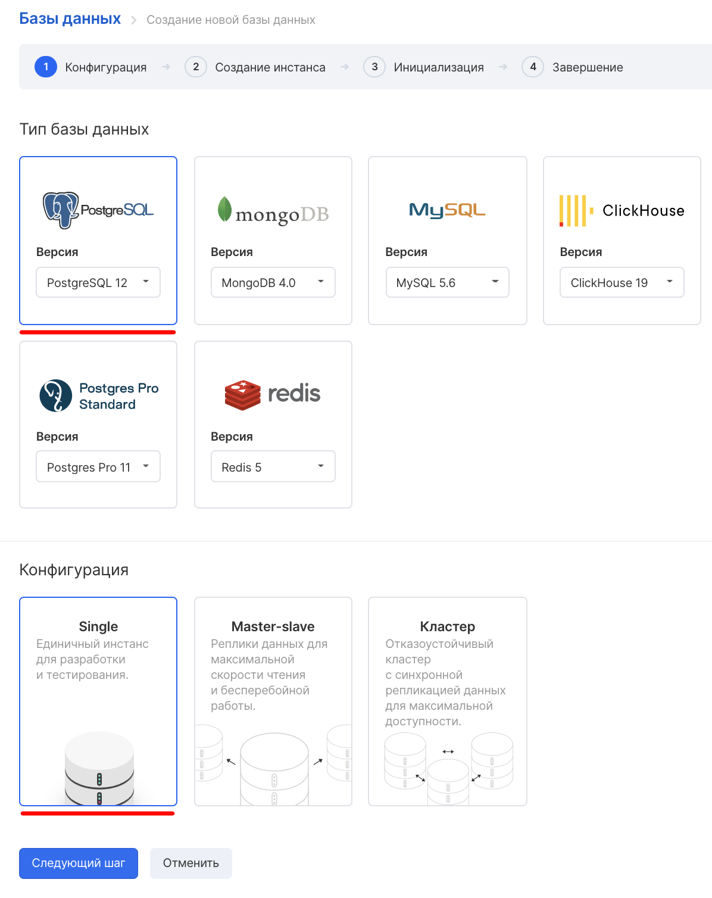
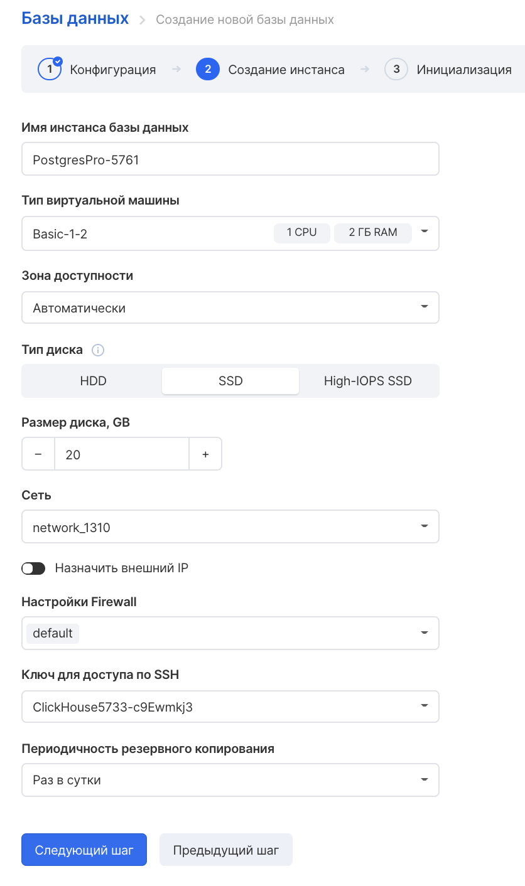
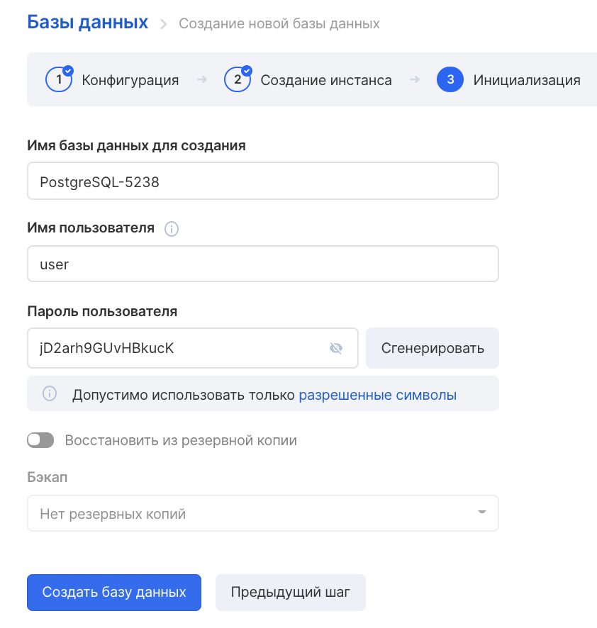
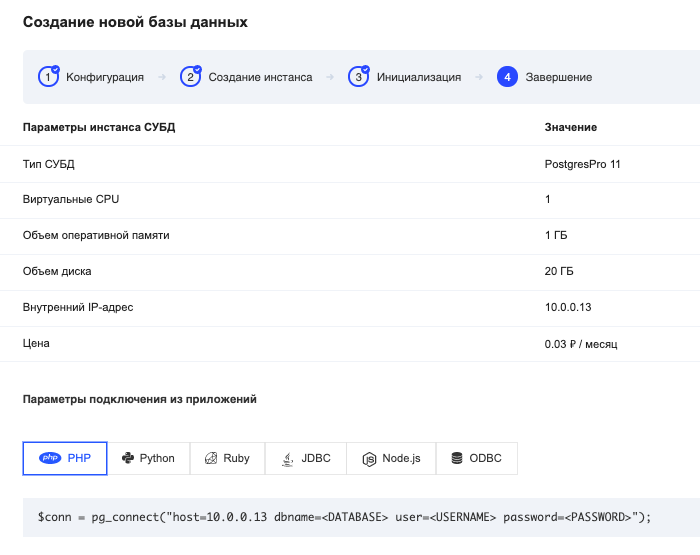

## Описание

Postgres Pro Standard — это объектно-реляционная система управления базами данных (ОРСУБД, ORDBMS), разработанная компанией Postgres.

Postgres Pro Standard, как иPostgreSQL, поддерживает большую часть стандарта SQL и предлагает множество современных функций:

- сложные запросы
- внешние ключи
- триггеры
- изменяемые представления
- транзакционная целостность
- многоверсионность

Кроме того, пользователи могут расширять Postgres Pro, так же как и PostgreSQL, например, создавая свои сущности:

- типы данных
- функции
- операторы
- агрегатные функции
- методы индексирования
- процедурные языки

### Различия между Postgres Pro Standard и PostgreSQL

Postgres Pro предоставляет наиболее актуальную версию PostgreSQL c дополнительными изменениями и расширениями. Этот продукт включает все новые возможности, реализованные компанией Postgres Professional, а также сторонние доработки, которые уже приняты сообществом PostgreSQL и попадут в новые версии PostgreSQL. Таким образом, пользователи Postgres Pro Standard получают ранний доступ к важным нововведениям и исправлениям.

Postgres Pro Standard отличают от PostgreSQL следующие усовершенствования:

- Улучшенный механизм проверки блокировок, не оказывающий отрицательного влияния на производительность.
- Уменьшение объёма записей в WAL, генерируемых при операциях CREATE INDEX с индексами GiST, GIN и SP-GiST.
- Улучшенная производительность при использовании множества временных таблиц в отдельных обслуживающих процессах и при большом количестве одновременных подключений.
- Увеличенная скорость и эффективность планирования для различных типов запросов.
- Уменьшенное потребление памяти при обработке сложных запросов со множеством таблиц.
- Добавление времени планирования в информацию, выводимую модулем [auto_explain](https://postgrespro.ru/docs/postgrespro/11/auto-explain "F.4. auto_explain").
- Возможность замены нулевого байта заданным ASCII-символом при загрузке данных с помощью команды COPY FROM. (См. описание параметра [nul_byte_replacement_on_import](https://postgrespro.ru/docs/postgrespro/11/runtime-config-compatible#GUC-NUL-BYTE-REPLACEMENT-ON-IMPORT).)
- Использование ICU на всех платформах с целью обеспечить платформонезависимую сортировку для различных локалей. По умолчанию провайдер правил сортировки icu задействуется для всех локалей, за исключением C и POSIX.
- Реализация механизма PTRACK, позволяющего программе [pg_probackup](https://postgrespro.ru/docs/postgrespro/11/app-pgprobackup "pg_probackup") отслеживать изменения страниц при создании инкрементальных резервных копий.
- Согласованное чтение на ведомых серверах.
- Представление [pg_recovery_settings](https://postgrespro.ru/docs/postgrespro/11/view-pg-recovery-settings "51.79. pg_recovery_settings"), отображающее текущие параметры восстановления из файла recovery.conf.
- Изменение параметров в recovery.conf без перезапуска сервера.
- Повышенная отказоустойчивость в системах Windows.
- Расширенная поддержка редактирования вводимых команд в psql для Windows, реализованная с использованием WinEditLine.
- Унифицированная структура пакетов двоичных файлов для всех дистрибутивов Linux, упрощающая миграцию между ними и позволяющая устанавливать несколько различных продуктов на базе PostgreSQL совместно без каких-либо конфликтов.

## Дополнительные модули

- Модуль [dump_stat](https://postgrespro.ru/docs/postgrespro/11/dump-stat "F.13. dump_stat"), позволяющий сохранять статистику данных при резервном копировании и восстановлении.
- Модуль [fasttrun](https://postgrespro.ru/docs/postgrespro/11/fasttrun "F.15. fasttrun"), который предоставляет транзакционно-небезопасную функцию для усечения временных таблиц, что предотвращает разрастание каталога pg_class.
- Модуль [fulleq](https://postgrespro.ru/docs/postgrespro/11/fulleq "F.17. fulleq"), предоставляющий дополнительный оператор равенства для совместимости сMicrosoft SQL Server.
- Модуль [hunspell-dict](https://postgrespro.ru/docs/postgrespro/11/hunspell-dict "F.20. Модули словарей Hunspell"), предоставляющий словари для ряда языков.
- Модуль [jsquery](https://postgrespro.ru/docs/postgrespro/11/jsquery "F.24. jsquery") реализует специальный язык запросов для эффективного, с использованием индексов, поиска в структурированных данных JSONB
- Служба мониторинга [mamonsu](https://postgrespro.ru/docs/postgrespro/11/mamonsu "mamonsu"), исполненная в виде агентаZabbix.
- Модуль [mchar](https://postgrespro.ru/docs/postgrespro/11/mchar "F.27. mchar"), предоставляющий дополнительный тип данных для совместимости сMicrosoft SQL Server.
- Модуль [online_analyze](https://postgrespro.ru/docs/postgrespro/11/online-analyze "F.28. online_analyze"), привносящий набор функций, которые немедленно обновляют статистику в целевых таблицах после операций INSERT, UPDATE, DELETE или SELECT INTO в них.
- Пул соединений [pgbouncer](https://postgrespro.ru/docs/postgrespro/11/pgbouncer "pgbouncer").
- Модуль [pg_pathman](https://postgrespro.ru/docs/postgrespro/11/pg-pathman "F.34. pg_pathman") предоставляет оптимизированный механизм секционирования, а также функции для создания и управления секциями.
- [pg_probackup](https://postgrespro.ru/docs/postgrespro/11/app-pgprobackup "pg_probackup") — менеджер резервного копирования и восстановления.
- Модуль [pg_query_state](https://postgrespro.ru/docs/postgrespro/11/pg-query-state "F.36. pg_query_state"), дающий возможность узнавать текущее состояние выполнения запросов в обслуживающем процессе.
- Утилита [pg_repack](https://postgrespro.ru/docs/postgrespro/11/app-pgrepack "pg_repack") для реорганизации таблиц.
- Модуль [pg_tsparser](https://postgrespro.ru/docs/postgrespro/11/pg-tsparser "F.41. pg_tsparser") — альтернативный анализатор текстового поиска.
- Модуль [pg_variables](https://postgrespro.ru/docs/postgrespro/11/pg-variables "F.42. pg_variables"), предоставляющий функции для работы с переменными различных типов.
- Модуль [plantuner](https://postgrespro.ru/docs/postgrespro/11/plantuner "F.44. plantuner"), добавляющий поддержку указаний для планировщика, подключающих или отключающих определённые индексы при выполнении запроса.
- Модуль [shared_ispell](https://postgrespro.ru/docs/postgrespro/11/shared-ispell "F.48. shared_ispell"), позволяющий разместить словари в общей памяти.
- Модуль [sr_plan](https://postgrespro.ru/docs/postgrespro/11/sr-plan "F.50. sr_plan"), позволяющий сохранять и восстанавливать планы запросов.

Выпуски Postgres Pro Standard следуют за выпусками PostgreSQL, хотя иногда могут выпускаться чаще. Схема версионирования Postgres Pro Standard основана на схеме версионирования PostgreSQL и включает дополнительную цифру.

---

Подробнее можно [прочесть в официальной документации](https://postgrespro.ru/docs/postgrespro/11/index).

## Возможности Postgres Pro в VK Cloud

Запуск Postgres Pro в VK Cloud - это:

- создание виртуальной машины с предустановленным ПО Postgres Pro
- предоставление интерфейсов / коннекторов к созданной базе данных
- обеспечение стабильной работы виртуальной машины и базы данных

## Запуск инстанса Postgres Pro

Для быстрого создания виртуальной машины с предустановленной СУБД Postgres Pro нужно в [разделе личного кабинета "Инстансы баз данных"](https://mcs.mail.ru/app/services/databases/add/) нажать "Добавить" и выбрать конфигурацию "PostgresPro Standard":



На следующем шаге необходимо выбрать параметры - конфигурацию инстанса, сеть, тип диска и периодичность резервного копирования:



Зона доступности - это логическое объединение гипервизоров для обеспечения отказоустойчивости. MS1 и DP1 — зоны, физически расположенные в разных дата-центрах.

На шаге "Инициализация" нужно ввести уникальную пару логин+пароль, с помощью которых можно будет подключиться к СУБД:



## Подключение

Подключиться к созданной базе данных можно из приложений, а также с использованием скриптовых языков, через коннекторы. Например, для PHP коннектор будет таким:

```
$conn =" pg_connect("host=10.0.0.13 "dbname="<DATABASE&"gt; user="<USERNAME&"gt; password="<PASSWORD&"gt;");
```

На карточке базы данных можно найти подробности для подключения с помощью других приложений:



---

Подробную документацию по PostgresPro можно прочитать на официальном ресурсе компании-разработчика СУБД - [https://postgrespro.ru/docs/](https://postgrespro.ru/docs/).
