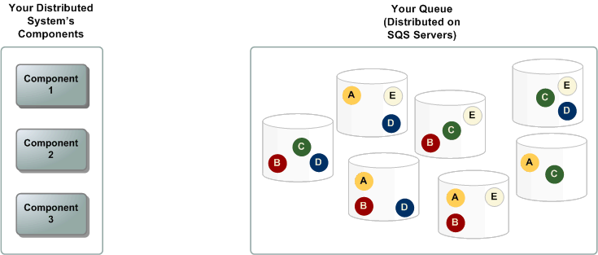

В этом разделе описываются части распределенной системы обмена сообщениями и объясняется жизненный цикл сообщения Cloud Queues.

## Распределенные очереди

Распределенная система обмена сообщениями состоит из трех основных частей: компонентов вашей распределенной системы, вашей очереди (распределенной на серверах Cloud Queues) и сообщений в очереди.

В следующем сценарии ваша система имеет несколько производителей (компонентов, которые отправляют сообщения в очередь) и потребителей (компонентов, которые получают сообщения из очереди). Очередь (которая содержит сообщения от A до E) избыточно хранит сообщения на нескольких серверах Cloud Queues.

~~

## Жизненный цикл сообщения

В следующем сценарии описывается жизненный цикл сообщения Cloud Queues в очереди от создания до удаления.

1. Производитель (компонент 1) отправляет сообщение A в очередь, и сообщение распределяется по серверам Cloud Queues с избыточностью.
2. Когда потребитель (компонент 2) готов обрабатывать сообщения, он принимает сообщения из очереди, и возвращается сообщение A. Пока сообщение A обрабатывается, оно остается в очереди и не возвращается в последующие запросы на получение в течение времени ожидания видимости.
3. Потребитель (компонент 2) удаляет сообщение A из очереди, чтобы предотвратить получение и повторную обработку сообщения по истечении времени ожидания видимости.

<warn>

В сервисе действует ряд [ограничений](../limitations/).

</warn>
