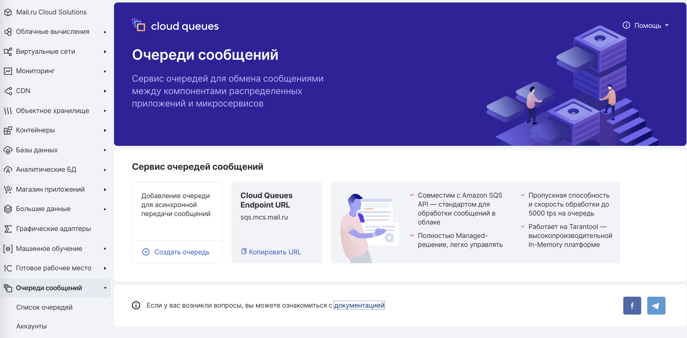
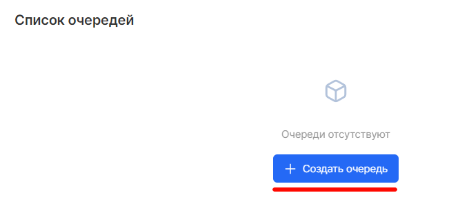
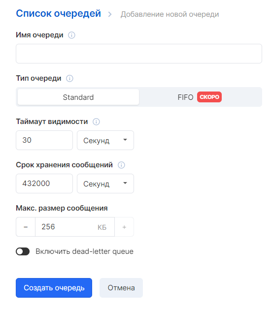
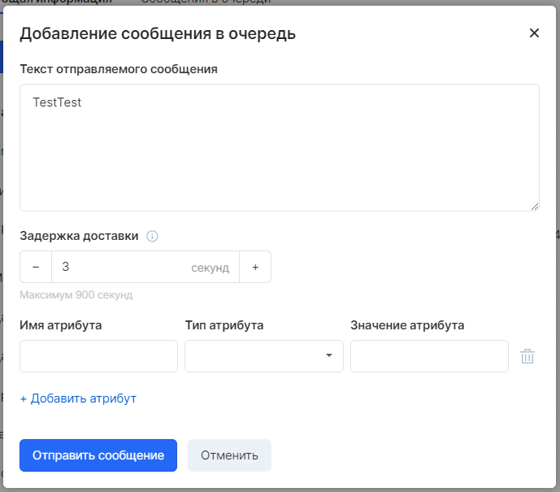
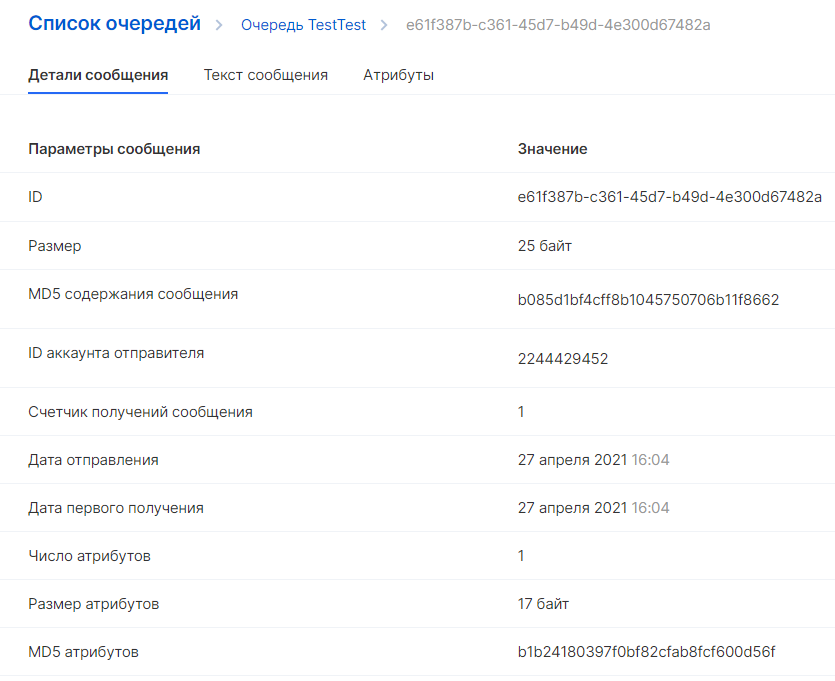

Раздел поможет ближе познакомиться с Cloud Queues и показать, как управлять очередями и сообщениями с помощью панели управления Cloud Queues.

Создание очереди
----------------

Первая и наиболее распространенная задача Cloud Quques- создание очередей. Эта процедура показывает, как создать и настроить очередь.

Выберите "Создать очередь":

Введите имя для своей очереди и её тип (Standart или FIFO). 

Чтобы создать очередь с параметрами по умолчанию, прокрутите вниз и выберите «Создать очередь».

VK CS SQS распространяет информацию о новой очереди по системе. Поскольку Cloud Quques является распределенной системой, может возникнуть небольшая задержка перед отображением очереди на странице «Список очередей» .

Отправка сообщения
------------------

После создания очереди вы можете отправить в нее сообщение.

На левой панели навигации выберите Список очередей. В списке очередей выберите созданную вами очередь:

Нажмите Добавить сообщение, затем введите текст в тело сообщения и выберите другие нужные вам параметры.

Выберите "Отправить сообщение".

Ваше сообщение отправлено, и на консоли отобразится сообщение об успешном добавлении в очередь. 

Просмотр и удаление своего сообщения
------------------------------------

После того, как вы отправите сообщение в очередь, вы можете посмотреть сообщение и его атрибуты из конкретной очереди. 

На странице "Список очередей" выберите нужную очередь и затем кликните на конкретном сообщении для его просмотра.

На вкладке «Сообщения в очереди» отображается список полученных сообщений. Для каждого сообщения в списке отображается идентификатор сообщения, размер, дата отправки, и количество приемов.

Чтобы удалить сообщения, выберите сообщения, которые вы хотите удалить, а затем выберите «Удалить».