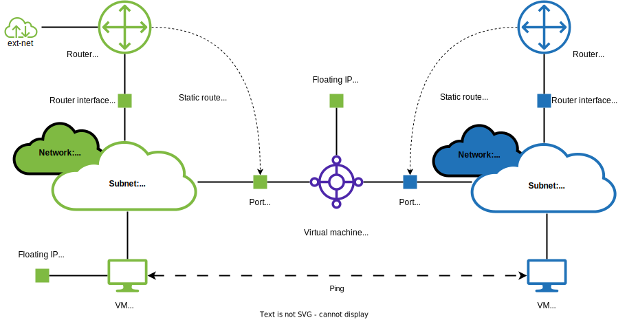

Далее приведен пример настройки маршрутизации между двумя сетями с помощью Terraform.

Инфраструктура примера:

- В примере созданы две сети: приватная `common-private` и публичная `common-public`. Каждая сеть состоит из одной подсети.
- Для каждой сети созданы маршрутизаторы с интерфейсами в соответствующих подсетях.
- Для маршрутизатора публичной сети настроен доступ к внешней сети `ext-net`. Поэтому объектам в этой сети можно назначать плавающие IP-адреса.
- В каждой сети создан порт, который соответствует его единственной подсети. К этим портам подключается виртуальная машина `common-router` , выступающая в роли маршрутизатора между двумя сетями.
- На маршрутизаторах настроены статические маршруты, ведущие к другой подсети через порт виртуальной машины.
- Создано по виртуальной машине в каждой подсети. Виртуальная машина в публичной сети имеет плавающий IP-адрес.

  Эти машины используются для [проверки настройки маршрутизации между сетями](#5--proverte-rabotosposobnost-primera): успешный пинг между ними будет свидетельствовать о корректной настройке.



## Перед началом работы

1. Ознакомьтесь с доступными ресурсами и [квотами](/ru/base/account/concepts/quotasandlimits) для [региона](/ru/base/account/concepts/regions), в котором планируется создать кластер. Для разных регионов могут быть настроены разные квоты.

   Если вы хотите увеличить квоты, обратитесь в [техническую поддержку](/ru/contacts).

1. Убедитесь, что клиент OpenStack [установлен](/ru/manage/tools-for-using-services/openstack-cli#1_ustanovite_klient_openstack), и [пройдите аутентификацию](/ru/manage/tools-for-using-services/openstack-cli#3_proydite_autentifikaciyu) в проекте.

1. [Установите Terraform и настройте провайдер](../../../quick-start), если этого еще не сделано.

   Поместите настройки провайдера в файл конфигурации Terraform `provider.tf`.

1. Создайте файл конфигурации Terraform `variables.tf` с переменными:

   ```hcl
   variable "image_flavor" {
     type = string
     default = "Ubuntu-22.04-202208"
   }

   variable "compute_flavor" {
     type = string
     default = "Basic-1-2-20"
   }

   variable "key_pair_name" {
     type = string
     default = "default"
   }

   variable "availability_zone_name" {
     type = string
     default = "MS1"
   }
   ```

   В этом файле объявляются следующие переменные:

   - `image_flavor`: имя образа виртуальной машины;
   - `compute_flavor`: имя шаблона конфигурации виртуальной машины;
   - `key_pair_name`: имя ключевой пары, которая будет использоваться для подключения к виртуальной машине по SSH;
   - `availability_zone_name`: имя зоны доступности, где будет размещена виртуальная машина.

   При необходимости скорректируйте значения переменных, уточнив их допустимые значения:

   <tabs>
   <tablist>
   <tab>image_flavor</tab>
   <tab>compute_flavor</tab>
   <tab>key_pair_name</tab>
   <tab>availability_zone_name</tab>
   </tablist>
   <tabpanel>

   C помощью OpenStack CLI:

   ```bash
   openstack image list
   ```

   </tabpanel>
   <tabpanel>

   C помощью OpenStack CLI:

   ```bash
   openstack flavor list
   ```

   </tabpanel>
   <tabpanel>

   C помощью OpenStack CLI:

   ```bash
   openstack keypair list
   ```

   </tabpanel>
   <tabpanel>

   Из документа, посвященного [зонам доступности](/ru/additionals/start/architecture#zony_dostupnosti_d9f6db93).

   </tabpanel>
   </tabs>

## 1. Создайте файлы с описанием базовой сетевой инфраструктуры

1. Создайте файл конфигурации Terraform `common-public.tf`. В нем описываются:

   - публичная сеть и подсеть;
   - маршрутизатор с доступом к внешней сети `ext-net` и интерфейсом в публичной подсети.

   ```hcl
   data "vkcs_networking_network" "extnet" {
     name = "ext-net"
   }

   resource "vkcs_networking_network" "common-public" {
     name = "common-public-net"
   }

   resource "vkcs_networking_subnet" "common-public" {
     name            = "common-public-subnet"
     network_id      = vkcs_networking_network.common-public.id
     cidr            = "192.168.200.0/24"
     dns_nameservers = ["8.8.8.8", "8.8.4.4"]
   }

   resource "vkcs_networking_router" "common-public" {
     name                = "common-public-router"
     admin_state_up      = true
     external_network_id = data.vkcs_networking_network.extnet.id
   }

   resource "vkcs_networking_router_interface" "common-public" {
     router_id = vkcs_networking_router.common-public.id
     subnet_id = vkcs_networking_subnet.common-public.id
   }
   ```

1. Создайте файл конфигурации Terraform `common-private.tf`. В нем описываются:

   - приватная сеть и подсеть;
   - маршрутизатор с интерфейсом в приватной подсети.

   ```hcl
   resource "vkcs_networking_network" "common-private" {
     name = "common-private-net"
   }

   resource "vkcs_networking_subnet" "common-private" {
     name            = "common-private-subnet"
     network_id      = vkcs_networking_network.common-private.id
     cidr            = "192.168.199.0/24"
     dns_nameservers = ["8.8.8.8", "8.8.4.4"]
   }

   resource "vkcs_networking_router" "common-private" {
     name           = "common-private-router"
     admin_state_up = true
   }

   resource "vkcs_networking_router_interface" "common-private" {
     router_id = vkcs_networking_router.common-private.id
     subnet_id = vkcs_networking_subnet.common-private.id
   }
   ```

## 2. Создайте файл с описанием инфраструктуры для виртуальной машины в роли маршрутизатора

Создайте файл конфигурации Terraform `main.tf`. В нем описываются:

- Порты в публичной и приватной подсетях, к которым подключается виртуальная машина.
- Конфигурация виртуальной машины.

  В конфигурации используется параметр `user_data`, чтобы выполнить команду, которая включает маршрутизацию, с помощью `cloud-init`:

  ```bash
  sysctl -w net.ipv4.ip_forward=1
  ```

- Статические маршруты к нужным сетям через порты виртуальной машины.
- Плавающий IP-адрес для подключения к виртуальной машине по SSH.

```hcl
data "vkcs_compute_flavor" "router-compute" {
  name = var.compute_flavor
}

data "vkcs_images_image" "router-image" {
  name = var.image_flavor
}

resource "vkcs_networking_port" "common-private" {
  name       = "common-private"
  network_id = vkcs_networking_network.common-private.id
  allowed_address_pairs {
    ip_address = vkcs_networking_subnet.common-public.cidr
  }
  admin_state_up = "true"
}

resource "vkcs_networking_port" "common-public" {
  name       = "common-public"
  network_id = vkcs_networking_network.common-public.id
  allowed_address_pairs {
    ip_address = vkcs_networking_subnet.common-private.cidr
  }
  admin_state_up = "true"
}

resource "vkcs_compute_instance" "common-router" {
  name              = "common-router"
  flavor_id         = data.vkcs_compute_flavor.router-compute.id
  security_groups   = ["default", "ssh"]
  availability_zone = var.availability_zone_name
  key_pair          = var.key_pair_name
  config_drive      = true

  user_data = <<EOF
#cloud-config
runcmd:
- sysctl -w net.ipv4.ip_forward=1
EOF

  block_device {
    uuid                  = data.vkcs_images_image.router-image.id
    source_type           = "image"
    volume_size           = 10
    volume_type           = "ceph-ssd"
    boot_index            = 0
    destination_type      = "volume"
    delete_on_termination = true
  }

  network {
    port = vkcs_networking_port.common-public.id
  }

  network {
    port = vkcs_networking_port.common-private.id
  }

  depends_on = [
    vkcs_networking_network.common-private,
    vkcs_networking_subnet.common-private,
    vkcs_networking_network.common-public,
    vkcs_networking_subnet.common-public
  ]
}

resource "vkcs_networking_router_route" "common-public" {
  router_id        = vkcs_networking_router.common-public.id
  destination_cidr = vkcs_networking_subnet.common-private.cidr
  next_hop         = vkcs_networking_port.common-public.all_fixed_ips[0]
  depends_on = [
    vkcs_networking_router_interface.common-public,
    vkcs_networking_port.common-public,
    vkcs_compute_instance.common-router
  ]
}

resource "vkcs_networking_router_route" "common-private" {
  router_id        = vkcs_networking_router.common-private.id
  destination_cidr = vkcs_networking_subnet.common-public.cidr
  next_hop         = vkcs_networking_port.common-private.all_fixed_ips[0]
  depends_on = [
    vkcs_networking_router_interface.common-private,
    vkcs_networking_port.common-private,
    vkcs_compute_instance.common-router
  ]
}

resource "vkcs_networking_floatingip" "fip-router" {
  pool = data.vkcs_networking_network.extnet.name
}

resource "vkcs_compute_floatingip_associate" "fip-router" {
  floating_ip = vkcs_networking_floatingip.fip-router.address
  instance_id = vkcs_compute_instance.common-router.id
}
```

## 3. Создайте файл с описанием тестовых виртуальных машин

Создайте файл конфигурации Terraform `test-vms.tf`. В нем описываются:

- Виртуальные машины:

  - `common-instance-public` в публичной подсети с плавающим адресом. К такой виртуальной машине можно подключиться по SSH из интернета.
  - `common-instance-private` в приватной подсети. К такой виртуальной машине можно подключиться по SSH с другой виртуальной машины.

  Эти виртуальные машины будут использоваться для [проверки работоспособности маршрутизации между двумя сетями](#5--proverte-rabotosposobnost-primera).

- Выводы ([output](https://developer.hashicorp.com/terraform/language/values/outputs)) Terraform с IP-адресами виртуальных машин.

```hcl
data "vkcs_compute_flavor" "vm-compute" {
  name = var.compute_flavor
}

data "vkcs_images_image" "vm-image" {
  name = var.image_flavor
}

resource "vkcs_compute_instance" "common-private" {
  name              = "common-instance-private"
  flavor_id         = data.vkcs_compute_flavor.vm-compute.id
  security_groups   = ["default", "ssh"]
  availability_zone = var.availability_zone_name
  key_pair          = var.key_pair_name

  block_device {
    uuid                  = data.vkcs_images_image.vm-image.id
    source_type           = "image"
    volume_size           = 10
    volume_type           = "ceph-ssd"
    boot_index            = 0
    destination_type      = "volume"
    delete_on_termination = true
  }

  network {
    uuid = vkcs_networking_network.common-private.id
  }

  depends_on = [
    vkcs_networking_network.common-private,
    vkcs_networking_subnet.common-private
  ]
}

resource "vkcs_compute_instance" "common-public" {
  name              = "common-instance-public"
  flavor_id         = data.vkcs_compute_flavor.vm-compute.id
  security_groups   = ["default", "ssh"]
  availability_zone = var.availability_zone_name
  key_pair          = var.key_pair_name

  block_device {
    uuid                  = data.vkcs_images_image.vm-image.id
    source_type           = "image"
    volume_size           = 10
    volume_type           = "ceph-ssd"
    boot_index            = 0
    destination_type      = "volume"
    delete_on_termination = true
  }

  network {
    uuid = vkcs_networking_network.common-public.id
  }

  depends_on = [
    vkcs_networking_network.common-public,
    vkcs_networking_subnet.common-public
  ]
}

resource "vkcs_networking_floatingip" "fip" {
  pool = data.vkcs_networking_network.extnet.name
}

resource "vkcs_compute_floatingip_associate" "fip" {
  floating_ip = vkcs_networking_floatingip.fip.address
  instance_id = vkcs_compute_instance.common-public.id
}

output "common-instance-public-floating-ip" {
  description = "The common-public VM floating IP address"
  value       = vkcs_networking_floatingip.fip.address
}

output "common-instance-public-ip" {
  description = "The common-public VM IP address"
  value       = vkcs_compute_instance.common-public.network[0].fixed_ip_v4
}

output "common-instance-private-ip" {
  description = "The common-private VM IP address"
  value       = vkcs_compute_instance.common-private.network[0].fixed_ip_v4
}
```

## 4. Создайте необходимые ресурсы с помощью Terraform

1. Поместите созданные файлы конфигурации Terraform в одну директорию:

   - `provider.tf`;
   - `variables.tf`;
   - `main.tf`;
   - `common-public.tf`;
   - `common-private.tf`;
   - `test-vms.tf`.

1. Перейдите в эту директорию.

1. Выполните команду:

   ```bash
   terraform init
   ```

1. Выполните команду:

   ```bash
   terraform apply
   ```

   При запросе подтверждения введите `yes`.

1. Дождитесь завершения операции.

   После завершения создания ресурсов будут показаны следующие выводы Terraform:

   - `common-instance-private-ip`: IP-адрес виртуальной машины в приватной подсети.
   - `common-instance-public-ip`: IP-адрес виртуальной машины в публичной подсети.
   - `common-instance-public-floating-ip`: плавающий IP-адрес виртуальной машины в публичной подсети.

   Используйте эти IP-адреса при [проверке работоспособности примера](#5--proverte-rabotosposobnost-primera).

## 5. Проверьте работоспособность примера

1. [Подключитесь по SSH](/ru/base/iaas/vm-start/vm-connect/vm-connect-nix) к виртуальной машине `common-instance-public`.

   Для подключения используйте:

   - IP-адрес из вывода `common-instance-public-floating-ip`.
   - SSH-ключ с именем, указанным в переменной `key_pair_name` файла `variables.tf`.

1. Выполните пинг IP-адреса из вывода `common-instance-private-ip`:

   ```bash
   ping 192.168.199.XXX
   ```

   Успешный пинг свидетельствует о корректной работе примера:

   ```text
   PING 192.168.199.XXX (192.168.199.XXX) 56(84) bytes of data.
   64 bytes from 192.168.199.XXX: icmp_seq=1 ttl=63 time=1.82 ms
   64 bytes from 192.168.199.XXX: icmp_seq=2 ttl=63 time=0.875 ms
   64 bytes from 192.168.199.XXX: icmp_seq=3 ttl=63 time=0.903 ms
   64 bytes from 192.168.199.XXX: icmp_seq=4 ttl=63 time=0.966 ms
   ^C
   --- 192.168.199.10 ping statistics ---
   4 packets transmitted, 4 received, 0% packet loss, time 3004ms
   rtt min/avg/max/mdev = 0.875/1.139/1.815/0.391 ms
   ```

## Проконтролируйте использование ресурсов

Если созданные с помощью Terraform ресурсы вам больше не нужны, удалите их:

1. Перейдите в директорию с файлами конфигурации Terraform.

1. Выполните команду:

   ```bash
   terraform destroy
   ```

   При запросе подтверждения введите `yes`.

1. Дождитесь завершения операции.
