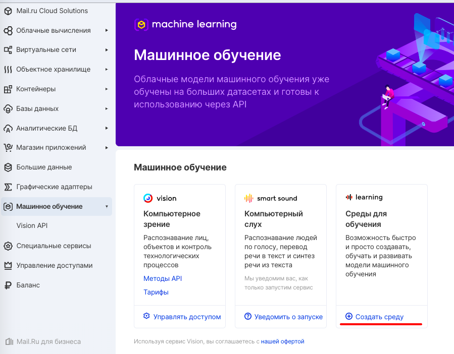
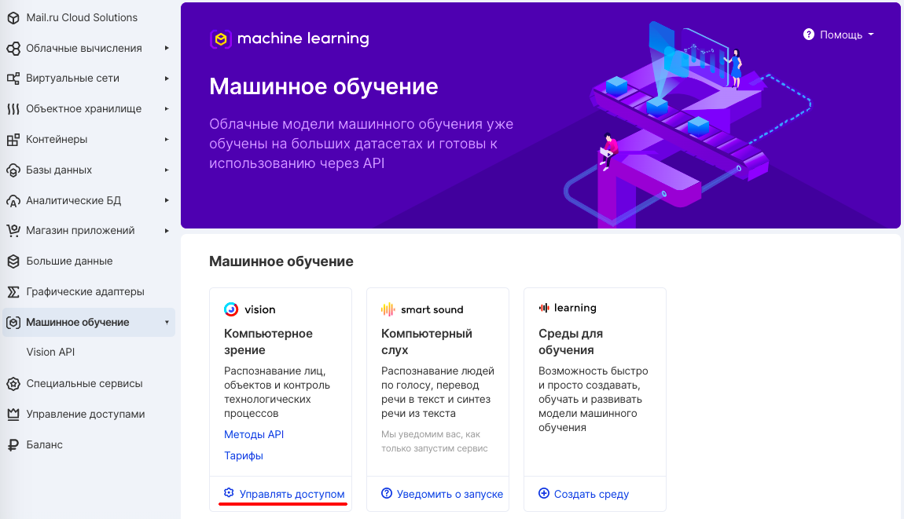
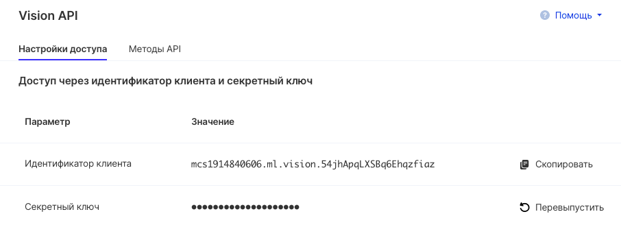

Сервис машинного обучения по умолчанию подключен во всех создаваемых проектах VK CS.

## Среды для обучения

Для создания и запуска виртуальной машины с интегрированными инструментами машинного обучения достаточно на странице сервиса нажать "Создать среду":

## Vision

Подключиться к сервису можно двумя разными способами, описанными ниже.

## API Endpoint

API Endpoint - это "точки входа", URL, по которому происходит подключение к сервису для управления. Для машинного обучения их два:

- Vision для распознавания изображений https://smarty.mail.ru/
- Vision для распознавания видео https://smarty.mail.ru/

## Доступ через идентификатор клиента и секретный ключ

Для управления доступом через идентификатор клиента и секретный ключ на [странице Vision API](https://mcs.mail.ru/app/services/machinelearning/vision/access/) отображается нужная информация. Идентификатор клиента уже сгенерирован и замене не подлежит, а ключ можно перевыпустить соответствующей кнопкой:

## Доступ через сервисный токен

Для генерации сервисного токена надо нажать кнопку и выбрать нужный скоуп:

Токен будет создан и отображён:

