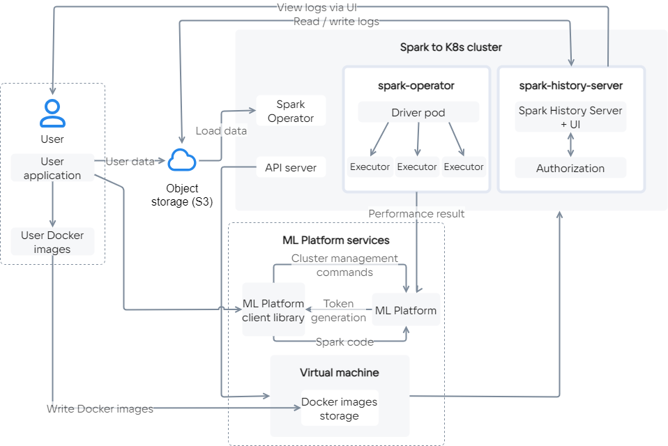

Apache Spark — ядро для обработки больших данных. Оно состоит из API-интерфейсов на Java, Scala, Python и R, а также инструментов обработки [Spark SQL](https://spark.apache.org/docs/latest/sql-programming-guide.html) для SQL, [pandas API](https://spark.apache.org/docs/latest/api/python/getting_started/quickstart_ps.html), [MLlib](https://spark.apache.org/docs/latest/ml-guide.html) для машинного обучения, [GraphX](https://spark.apache.org/docs/latest/graphx-programming-guide.html) для обработки графиков и [Structured Streaming](https://spark.apache.org/docs/latest/structured-streaming-programming-guide.html) для потоковой обработки. Чаще всего Spark используется в составе Hadoop-кластера.

Cloud Spark — решение на базе [Apache Spark Operator](https://github.com/GoogleCloudPlatform/spark-on-k8s-operator) и [PaaS Kubernetes](/ru/base/k8s) от VK Cloud. Оно позволяет развернуть Spark внутри Kubernetes с помощью образа из Docker Registry, без использования Hadoop-кластера.

## Для каких задач подходит сервис

- Распределенная обработка больших данных.
- Чтение данных из S3 с их дальнейшим экспортом в БД для обработки (ClickHouse / Greenplum / PostgreSQL). Также возможна передача данных из БД в S3.
- Распределенное обучение ML-моделей с использованием больших данных.
- Графовые вычисления с применением компонента [GraphX](https://spark.apache.org/docs/latest/graphx-programming-guide.html).

## Возможности сервиса

- Развертывание кластера Spark внутри Kubernetes.
- Автоматическая настройка master-узлов разворачиваемых кластеров.
- Подключение заранее собранного образа Spark через Docker Registry.
- Горизонтальное и вертикальное масштабирование кластера с поддержкой автомасштабирования.
- Разграничение доступов с помощью токенов и ролевой модели.
- Автоудаление или перевод кластера в спящий режим по расписанию.
- [Управление сервисом](https://mlplatform.hb.ru-msk.vkcs.cloud/mlplatform_client.tar.gz) с помощью API.

## Взаимодействие компонентов сервиса

