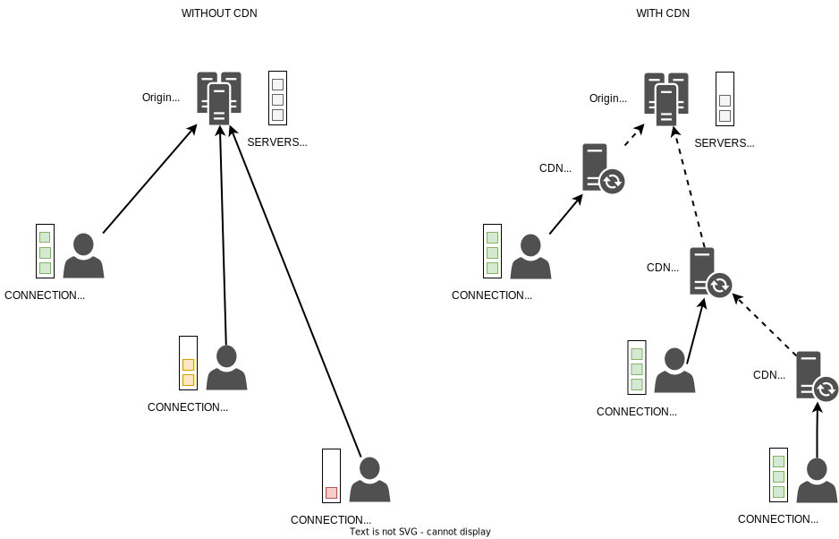

## Принцип работы CDN

CDN (Content Delivery Network) — это географически распределенные кеширующие серверы для раздачи контента, которые объединены в сеть.

При использовании CDN контент раздается с ближайшего к потребителю CDN-сервера. Если на этом сервере нет нужного контента, то он запрашивается с серверов-источников (origin) или соседних CDN-серверов и кешируется на некоторое время. В сервисе CDN VK Cloud также есть возможность [предварительной загрузки контента](../../instructions/upload-content/) на CDN-серверы, что дополнительно снижает нагрузку на серверы-источники.

Таким образом:

- Повышается скорость и надежность доставки контента конечному потребителю.

  Без CDN потребители, расположенные далеко от серверов-источников, могут испытывать проблемы с получением доступа к контенту. Например, возможно медленное или нестабильное соединение с этими серверами.

- Снижается нагрузка на серверы-источники. Также появляется возможность выдерживать повышенную нагрузку при запросе контента множеством потребителей.

  Без CDN все потребители обращаются к серверам-источникам, что создает большую нагрузку на эти серверы. CDN позволяет перенести нагрузку на CDN-серверы и распределить ее между ними.

## Возможности CDN VK Cloud

- Более 70 точек присутствия.

  Доступны следующие регионы: Европа, СНГ, Северная и Южная Америка.

  <info>

  Доступ к регионам Азии, Австралии и Африки предоставляется по запросу в [техническую поддержку](/ru/contacts).

  </info>

- Более 650 кеширующих CDN-серверов.
- Более 5000 пиринговых партнеров.
- Емкость сети более 50 терабит в секунду (Tbps).
