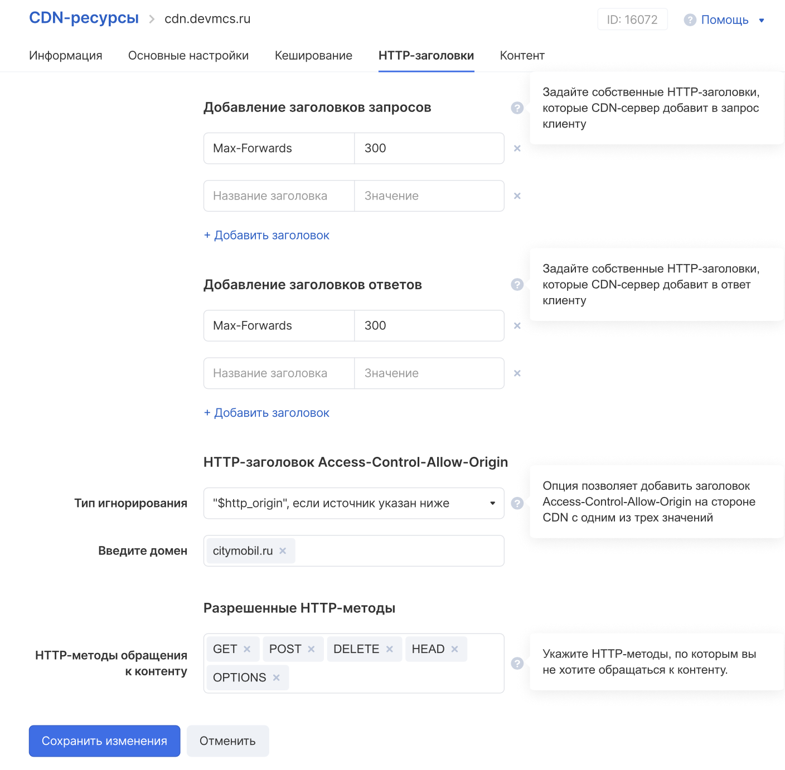

## Добавление ресурса

Для добавления ресурса следует перейти на закладку "CDN-ресурсы" (слева) и нажать на кнопку "Создать ресурс":


Затем заполнить поля по описанию:


Ресурс создан:


## Кеширование

Кеширование ресурса нужно для быстрой отдачи контента - например, если контент используется на популярном веб-ресурсе с посещением пользователей более 100 000 в месяц.

В настройках CDN-ресурса можно выставить нужные значения кеширования:


## HTTP-заголовки

Когда браузер запрашивает ресурс с сервера, он использует HTTP. Этот запрос включает набор пару ключ-значение, содержащих такую информацию, как версия браузера или форматы файлов, которые он понимает. Эти пары называются заголовками запросов.

Сервер отвечает запрашиваемым ресурсом, но также отправляет заголовки ответа, содержащие информацию о ресурсе или самом сервере.

В настройках CDN-ресурса можно настроить нужные заголовки с нужными параметрами:



## Настройки контента

В настройках ресурса CDN можно выставить необходимые настройки контента, включая код ответа HTTP и URL для редиректа:


## Группы источников

В случае, если есть необходимость раздавать контент из разных источников, в интерфейсе VK Cloud есть такая возможность.

Для добавления группы источников следует нажать кнопку "Создать группу источников":

А затем заполнить поля нужными данными:


## Настройка DNS

Создайте CNAME-запись cdn для доменной зоны devmcs.ru, направленную на [URL пользователя] ( в данном примере речь идёт о домене cl-0cc5e00c.gcdn.co).

Пример в формате BIND ниже:

```
$ORIGIN devmcs.ru. cdn CNAME cl-0cc5e00c.gcdn.co.
```

## Интеграция с CDN / раздача контента

1.  Надо определиться, какой контент (какие файлы) нужно раздавать через CDN.
2.  Надо определиться с источником/группой источников, через которые будет раздаваться контент.
3.  Надо загрузить контент в интерфейс VK Cloud.
4.  Надо создать DNS-запись (об этом выше).
5.  Надо заменить в пути до статических файлов оригинальный домен на персональный.
6.  Получившийся путь/URL и будет именно тем, который надо подставить в вёрстке веб-страницы (или иного ресурса) как URL нужного контента.

## Удаление CDN-ресурса

### Из интерфейса CDN

<tabs>
<tablist>
<tab>Личный кабинет</tab>
</tablist>
<tabpanel>

Это групповая операция: при необходимости можно удалить сразу несколько CDN-ресурсов, выбрав их с помощью флажков.

Для удаления CDN-ресурса:

1. [Перейдите](https://mcs.mail.ru/app/) в личный кабинет VK Cloud.
1. Выберите проект, где находится нужный CDN-ресурс.
1. Перейдите в раздел **CDN → CDN-ресурсы**.
1. Выполните одно из действий для нужного CDN-ресурса:

   - Выберите с помощью флажка ресурс, затем нажмите кнопку **Удалить**.
   - Раскройте меню ресурса и выберите пункт **Удалить**.

1. Подтвердите удаление.

</tabpanel>
</tabs>

### Из интерфейса бакета

Если бакет объектного хранилища используется в качестве источника для CDN, то ресурс CDN можно удалить из интерфейса бакета.

<tabs>
<tablist>
<tab>Личный кабинет</tab>
</tablist>
<tabpanel>

1. [Перейдите](https://mcs.mail.ru/app/) в личный кабинет VK Cloud.
1. Выберите проект, где находится нужный бакет.
1. Перейдите в раздел **Объектное хранилище → Бакеты**.
1. Нажмите на имя нужного бакета.
1. Перейдите на вкладку **CDN**.
1. Выключите опцию **Использовать CDN для данного бакета**.
1. Нажмите кнопку **Сохранить изменения**.
1. В появившемся окне выберите опцию **Удалить привязанный CDN-ресурс**.
1. Нажмите кнопку **Отключить CDN**.

</tabpanel>
</tabs>
