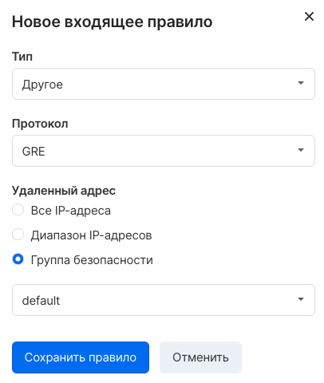
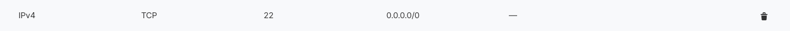
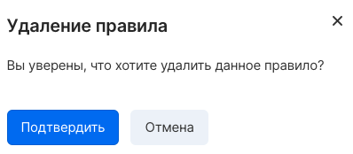

Правило группы безопасности - это набор параметров, определяющих условия прохождения трафика. Правила объединяются в группы, которые в свою очередь применяются для портов инстансов.

Для управления правилами группы безопасности нужно нажать на название группы на странице "Настройки firewall" страницы "Виртуальные сети" [личного кабинета VK Cloud](https://mcs.mail.ru/app/services/infra/firewall/).

## Добавление правила

Для добавления нового правила следует выбрать "Добавить правило" в разделе "Входящий трафик" или "Исходящий трафик".

Возможен выбор предустановленного типа трафика (SSH, HTTP, HTTPS и т.д) или детальная настройка протокола и порта:

В разделе "Удаленный адрес" нужно настроить адрес, для которого выбранный тип трафика будет разрешен. Поддерживается указание адреса сети в формате CIDR или выбор группы безопасности - во втором случае будет разрешен трафик от инстансов, которые состоят в выбранной группе.

## Удаление правил

Для удаления правила нужно нажать на значок корзины в строке с нужным правилом:

После чего подтвердить удаление:

## Управление правилами OpenStack CLI

Управление правилами групп безопасности осуществляется с помощью клиента OpenStack:

Просмотр групп безопасности в проекте:

```
openstack security group list
```

Просмотр списка правил группы:

```
openstack security group rule list --long <ID группы>
```

Получение информации о группе безопасности:

```
openstack security group show <ID группы>
```

Создание правила:

```
openstack security group rule create <аргументы> <ID группы безопасности>
```

Доступные аргументы команды создания правила:

- \--remote-ip - указывает адрес, с которого может осуществляться подключения (в формате CIDR)
- \--remote-group - указывает группу, инстансы которой могут быть источником трафика
- \--dst-port - порт назначения, требуется для TCP и UDP протоколов
- \--protocol - протокол, возможно указание названия, номера или разрешение всех протоколов (any)
- \--description - произвольное описание
- \--icmp-type - тип ICMP
- \--icmp-code - код ICMP
- \--ingress - применить правило для входящего трафика
- \--egress - применить правило для исходящего трафика
- \--ethertype - значение EtherType (IPv4, IPv6)

Удаление правила:

```
openstack security group rule delete <ID правила>
```

Просмотр детальной информации для правила:

```
openstack security group rule show <ID правила>
```
