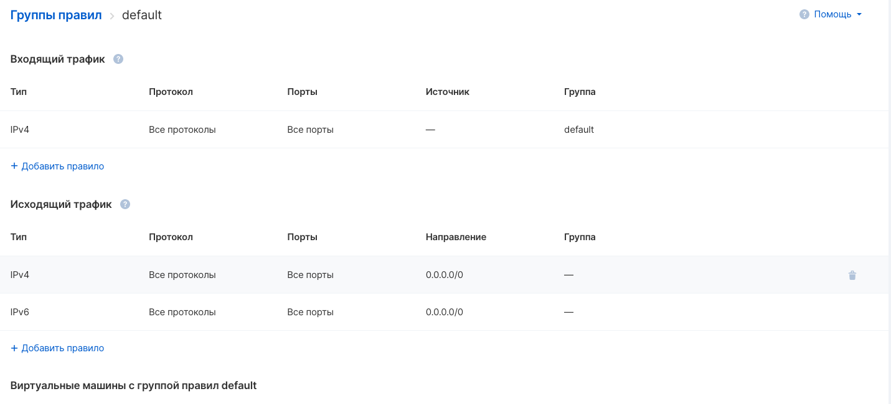
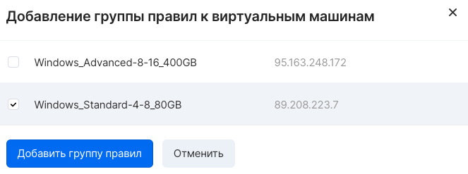

Группа безопасности - это набор настраиваемых разрешающих правил прохождения трафика, которые возможно назначать на порты инстансов.

### Важно

GRE трафик доступен только в ext-net сетях.

### Важно

Если ваша виртуальная машина содержит функцию "**allowed address pairs**", которая разрешает весь трафик, то группа безопасности "**default**" не будет работать как задумано.

Если вам точно нужно использовать эту функцию, то в качестве решения нужно либо удалять из default группы виртуальную машину с этой функцией (но тогда нужно создать группу, разрешающую трафик из подсети ВМ, которые захотят с ней общаться), либо удалить разрешающее правило 0.0.0.0/0 с порта ВМ.

Создание группы безопасности
----------------------------

Создание группы безопасности можно произвести на странице "Настройки firewall" раздела "Виртуальные сети" [в личном кабинете VK CS](https://mcs.mail.ru/app/services/infra/shares/) с помощью кнопки "Добавить":

Просмотр списка правил
----------------------

Чтобы просмотреть текущий список правил в группе безопасности, следует открыть желаемую группу безопасности в списке групп на странице "Настройки firewall". Появится окно просмотра и редактирования правил группы:

Назначение группы правил на инстанс
-----------------------------------

Для применения набора правил к виртуальной машине, группу безопасности, содержащую этот набор, необходимо применить к виртуальной машине.

Для назначения группы на инстанс необходимо перейти в настройки группы и выбрать "Добавить виртуальную машину" в разделе "Виртуальные машины с группой правил". В появившемся меню выбрать инстансы, к которым будет добавлена группа:

Удаление группы безопасности
----------------------------

Удаление групп безопасности производится через опцию "Удалить" в контекстном меню группы на странице "Настройки firewall". 

**Внимание**

Группа не может быть удалена до тех пор, пока есть порты, которые используют эту группу. Также не может быть удалена группа безопасности "default".

Операции в OpenStack CLI
------------------------

Для создания группы безопасности в клиенте OpenStack нужно выполнить команду:

```
openstack security group create --description <описание группы> <название новой группы>
```

Изменить описание, название группы:

```
openstack security group set --description <описание> --name <название> <ID группы>
```

Добавить группу к инстансу:

```
openstack server add security group <ID инстанса> <ID группы безопасности>
```

Отвязать группу от инстанса:

```
openstack server remove security group <ID инстанса> <ID группы безопасности>
```

Просмотреть правила группы безопасности:

```
openstack security group rule list --long <ID группы безопасности>
```

Удалить группу:

```
openstack security group delete <ID группы>
```