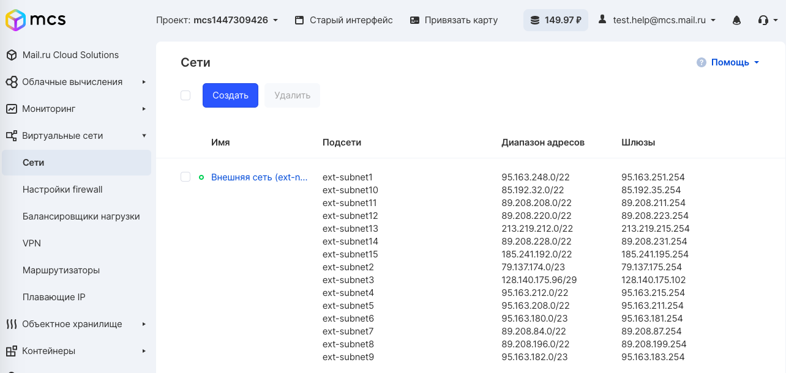
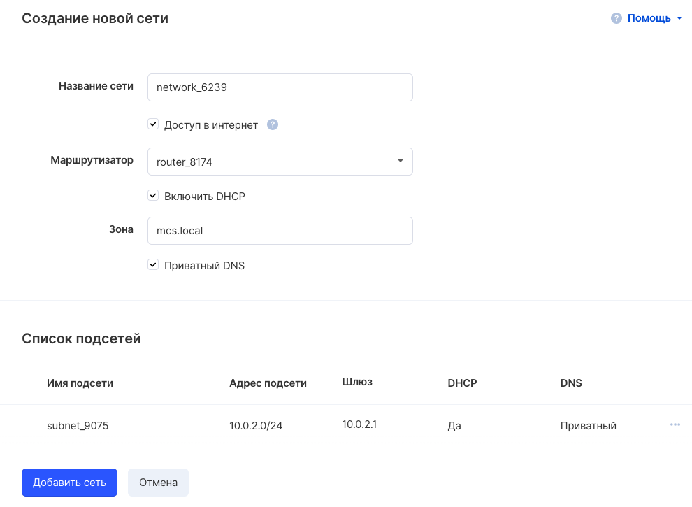
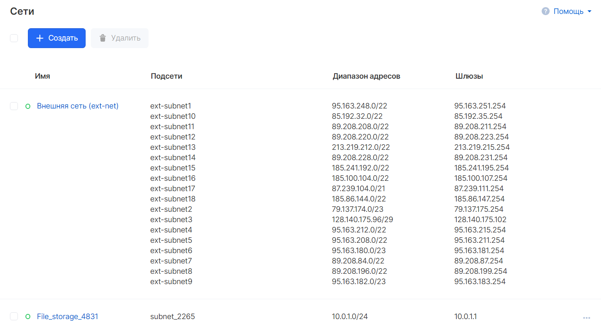
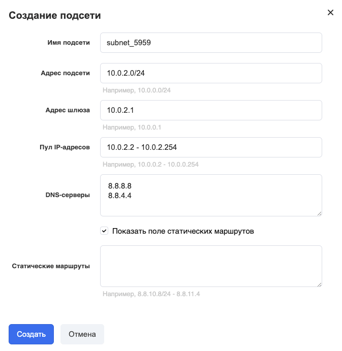
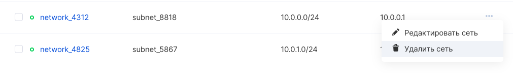

В [личном кабинете раздел "Виртуальные сети"](https://mcs.mail.ru/app/services/server/networks/) отвечает за создание сетей и подсетей. После создания сети и подсети становятся сразу доступны для всех виртуальных машин проекта. Для того чтобы другие виртуальные машины видели друг друга в пределах одной сети или подсети, необходимо задать соответствующие сетевые настройки (принадлежность к этой сети или подсети) в каждой из виртуальных машин.

По умолчанию в проекте уже создана одна сеть с несколькими подсетями:

## Создание сети

В разделе "Сети" можно создать сеть, использую кнопку "Создать". Откроется мастер создания новой сети :

После создания сети она появится в общем списке сетей:

## PTR-запись

Для прописывания обратной PTR-записи нужно обратиться в [техническую поддержку](https://mcs.mail.ru/help/contact-us).

## Создание подсети

Для создания подсети необходимо предварительно выбрать сеть из списка созданных сетей в разделе "Виртуальные сети" Личного кабинета VK Cloud.

При нажатии на кнопку "Добавить подсеть" откроется мастер создания подсети, в котором следует указать желаемую конфигурацию подсети и можно задать статические маршруты:

## Удаление сети

Для удаления сети или подсети достаточно выбрать соответствующий пункт меню в выпадающем списке при наведении:

