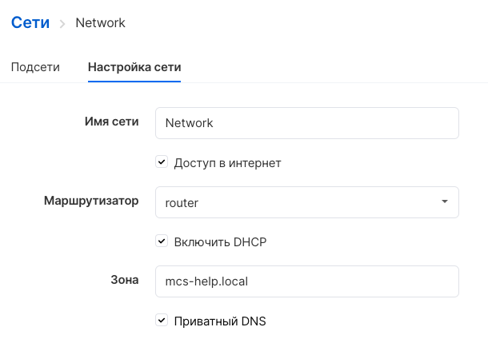
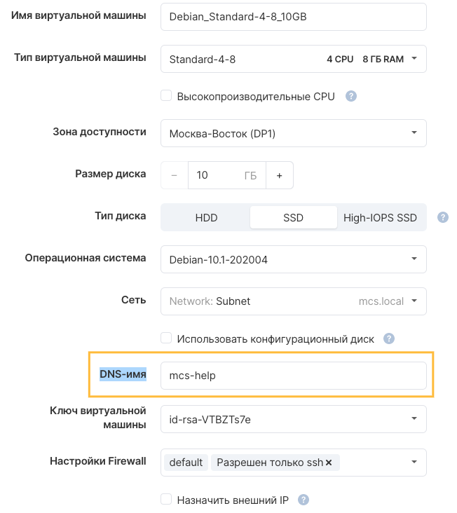
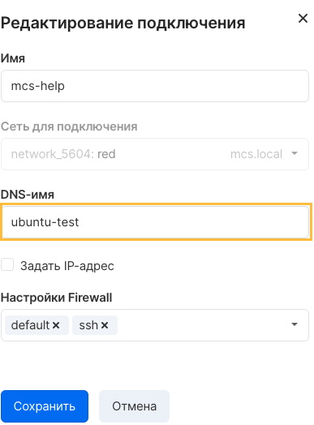

Приватный DNS в VK CS - функционал DNS сервера, работающего в проектных сетях и позволяющего обращаться к инстансам по DNS-именам.

Сервис поддерживает настройку приватной зоны и имен портов виртуальных машин. DNS сервер отвечает по тем же адресам, что и порты DHCP в сети. Для работы приватного DNS в сети должен быть включен DHCP-сервер.

**Примечание**

В данный момент серверы пересылки запросов приватного DNS - 8.8.8.8, 8.8.4.4, изменение этих адресов не поддерживается.

## Включение приватного DNS

Включение сервиса для определенной сети можно выполнить в раздел "Сети" сервиса "Облачные вычисления" [в личном кабинете VK CS](https://mcs.mail.ru/app/services/server/networks/) . На странице требуемой сети, на вкладке "Настройка сети" выбрать опцию "Приватный DNS" и ввести имя зоны:

**Внимание**

Максимальная длина имени зоны - 253 символа. Состоит из блоков вида "[a-z0-9-]+\\.". Максимальная длина блока - 63 символа. Блок не может начинаться и заканчиваться на "-".

## Настройка DNS имени

При создании виртуальной машины в приватной сети существует возможность ввести DNS-имя:

Также изменить имя возможно в настройках подключения на странице инстанса, выбрав опцию "Редактировать подключение" в контекстном меню порта:

**Внимание**

Максимальная длина имени - 63 символа. Допустимы только цифры, маленькие латинские буквы и символ тире "-".

## OpenStack CLI

Для редактирования DNS имени ВМ в клиенте OpenStack следует:

Получить список портов инстанса:

```
openstack port list --server <ID сервера>
```

Указать DNS-имя для порта:

```
openstack port set --dns-name <DNS-имя> <ID порта>
```
