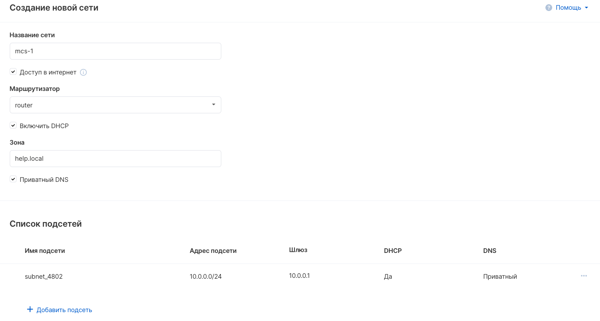
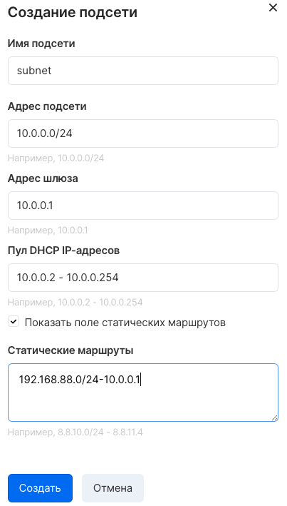

Платформа VK Cloud позволяет создавать и настраивать приватные сети в проекте, идентичные локальным сетям.

По умолчанию, в новом проекте доступна только ext-net, это внешняя сеть, общая для всех проектов. Ext-net не является приватной сетью.

## Панель управления VK Cloud

Управление сетями в [личном кабинете VK Cloud](https://mcs.mail.ru/app/services/server/networks/) осуществляется на странице "Сети" сервиса "Виртуальные сети".

Для создания сети нужно нажать "Создать" в верхнем меню страницы. Появится окно настройки параметров новой сети:



Необходимо настроить следующие параметры:

<table style="width: 100%;"><tbody><tr><td style="width: 19.1593%;">Название сети</td><td style="width: 80.7522%;">Ввод произвольного названия создаваемой сети.</td></tr><tr><td style="width: 19.1593%;">Доступ в интернет</td><td style="width: 80.7522%;">Подключение сети к маршрутизатору. Без установки параметра не будут работать сервисы VPN, SNAT, маршрутизация между сетями. Сеть будет недоступна для развертывания PaaS сущностей.</td></tr><tr><td style="width: 19.1593%;">Маршрутизатор</td><td style="width: 80.7522%;">Выбор маршрутизатора для подключения сети.</td></tr><tr><td style="width: 19.1593%;">Включить DHCP</td><td style="width: 80.7522%;">Выбор элемента включает сервер DHCP в сети.</td></tr><tr><td style="width: 19.1593%;">Зона</td><td style="width: 80.7522%;">Ввод зоны приватного DNS.</td></tr><tr><td style="width: 19.1593%;">Приватный DNS</td><td style="width: 80.7522%;">Установка элемента включает сервис приватного DNS.</td></tr></tbody></table>

Затем нужно настроить параметры создаваемой подсети:

<table style="width: 100%;"><tbody><tr><td style="width: 23.0531%;">Имя подсети</td><td style="width: 76.8584%;">Ввод произвольного названия подсети.</td></tr><tr><td style="width: 23.0531%;">Адрес подсети</td><td style="width: 76.8584%;">Ввод адресации в формате CIDR. Не может быть изменен после создания подсети.</td></tr><tr><td style="width: 23.0531%;">Адрес шлюза</td><td style="width: 76.8584%;">Ввод адреса шлюза сети.</td></tr><tr><td style="width: 23.0531%;">Пул DHCP IP-адресов</td><td style="width: 76.8584%;">Настройка диапазона адресов, выдаваемых клиенту по DHCP</td></tr><tr><td style="width: 23.0531%;">Статические маршруты</td><td style="width: 76.8584%;">Ввод статических маршрутов. Добавление статических маршрутов в сеть клиента требуется при использовании VPNaaS.</td></tr></tbody></table>

После завершения настройки параметров нужно нажать "Добавить сеть".

Для изменения параметров существующей сети следует выбрать опцию "Редактировать сеть" в контекстном меню на странице списка сетей. Возможно добавление новых подсетей, смена маршрутизатора, включение или отключение DHCP/DNS, также смена адресации.

## OpenStack CLI

Управление сетями проекта может выполняться в клиенте OpenStack:

Создание сети:

```
openstack network create <название сети>
```

Создание подсети:

```
openstack subnet create --network <название сети> --dns-nameserver <адрес DNS> --gateway <адрес шлюза> --subnet-range <адрес подсети> <название>
```

Создание маршрутизатора:

```
openstack router create <название>
```

Подключение маршрутизатора к внешней сети:

```
openstack router set --external-gateway ext-net <ID роутера>
```

Подключение подсети к маршрутизатору:

```
openstack router add subnet <ID роутера> <ID подсети>
```

Получение списка сетей:

```
openstack network list
```
