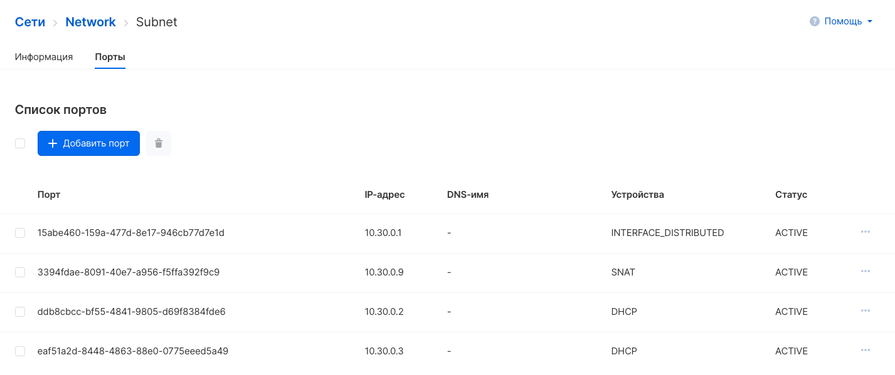

Порт - виртуальная сетевая карта инстанса, содержащая IP адрес, DNS имя и группы безопасности.

Операции с портами можно выполнять [в личном кабинете VK CS](https://mcs.mail.ru/app/services/infra/shares/) и в Openstack CLI.

## Просмотр портов

В личном кабинете VK CS возможен просмотр существующих портов приватных сетей. Для этого нужно перейти на страницу "Сети" раздела "Виртуальные сети", выбрать требуемую сеть, затем открыть подсеть.

На вкладке "Порты" показана подсеть, подключенная к интернет (видны порты маршрутизатора: SNAT, INTERFACE_DISTRIBUTED) и с включенным DHCP (адрес порта DHCP также является адресом приватного DNS сервера).

## Добавление портов

В панели VK CS добавление порта (сетевого подключения) к виртуальной машине производится выбором опции "Добавить подключение" на вкладке "Информация о сетях" страницы инстанса:

В параметрах добавляемого подключения необходимо заполнить поля:

<table><tbody><tr><td>Параметр</td><td>Описание</td></tr><tr><td>Сеть для подключения</td><td>Выбор внешней (ext-net) или приватной сети для подключения к инстансу. Также возможно создание новой сети в проекте.</td></tr><tr><td>DNS-имя</td><td>Ввод DNS-имени порта, требуется при использовании приватного DNS. Появляется при выборе приватной сети.</td></tr><tr><td>Задать IP адрес</td><td>Установка элемента позволяет задать инстансу определенный адрес в приватной сети.</td></tr><tr><td>Настройки firewall</td><td>Выбор правил групп безопасности, назначаемых на порт.</td></tr></tbody></table>

После сохранения сетевой интерфейс будет добавлен к инстансу, дополнительно потребуется настройка сети в операционной системе инстанса.

## Редактирование и удаление портов

Редактирование или удаление существующих портов доступно в контекстном меню порта на вкладке "Порты":

## OpenStack CLI

Операции с портами можно выполнять в клиенте OpenStack:

Добавить сеть к инстансу:

```
openstack server add network <ID сервера> <ID сети>
```

Просмотреть список портов виртуальной машины:

```
openstack port list --server <ID сервера>
```

Получить данные порта:

```
openstack port show <ID порта>
```

Изменить параметры порта:

```
openstack port set <аргумент> <ID порта>
```

- \--dns-name - DNS имя порта
- \--description - произвольное описание
- \--enable/disable - включение/отключение порта (выключенный порт не пропускает трафик)
- \--name - название порта
- \--fixed-ip - назначение указанный адрес из подсети
- \--security-group - назначение группы безопасности на порт
- \--allowed-address - указание доверенного списка адресов исходящего трафика

Удалить порт:

```
openstack port delete <ID порта>
```
