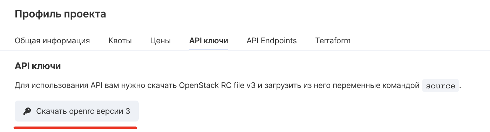

## Установка terraform

Скачайте terraform по ссылке [https://www.terraform.io/downloads.html](https://www.terraform.io/downloads.html) и воспользуйтесь инструкцией [https://learn.hashicorp.com/terraform/getting-started/install.html](https://learn.hashicorp.com/terraform/getting-started/install.html) по его установке.

## Настройка провайдера

Для начала использования провайдера terraform VK Cloud выполните следующие действия:

- Скачайте бинарный файл VK Cloud провайдера по ссылке [https://hub.mcs.mail.ru/repository/terraform/linux/v0.1.0/mcs-provider](https://hub.mcs.mail.ru/repository/terraform/linux/v0.1.0/mcs-provider).
- Создайте директорию, в которой будут храниться конфигурационные файлы, например, "mcs_provider".
- Поместите бинарный файл VK Cloud провайдера по следующему пути "~/.terraform.d/plugins/".
- Перейдите в директорию "mcs_provider" и создайте в ней файл "main.tf". Для использования переменных при создании ресурсов также создайте файл "vars.tf".
- Для инициализации openstack провайдера используйте "openrc" файл - скачать его можно по ссылке [https://mcs.mail.ru/app/project/keys/](https://mcs.mail.ru/app/project/keys/).

Затем выполните:

```
source %your_openrc_name%.sh
```

**Внимание**

Для корректной работы обоих провайдеров убедитесь, что в переменных окружения не установлена переменная "OS_USER_DOMAIN_ID". Вы также можете убрать ее, выполнив команду "unset OS_USER_DOMAIN_ID".

Также openstack провайдер может быть сконфигрурирован в файле "main.tf" (для подробного ознакомления воспользуйтесь документацией по ссылке [https://www.terraform.io/docs/providers/openstack/index.html](https://www.terraform.io/docs/providers/openstack/index.html)):

```
provider "openstack" {
  user_name   = "admin"
  tenant_name = "admin"
  password    = "pwd"
  auth_url    = "http://myauthurl:5000/v2.0"
  region      = "RegionOne"
}
```

Для инициализации VK Cloud провайдера выставите в переменные окружения следующие переменные, выполнив команды:

```
export USER_NAME="your_username" #same as OS_USERNAME
export PASSWORD="your_password" #same as OS_PASSWORD
export PROJECT_ID="your_project_id" #same as OS_PROJECT_ID
```

также конфигурацию провайдеров можно описывать в файле "main.tf", например:

```
provider "mcs"{
  username = "your_username"
  password = "your_password"
  project_id = "your_project_id"
}
```

## Создание ресурсов

Для создания и управления ресурсами выполните следующие шаги:

Опишите в файле "main.tf" ресурсы для создания, например, для создания кластера с группой узлов вставьте следующее:

```
data "mcs_kubernetes_clustertemplate" "ct1" {
  version = 16
}
data "openstack_compute_flavor_v2" "k8s" {
name = "Standard-2-4-40"
}

resource "mcs_kubernetes_cluster" "mycluster" {
  cluster_template_id = data.mcs_kubernetes_clustertemplate.ct1.id
  subnet_id = "your_subnet_id"
  network_id = "your_network_id"
  master_flavor = data.openstack_compute_flavor_v2.k8s.id
  keypair = "your_keypair_name"
}
resource "mcs_kubernetes_node_group" "myng" {
  cluster_id = mcs_kubernetes_cluster.mycluster.id
  node_count = 1
}
```

**Внимание**

Для удобства заполнения некоторых "id" можно использовать "data sources", они начинаются с метки "data" и читают уже существующие ресурсы.

Для создания или использования keypair (ключевой пары):

```
# Прочитает существующую ключевую пару, для доступа к атрибутам используйте \`data.openstack_compute_keypair_v2.kp\`
data "openstack_compute_keypair_v2" "kp" {
 name = "my-keypair"
}

# Сгенерирует пару ключей
resource "openstack_compute_keypair_v2" "test-keypair" {
 name = "my-keypair"
}

# Создание с существующей парой ключей
resource "openstack_compute_keypair_v2" "test-keypair" {
 name       = "my-keypair"
 public_key = "ssh-rsa your_public_key"
}
```

Для создания новых сетевых сущностей или чтения существующих используйте следующие конструкции:

```
# Чтение существующих ресурсов
data "openstack_networking_network_v2" "k8s_network" {
 name = "your_network_name"
}

data "openstack_networking_subnet_v2" "k8s_subnet" {
 name = "your_subnet_name"
}

# Создание новых ресурсов
resource "openstack_networking_network_v2" "k8s" {
 name           = "k8s-net"
 admin_state_up = true
}

resource "openstack_networking_subnet_v2" "k8s-subnetwork" {
 name            = "k8s-subnet"
 network_id      = openstack_networking_network_v2.k8s.id
 cidr            = "192.168.0.0/24"
 ip_version      = 4
 dns_nameservers = ["8.8.8.8", "8.8.4.4"]
}

data "openstack_networking_network_v2" "extnet" {
 name = "ext-net"
}

resource "openstack_networking_router_v2" "k8s" {
 name                = "k8s-router"
 admin_state_up      = true
 external_network_id = data.openstack_networking_network_v2.extnet.id
}

resource "openstack_networking_router_interface_v2" "k8s" {
 router_id = openstack_networking_router_v2.k8s.id
 subnet_id = openstack_networking_subnet_v2.k8s-subnetwork.id
}
```

## Применение конфигурации

Выполните команду "terraform init".

Для того чтобы увидеть, какие ресурсы будут созданы - выполните "terraform plan".

Для применения выбранной конфигурации выполните "terraform apply" и введите "yes".

## Удаление ресурсов

Выполните команду "terraform destroy" и введите "yes".

## Переход на провайдера VK Cloud

Для перехода с openstack провайдера на VK Cloud выполните следующие команды:

Рассмотрим следующий openstack кластер:

```
resource "openstack_containerinfra_cluster_v1" "cluster_1" {
name                = "clusterone"
cluster_template_id = "cluster_template_id"
master_count        = 1
keypair             = "keypair_name"
master_flavor       = "master_flavor_id"
labels = {
  fixed_network = "fixed_network_id"
  fixed_subnet = "fixed_subnet_id"
}
}
```

Создадим конфигурацию для VK Cloud провайдера и заполним только необходимые поля:

```
resource "mcs_kubernetes_cluster" "cluster_2" {
name                = "clusterone"
cluster_template_id = "cluster_template_id"
keypair             = "keypair_name"
network_id = "fixed_network_id"
subnet_id = "fixed_subnet_id"
}
resource "mcs_kubernetes_node_group" "ng_2" {
  cluster_id = mcs_kubernetes_cluster.cluster_2.id
  node_count = 1
}
```

Если до этого у вас в стейте не было ресурсов VK Cloud провайдера то выполните "terraform init -plugin-dir $GOPATH/bin".

Выполните команды:

```
terraform import mcs_kubernetes_cluster.cluster_2 cluster_uuid
terraform import mcs_kubernetes_node_group.ng_2 ng_uuid
```

Для прекращения использования openstack провайдера для управления кластером откройте файл terraform.tfstate (он должен находиться в той же директории) и удалите из него всю информацию о кластере, созданном через openstack провайдер. Резервная копия стейта находится в файле terraform.tfstate.backup.

В результате в terraform будет создан новый ресурс, который будет управлять существующим кластером.

Теперь управление кластером осуществляется через VK Cloud провайдер.
