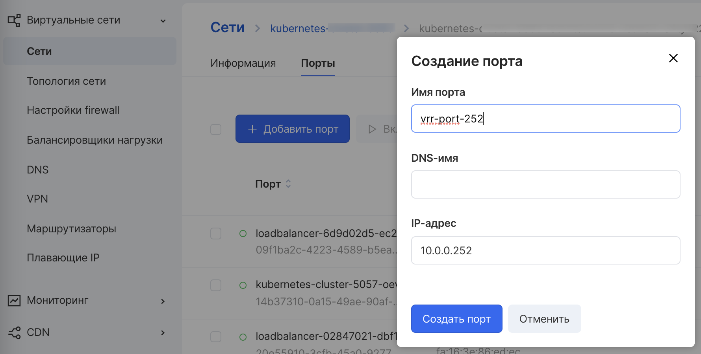

Исходная конфигурация:

* Подсеть 10.0.0.0/24
* ВМ (виртуальная машина) backend01 - ip-адрес 10.0.0.11/24 
* ВМ backend02 - ip-адрес 10.0.0.21/24

Под VIP планируем использовать адрес 10.0.0.252/24.

<warn>
IP-адреса в конфигурации выше используются для примера. У Вас будут другие IP-адреса.
</warn>

Важно, чтобы все IP-адреса были из одной подсети. Также следует обратить внимание на то, чтобы VIP не принадлежал диапазону раздаваемых по dhcp ip-адресов в подсети (subnet), где мы будем настраивать VIP. Надежным способом избежать этой ситуации будет создание порта с назначением ему ip-адреса, соответствующего VIP. Это можно сделать двумя способами: через openstack-cli и через ui. 

## Команда создания порта в подсети через openstack cli:
```
#> openstack port create --network [название сети] --fixed-ip subnet=[название подсети],ip-address=10.0.0.252 vrrp-port-252
```
## Создание порта через UI
Заходим в настройки соответствующей подсети, и нажимаем кнопку “Добавить порт”. В появившемся окне “Создание порта” заполняем поля и нажимаем кнопку “Создать порт”:



В списке портов подсети появится наш порт в состоянии “Не подключен”:


Затем необходимо разрешить для портов (сетевых интерфейсов) виртуальных машин трафик с ip-адресами источника, отличными от ip-адреса, назначенного на этот порт. Для этого находим id порта виртуальной машины командой:
```
#> openstack port list --server backend01
```
Будет выведен список всех портов, подключенных к виртуальной машине. Нам нужен ID того порта, на котором мы планируем настраивать VIP. Следующим шагом разрешаем исходящий трафик с ip-адресом источника, отличным от ip-адреса порта ВМ:
```
#> openstack port set --allowed-address ip-address=0.0.0.0/0 xxxxyyyy-zzzz-aaaa-bbbb-ccccddddeeee
```
Те же самые действия проделываем для ВМ backend02.

<warn>
Есть один нюанс для параметра ip-address. Если на порт назначена группа безопасности, содержащее правило со ссылкой на саму эту группу безопасности, то в эту группу **неявно** будет добавлено правило, разрешающее помимо трафика с хостов в группе безопасности еще и трафик с диапазона ip-address.
</warn>

После успешного завершения предыдущих шагов переходим к установке пакета keepalived. Подключаемся к виртуальным машинам backend01 и backend02 по ssh или через консоль. Производим установку пакета keepalived c помощью пакетного менеджера.

## Установка конфигурации
Для ВМ backend01 в конфигурационный файл /etc/keepalived/keepalived.conf прописываем следующую конфигурацию:
```
global_defs { router_id BACKEND01
}
 
vrrp_instance VI_252 {
state MASTER interface eth0 virtual_router_id 252
priority 120
advert_int 1 authentication { auth_type PASS auth_pass qweqweqwe
}
 
virtual_ipaddress { 10.0.0.252/24
}
}
```
Для ВМ backend02 в конфигурационный файл /etc/keepalived/keepalived.conf прописываем следующую конфигурацию:
```
global_defs { router_id BACKEND02
}
 
vrrp_instance VI_252 {
state BACKUP interface eth0 virtual_router_id 252
priority 90
advert_int 1 authentication { auth_type PASS auth_pass qweqweqwe
}
 
virtual_ipaddress { 10.0.0.252/24
}
}
```
## Запуск сервиса
Запускаем сервис keepalived на обоих ВМ командой:
```
#> systemctl start keepalived
```
## Проверка статуса
Проверяем статус запущенных сервисов
```
#> systemctl status keepalived
```
Сервис на обоих ВМ должен быть в состоянии active (running). Если это не так, то нужно выявить причину и устранить ее.

Проверяем командой наличие VIP на интерфейсе:
```
#> ip a
```
На сетевом интерфейсе eth0 ВМ backend01 должен появиться дополнительный ip-адрес, соответствующий VIP.

## Проверка конфигурации
Проверим работу нашей конфигурации: с какой-либо третьей ВМ запустим пинг по адресу VIP, который назначен на ВМ backend01. Затем остановим сервис keepalived на backend01. VIP должен переназначаться на интерфейс eth0 ВМ backend02. 

Это можно проверить, выполнив команду “ip a” в консоли сервера backend02. Он должен появиться в списке ip-адресов, назначенных на сетевой интерфейс. При этом пинг со сторонней машин будет успешно идти на VIP. 

Снова запустим сервис keepalived на backend01, и VIP снова будет переназначен интерфейсу ВМ backend01. 

VIP успешно настроен.