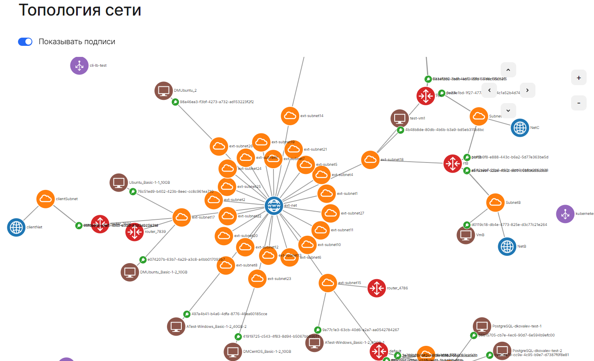

Топология сети — это графическое представление сетевой связности виртуальных машин. Это схема, на которой можно увидеть следующие элементы, а также все связи между ними:

- сети;
- подсети;
- роутеры;
- виртуальные машины.

Чтобы посмотреть топологию сети отдельного проекта:

1. Перейдите в [личный кабинет](https://mcs.mail.ru/app/) VK Cloud.
1. Выберите проект и регион.
1. Перейдите в раздел **Виртуальные сети** → **Топология сети**.

## Управление топологией

Доступны операции с топологией сети:

- *Перемещение по карте*. Используйте стрелки в правом верхнем углу топологии или удерживайте и передвигайте левую кнопку мыши в нужном направлении.
- *Масштабирование*. Используйте **+** и **-** в правом верхнем углу топологии или прокручивайте колесико мыши.
- *Скрытие или отображение подписей на топологии*. Используйте переключатель **Показывать подписи** в левом верхнем углу топологии.
- *Просмотр подробной информации об элементе топологии*. Нажмите на элемент топологии левой клавишей мыши. Будут отображены параметры:
  - **Название** — наименование выбранного элемента.
  - **ID** — идентификатор элемента в системе.
  - **Тип** — тип выбранного элемента:

    - network — сеть;
    - subnet — подсеть;
    - instance — инстанс;
    - router — маршрутизатор;
    - balancer — балансировщик нагрузки;
    - port — порт.

  - **Статус** — состояние выбранного элемента. Не отображается для подсети. <!-- todo заполнить возможные статусы-->
  - Дополнительные параметры в зависимости от типа элемента.
  - Ссылка для перехода на элемент в личном кабинете. Не отображается для портов.
