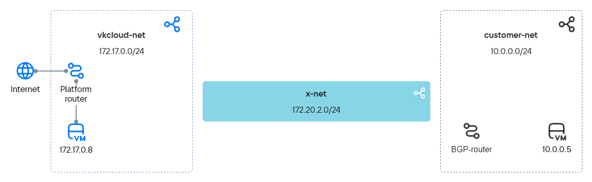
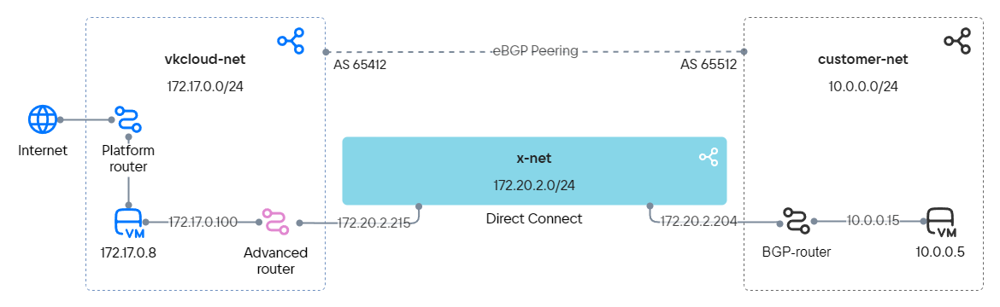

Продвинутый маршрутизатор позволяет связать сеть, которая находится в вашей локальной инфраструктуре, с виртуальными сетями и подсетями VK Cloud без использования выделенной виртуальной машины в качестве маршрутизатора. Это упрощает обмен данными за счет возможности динамической маршрутизации по протоколу [BGP](https://datatracker.ietf.org/doc/html/rfc1163).

Чтобы показать настройку продвинутого маршрутизатора, по BGP-протоколу будут связаны две независимые сети:

- Клиентская сеть — внутренняя сеть заказчика, которая может не иметь доступа к интернету.
- Виртуальная сеть — находится в VK Cloud и подключена к платформенному маршрутизатору.

## Подготовительные шаги

1. Убедитесь, что клиент OpenStack [установлен](/ru/manage/tools-for-using-services/openstack-cli#1_ustanovite_klient_openstack), и [пройдите аутентификацию](/ru/manage/tools-for-using-services/openstack-cli#3_proydite_autentifikaciyu) в проекте.

1. Выберите клиентскую сеть в вашей локальной инфраструктуре:

   - Сеть должна быть подключена к маршрутизатору, который:
      - поддерживает соединение по BGP-протоколу;
      - (опционально) может поддерживать BFD-протокол: это позволит сократить время сходимости протоколов маршрутизации;
      - может быть устройством или виртуальной машиной в клиентской сети.
   - Сеть может не иметь доступа к интернету.

   Если подходящей сети нет, создайте ее.

   Запишите следующую информацию:

   - имя и IP-адрес подсети;
   - имя сети, в которой находится подсеть;
   - IP-адрес машины в подсети, которая будет использоваться для проверки связи между сетями;
   - имя BGP-маршрутизатора.

   <info>
   Для примера будет использована сеть с виртуальной машиной Router OS 7.10 (MikroTik), выполняющей функции BGP-маршрутизатора.
   </info>

1. Выберите или [создайте](../../operations/manage-net#sozdanie_seti) виртуальную сеть с доступом к интернет в VK Cloud. Используйте уже существующий маршрутизатор с подключением к внешней сети или [создайте](../../operations/manage-router#dobavlenie_marshrutizatora) новый.

   Запишите следующую информацию:

   - имя и IP-адрес подсети;
   - имя сети, в которой находится подсеть;
   - имя маршрутизатора.

1. Создайте [виртуальную машину](../../../../base/iaas/instructions/vm/vm-create) в сети `vkcloud-net`. Добавьте доступ по SSH и отключите резервное копирование.

   Запишите IP-адрес ВМ.

1. Обратитесь в [техническую поддержку](/ru/contacts), чтобы подключить в ваш проект сеть для организации выделенного канала подключения (сетевой стык).

   Когда сеть будет предоставлена, запишите ее имя, имя и IP-адрес подсети.

1. Убедитесь, что собраны все сведения, необходимые для дальнейшей работы.

Для примера далее используются следующие данные:

| Объект | Клиентская сеть | Виртуальная сеть| Сетевой стык
| :---| :--- | :--- | :---
| Имя сети                                   | `customer-net`                                    | `vkcloud-net` | `x-net` |
|Имя и IP-адрес подсети                              | `customer-subnet`, `10.0.0.0/24`                            | `vkcloud-subnet`, `172.17.0.0/24`| `x-subnet`, `172.20.2.0/24`|
| IP-адрес машины в подсети     | `10.0.0.5`    | `172.17.0.8`|
| Имя BGP-маршрутизатора | `MikroTik` |

Схема предварительной подготовки сетей выглядит следующим образом:



## 1. Добавьте продвинутый маршрутизатор

1. В [личном кабинете](https://mcs.mail.ru/app/) перейдите в раздел **Виртуальные сети** → **Маршрутизаторы**.
1. Нажмите кнопку **Добавить маршрутизатор**.
1. Выберите тип **Продвинутый**. Если в проекте не доступен продвинутый маршрутизатор, обратитесь в [техническую поддержку](/ru/contacts).
1. Введите название маршрутизатора. В этом примере — `advanced-router`.
1. Нажмите кнопку **Создать**.

## 2. Настройте сетевые интерфейсы продвинутого маршрутизатора

Чтобы организовать передачу данных между независимыми сетями, нужно добавить интерфейсы продвинутому маршрутизатору:

- Направленные в сеть, где расположен маршрутизатор — `vkcloud-net`. Эти интерфейсы используются для подключения к машинам внутри сети. Количество таких интерфейсов зависит от структуры сети.
- Направленный в сетевой стык — `x-net`. Этот интерфейс поможет организовать связность между VK Cloud и локальной сетью заказчика.

Для добавления интерфейсов:

1. Перейдите на вкладку маршрутизатора **Интерфейсы**.
1. Добавьте интерфейс в виртуальную сеть:
   1. Нажмите кнопку **Добавить интерфейс**.
   1. Укажите параметры интерфейса:

      - **Название**: `vkcloud-net-iface`;
      - **Подсеть**: `vkcloud-subnet`;
      - **IP-адрес интерфейса**: `172.17.0.100`.

   1. Нажмите кнопку **Создать**.
1. Добавьте интерфейс в сетевой стык:
   1. Нажмите кнопку **Добавить интерфейс**.
   1. Укажите параметры интерфейса:

      - **Название**: `x-net-iface`;
      - **Подсеть**: `x-subnet`;
      - **IP-адрес интерфейса**: `172.20.2.215`.

   1. Нажмите кнопку **Создать**.

## 3. Настройте сетевые интерфейсы BGP-маршрутизатора клиентской сети

1. Добавьте сетевые интерфейсы:

   - Направленный в сетевой стык — `x-net`. Этот интерфейс поможет организовать связность между VK Cloud и локальной сетью заказчика.
   - Направленные в клиентскую сеть, где расположен BGP-маршрутизатор Эти интерфейсы используются для подключения к ресурсам внутри сети. Количество таких интерфейсов зависит от структуры сети.

   В этом примере:

   - `172.20.2.204/24` — интерфейс в сетевой стык `x-net`;
   - `10.0.0.15/24` — интерфейс в клиентскую сеть до виртуальной машины `10.0.0.5`.

1. Настройте интерфейсы с использованием DHCP.

1. Настройте системный идентификатор (System ID).

1. Подготовьте список сетей для BGP-анонса.

1. (Опционально) Если маршрутизатор поддерживает BFD, настройте BFD-протокол.

<details>
    <summary>Пример настройки для MikroTik</summary>

   1. Для добавления сетевых интерфейсов подключитесь к MikroTik по SSH и выполните команду:

      ```bash
       /ip address add address=172.20.2.204/24 interface ether1
       /ip address add address=10.0.0.15/24 interface ether2
      ```

   1. Настройте интерфейсы с использованием DHCP:

      ```bash
       /ip dhcp-client
       add add-default-route=no interface=ether1
       add add-default-route=no interface=ether2
      ```

   1. Настройте системный идентификатор (System ID):

      ```bash
       /system identity
       set name=bgp-customer
      ```

   1. Подготовьте список сетей для BGP-анонса:

      ```bash
       /ip firewall address-list
       add address=10.0.0.0/24 list=bgp_networks
      ```

   1. Настройте BFD-протокол:

      ```bash
       /routing bfd configuration
       add disabled=no interfaces=ether1
      ```

</details>

## 4. Настройте BGP-соседство для продвинутого маршрутизатора

Чтобы настроить связь по BGP-протоколу, нужно добавить динамические маршруты и указать BGP-соседей. Для динамической маршрутизации требуются номера автономных сетей — ASN. Если вашей сети присвоен ASN, используйте его. Если ASN не присвоен, используйте номер из диапазона `64512`–`65534` — эти номера могут быть назначены для приватных автономных сетей. В примере будут использованы следующие номера:

- `65512` для сети `customer-net`;
- `64512` для сети `vkcloud-net`.

Чтобы настроить динамические маршруты для `advanced-router`:

1. В [личном кабинете](https://mcs.mail.ru/app/) перейдите в раздел **Виртуальные сети** → **Маршрутизаторы**.
1. Откройте добавленный продвинутый маршрутизатор и перейдите на вкладку **Динамическая маршрутизация**.
1. Нажмите кнопку **Создать BGP маршрутизатор**.
1. Укажите параметры BGP-маршрутизатора:

   - **Название**: `to-MikroTik`;
   - **Router ID**: `172.20.2.215`;
   - **ASN**: `64512`.

1. Нажмите кнопку **Создать**.
1. Откройте добавленный BGP-маршрутизатор и перейдите на вкладку **BGP соседи**.
1. Добавьте BGP-соседа. Укажите параметры:

   - **Название**: `MikroTik`;
   - **Remote neighbor**: `172.20.2.204`;
   - **Remote ASN**: `65512`.

1. Нажмите кнопку **Создать**.

Убедитесь, что маршрутизатор установил связь с соседом: маркер рядом с названием зеленый, а BFD включен.

Продвинутый маршрутизатор начнет передавать BGP-анонсы своему соседу. Перейдите на вкладку **BGP анонсы** и убедитесь, что маршрутизатор передает анонсы всех сетей, в которые направлены его интерфейсы:

- `172.17.0.0/24`;
- `172.20.2.0/24`.

Оба анонса должны иметь зеленые маркеры.

## 5. Настройте BGP-соседство для маршрутизатора клиентской сети

1. Подключитесь в маршрутизатору в вашей локальной сети.  
1. Укажите параметры для подключения по BGP-протоколу:

   - ASN локальной сети: `65512`;
   - ID маршрутизатора: `172.20.2.204`;
   - ASN внешней сети: `64512`;
   - ID BGP-соседа: `172.20.2.215`;
   - использовать BFD.
1. (Опционально) Проверьте, что установлена связь по BFD-протоколу.
1. Проверьте, что установлена связь с BGP-соседом. Если BGP соединение установлено, в ответе должны прийти значения `keepalive-time` и `uptime`, отличные от нуля.
1. Просмотрите все доступные BGP-маршруты. В списке маршрутов должны быть указаны сети `172.17.0.0/24` и `172.20.2.0/24`.

<details>
 <summary>Пример настройки для MikroTik</summary>

1. Подключитесь к MikroTik по SSH и выполните команду:

    ```bash
    /routing bgp connection
    add address-families=ip as=65512 local.address=172.20.2.204 .role=ebgp name=bgp-customer output.network=bgp_networks remote.address=172.20.2.215 .as=64512 router-id=172.20.2.204 use-bfd=yes
    ```
1. Проверьте, что установлена связь по BFD-протоколу. Выполните команду:

   ```bash
   /routing bfd session print
   ```

   Пример ответа:

   ```bash
      Flags: U - up, I - inactive 
   0 U multihop=no vrf=main remote-address=172.20.2.215%ether1 local-address=172.20.2.204 state=up state-changes=1 uptime=3h27m12s desired-tx-interval=200ms actual-tx-interval=100ms 
     required-min-rx=200ms remote-min-rx=10ms multiplier=5 hold-time=1s packets-rx=75343 packets-tx=72203
   ```

1. Проверьте, что установлена связь с BGP-соседом на стороне MikroTik. Выполните команду:

   ```bash
   /routing bgp session print
   ```

   Пример ответа:

   ```bash
      Flags: E - established
   0 E name="tw-bgp-mikrotik-1"
        remote.address=172.20.2.215 .as=64512 .id=172.20.2.215 .capabilities=mp,rr,gr,as4,ap,err,llgr .hold-time=4m
       .messages=5 .bytes=131 .gr-time=120 .eor=ip
      local.address=172.20.2.204 .as=65512 .id=172.20.2.204 .capabilities=mp,rr,gr,as4 .messages=4 .bytes=105 .eor=""
        output.procid=20 .network=bgp_networks
       input.procid=20 ebgp
      hold-time=3m keepalive-time=1m uptime=2m51s380ms last-started=aug/28/2023 07:27:15
   ```
1. Введите команду, чтобы посмотреть все маршруты MikroTik:

   ```bash
   /ip route print where bgp
   ```

   Пример ответа:

   ```bash
   Flags: D - DYNAMIC; A - ACTIVE; b, y - BGP-MPLS-VPN
   Columns: DST-ADDRESS, GATEWAY, DISTANCE
       DST-ADDRESS    GATEWAY       DISTANCE
   DAb 172.17.0.0/24  172.20.2.215        20
   D b 172.20.2.0/24  172.20.2.215        20   
   ```

</details>

## 6. Настройте статические маршруты между сетями

1. Настройте статический маршрут от виртуальной сети `vkcloud-net` до клиентской сети `customer-net` через продвинутый маршрутизатор:

   1. В [личном кабинете](https://mcs.mail.ru/app/) перейдите в раздел **Виртуальные сети** → **Сети**.
   1. Выберите сеть `vkcloud-net` и откройте свойства подсети.
   1. Выберите **Показывать поле статических маршрутов**.
   1. Укажите маршрут: `10.0.0.0/24 - 172.17.0.100`.
   1. Нажмите кнопку **Сохранить**.

1. Настройте статический маршрут от клиентской сети `customer-net` до виртуальной сети `vkcloud-net` через BGP-маршрутизатор клиентской сети. Маршрут должен быть к `172.17.0.0/24` через `10.0.0.15`.

1. Перезагрузите машины `172.17.0.8` и `10.0.0.5`, чтобы маршруты попали в их маршрутную сеть.

1. Проверьте, что статические маршруты прописаны на ВМ `172.17.0.8`, которая находится в виртуальной сети `vkcloud-net`:

   1. Откройте сессию терминала с ВМ `vkcloud-vm`.
   1. Введите команду:

       ```bash
       ip route
       ```

      В списке маршрутов должны быть указаны сети `10.0.0.0/24` и `172.20.2.0/24`.
1. Проверьте список маршрутов для машины `10.0.0.5`, которая находится в клиентской сети `customer-net`. В списке маршрутов должны быть указаны сети `172.17.0.0/24` и `172.20.2.0/24`.

## 7. Проверьте работоспособность

Для проверки отправьте `ping` или `traceout` до машины в противоположной сети. Если из другой сети приходит ответ, то настройка связности сетей выполнена правильно.

Например, выполните пинг с машины `172.17.0.8` в виртуальной сети до машины `10.0.0.5` в клиентской сети:

1. Откройте сессию терминала с ВМ `vkcloud-vm`.
1. Выполните пинг внутреннего IP-адреса машины в клиентской сети:

      ```bash
      ping 10.0.0.5
      ```

IP-адрес должен отвечать на пинг.

Схема выстроенного взаимодействия между сетями и машинами внутри сетей выглядит следующим образом:



## Удалите ненужные ресурсы

Если созданные ресурсы вам больше не нужны, удалите их:

1. [Удалите](/ru/base/iaas/instructions/vm/vm-manage#udalenie_vm) виртуальную машину.
1. [Удалите](../../operations/manage-router#udalenie_marshrutizatora) маршрутизаторы.
1. Удалите [подсеть](../../operations/manage-net#udalenie_podseti) и [сеть](../../operations/manage-net#udalenie_seti), в которой была размещена ВМ.
