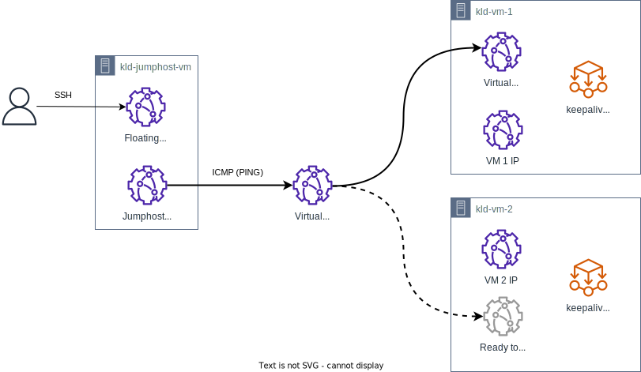

Если входящий трафик обрабатывается кластером из нескольких однотипных виртуальных машин, то для них можно создать виртуальный IP-адрес (Virtual IP, VIP). Такой адрес используется для организации отказоустойчивой обработки входящего трафика этими виртуальными машинами. Технология устроена так: VIP присваивается одной из виртуальных машин кластера, которая обрабатывает трафик с этого VIP. Клиенты, обращаясь по такому адресу, будут направлены на эту виртуальную машину. Если виртуальная машина выйдет из строя, то VIP перейдет другой виртуальной машине из кластера, и обработка трафика продолжится. Виртуальные машины отслеживают свое состояние и управляют назначением VIP с помощью протокола [VRRP](https://www.rfc-editor.org/rfc/rfc3768).

Чтобы показать настройку виртуального IP-адреса:

- будут созданы две виртуальные машины, для которых:
  - будет создан виртуальный IP-адрес;
  - будет настроен VRRP в реализации [keepalived](https://keepalived.readthedocs.io/en/latest/introduction.html) для обслуживания этого IP-адреса.
- будет создана третья виртуальная машина с плавающим IP-адресом, с которой будут выполнены все необходимые настройки и проверка работоспособности.



## 1. Подготовительные шаги

1. Убедитесь, что клиент OpenStack [установлен](/ru/manage/tools-for-using-services/openstack-cli#1--ustanovite-klient-openstack), и [пройдите аутентификацию](/ru/manage/tools-for-using-services/openstack-cli#3--proydite-autentifikaciyu) в проекте.

1. Выберите подсеть, в которой будут размещены виртуальные машины и виртуальный IP-адрес. Они должны размещаться в одной подсети.

   Если нужной подсети нет, [создайте ее](../../operations/manage-net#sozdanie-podseti).

   Запишите следующую информацию:
   - имя подсети;
   - имя сети, в которой находится подсеть.

   В качестве примера будет использоваться подсеть `mysubnet` в сети `mynetwork`.

1. Определите, какой IP-адрес будет использоваться в качестве виртуального IP-адреса. Этот IP-адрес не должен использоваться любыми объектами (например, виртуальной машиной или балансировщиком нагрузки).

   В качестве примера будет использоваться адрес `192.168.0.254/24`.

1. Убедитесь, что этот IP-адрес не будет использован другими объектами (например, назначен порту виртуальной машины или балансировщика нагрузки). Один из наиболее простых способов этого добиться — создать порт OpenStack с выбранным адресом и потом нигде не использовать этот порт.

   Чтобы создать такой порт, выполните команду в OpenStack CLI:

   ```bash
   openstack port create <имя порта> --network mynetwork --fixed-ip subnet=mysubnet,ip-address=192.168.0.254
   ```

1. Создайте виртуальные машины `kld-vm1`, `kld-vm-2` и `kld-jumphost-vm`.

   Эти виртуальные машины должны находиться в группе безопасности, для которой разрешен любой входящий и исходящий трафик в рамках самой группы.
   Например, такой группой является `default`.

   Если используются нестандартные группы безопасности, в них должен быть разрешен:
   - SSH-трафик к `kld-vm1` и `kld-vm-2`;
   - VRRP-трафик между `kld-vm1` и `kld-vm-2`;
   - ICMP-трафик к выбранному виртуальному IP-адресу (для проверки работоспособности).

   <tabs>
   <tablist>
   <tab>kld-vm-1</tab>
   <tab>kld-vm-2</tab>
   <tab>kld-jumphost-vm</tab>
   </tablist>
   <tabpanel>

   Задайте следующие параметры:

   - **Имя виртуальной машины:** `kld-vm-1`.
   - **Количество машин в конфигурации:** `1`.
   - **Операционная система:** `Ubuntu 22.04`.
   - **Сеть:** сеть и подсеть, выбранные ранее.
   - **DNS-имя:** `kld-vm-1`.
   - **Настройки Firewall:** `default`.
   - **Назначить внешний IP:** убедитесь, что опция не выбрана.

   Прочие параметры виртуальной машины выберите на свое усмотрение.

   </tabpanel>
   <tabpanel>

   Задайте следующие параметры:

   - **Имя виртуальной машины:** `kld-vm-2`.
   - **Количество машин в конфигурации:** `1`.
   - **Операционная система:** `Ubuntu 22.04`.
   - **Сеть:** сеть и подсеть, выбранные ранее.
   - **DNS-имя:** `kld-vm-2`.
   - **Настройки Firewall:** `default`.
   - **Назначить внешний IP:** убедитесь, что опция не выбрана.

   Прочие параметры виртуальной машины выберите на свое усмотрение.

   </tabpanel>
   <tabpanel>

   Задайте следующие параметры:

   - **Имя виртуальной машины:** `kld-jumphost-vm`.
   - **Количество машин в конфигурации:** `1`.
   - **Операционная система:** `Ubuntu 22.04`.
   - **Сеть:** сеть и подсеть, выбранные ранее.
   - **DNS-имя:** `kld-jumphost-vm`.
   - **Настройки Firewall:** `default`, `ssh`.
   - **Назначить внешний IP:** убедитесь, что опция выбрана. Плавающий IP-адрес (Floating IP, FIP) необходим для подключения к виртуальной машине по SSH из интернета.

   Прочие параметры виртуальной машины выберите на свое усмотрение.

   </tabpanel>
   </tabs>

1. Определите порт OpenStack, через который виртуальные машины `kld-vm-1` и `kld-vm-2` будут работать с виртуальным IP-адресом:

   1. Для виртуальной машины `kld-vm-1`:

      1. [Подключитесь](/ru/base/iaas/instructions/vm/vm-connect/vm-connect-nix) к виртуальной машине `kld-jumphost-vm` по SSH.
      1. Подключитесь к виртуальной машине `kld-vm-1` по SSH.
      1. Выполните команду:

         ```bash
         ip route | grep default
         ```

         Пример вывода:

         ```text
         default via 192.168.0.1 dev ens3 proto dhcp src 192.168.0.11 metric 100
         ```

         Запишите следующую информацию из вывода:

         - Имя сетевого интерфейса (следует после `dev`): в этом примере `ens3`.
         - IP-адрес сетевого интерфейса (следует после `src`): в этом примере `192.168.0.11`.

      1. Выполните команду OpenStack CLI:

         ```bash
         openstack port list -c ID --server kld-vm-1 --fixed-ip ip-address=<IP-адрес сетевого интерфейса из предыдущего шага>
         ```

         Пример вывода:

         ```text
         +--------------------------------------+
         | ID                                   |
         +--------------------------------------+
         | e1bd636a-aaaa-bbbb-cccc-a673e7cbef83 |
         +--------------------------------------+
         ```

         Запишите идентификатор порта OpenStack из вывода.

   1. Выполните аналогичные действия на виртуальной машине `kld-vm-2`.

Запишите все полученные данные. Результат для приведенного примера:

<!-- prettier-ignore -->
| Объект                                                    | Значение                                  |
| --------------------------------------------------------- | ----------------------------------------- |
| **Для виртуальной машины kld-vm-1**                                                                   |
| Имя сетевого интерфейса                                   | `ens3`                                    |
| IP-адрес сетевого интерфейса                              | `192.168.0.11`                            |
| Идентификатор порта OpenStack для сетевого интерфейса     | `e1bd636a-aaaa-bbbb-cccc-a673e7cbef83`    |
| **Для виртуальной машины kld-vm-2**                                                                   |
| Имя сетевого интерфейса                                   | `ens3`                                    |
| IP-адрес сетевого интерфейса                              | `192.168.0.22`                            |
| Идентификатор порта OpenStack для сетевого интерфейса     | `74268d00-xxxx-yyyy-zzzz-cf9f93536d5c`    |
| **Прочее**                                                                                            |
| Подсеть для виртуальных машин и виртуального IP-адреса    | `192.168.0.0/24`                          |
| Имя подсети                                               | `mysubnet`                                |
| Имя сети, в которой находится подсеть                     | `mynetwork`                               |  
| Виртуальный IP-адрес                                      | `192.168.0.254/24`                        |
<!-- prettier-ignore -->

## 2. Установите и настройте keepalived

1. Установите `keepalived`:

   1. Для виртуальной машины `kld-vm-1`:

      1. [Подключитесь](/ru/base/iaas/instructions/vm/vm-connect/vm-connect-nix) к виртуальной машине `kld-jumphost-vm` по SSH.
      1. Подключитесь к виртуальной машине `kld-vm-1` по SSH.
      1. Выполните команды:

         ```bash
         sudo apt update
         sudo apt install keepalived

         ```

   1. Выполните аналогичные действия на виртуальной машине `kld-vm-2`.

1. Настройте `keepalived`:

   <tabs>
   <tablist>
   <tab>kld-vm-1</tab>
   <tab>kld-vm-2</tab>
   </tablist>
   <tabpanel>

   1. Подключитесь к виртуальной машине `kld-jumphost-vm` по SSH.
   1. Подключитесь к виртуальной машине `kld-vm-1` по SSH.
   1. Отредактируйте файл `/etc/keepalived/keepalived.conf`, заменив его содержимое на следующее:

      ```conf
      global_defs
      {
        router_id KLD-VM-1
      }
      
      vrrp_instance VI_254
      {
        state MASTER
        interface ens3
        virtual_router_id 254
        priority 120
        advert_int 1

        authentication
        {
          auth_type PASS
          auth_pass <пароль для аутентификации>
        }
      
        virtual_ipaddress
        {
          192.168.0.254/24
        }
      }
      ```

   </tabpanel>
   <tabpanel>

   1. Подключитесь к виртуальной машине `kld-jumphost-vm` по SSH.
   1. Подключитесь к виртуальной машине `kld-vm-2` по SSH.
   1. Отредактируйте файл `/etc/keepalived/keepalived.conf`, заменив его содержимое на следующее:

      ```conf
      global_defs
      {
        router_id KLD-VM-2
      }
      
      vrrp_instance VI_254
      {
        state BACKUP
        interface ens3
        virtual_router_id 254
        priority 90
        advert_int 1

        authentication
        {
          auth_type PASS
          auth_pass <пароль для аутентификации>
        }
      
        virtual_ipaddress
        {
          192.168.0.254/24
        }
      }
      ```

   </tabpanel>
   </tabs>

   В конфигурационном файле:

   - `router_id` — идентификатор роутера `keepalived`, значение различно для каждой из конфигураций.
   - `vrrp_instance` — настройки инстанса VRRP. Имя инстанса VRRP значимо только локально, поэтому может совпадать для конфигураций на разных виртуальных машинах.

     - `state` — роль, с которой начинает работу `keepalived`: `MASTER` или `SLAVE`. Затем, в зависимости от результата выбора мастера, роль может быть изменена.
     - `interface` — имя интерфейса, на котором работает VRRP. Имя интерфейса значимо только локально, поэтому может совпадать для конфигураций на разных виртуальных машинах.
     - `virtual_router_id` — идентификатор роутера VRRP от 0 до 255. Должен совпадать в обеих конфигурациях.
     - `priority` — приоритет, согласно которому выбирается мастер VRRP. В данном случае мастером станет `kld-vm-1`, поскольку у него самый высокий приоритет.
     - `advert_int` — интервал рассылки сообщений VRRP (в секундах).
     - `authentication` — параметры аутентификации. В данном случае аутентификация производится по паролю (`PASS`). Пароли (значение `auth_pass`) должны совпадать во всех конфигурациях.
     - `virtual_ipaddress` — виртуальный IP-адрес. Значения должны совпадать во всех конфигурациях.

     Подробнее о параметрах в [документации keepalived](https://keepalived.readthedocs.io/en/latest/configuration_synopsis.html#vrrp-instance-definitions-synopsis).

1. Запустите `keepalived`:

   1. Для виртуальной машины `kld-vm-1`:

      1. Подключитесь к виртуальной машине `kld-jumphost-vm` по SSH.
      1. Подключитесь к виртуальной машине `kld-vm-1` по SSH.
      1. Выполните команду:

         ```bash
         sudo systemctl start keepalived

         ```

      1. Выполните команду для проверки состояния `keepalived`:

         ```bash
         sudo systemctl status keepalived
         ```

         Пример вывода:

         ```text
         ● keepalived.service - Keepalive Daemon (LVS and VRRP)
              Loaded: loaded (/lib/systemd/system/keepalived.service; enabled; vendor preset: enabled)
              Active: active (running) since Mon 2023-01-09 10:55:35 UTC; 21h ago
              ...
         ```

         `keepalived` должен находиться в состоянии `running`.

   1. Выполните аналогичные действия на виртуальной машине `kld-vm-2`.

## 3. Настройте IP Source Guard

Установленный на виртуальных машинах `keepalived` должен иметь возможность отправлять трафик не только с IP-адресов `192.168.0.11` и `192.168.0.22`, но и с виртуального IP-адреса `192.168.0.254`. Поскольку на портах OpenStack в VK Cloud используется [механизм IP Source Guard](../../concepts/traffic-limiting#ispolzovanie-ip-source-guard), разрешите трафик с виртуального IP-адреса для портов виртуальных машин:

1. Для `kld-vm-1`:

   ```bash
   openstack port set e1bd636a-aaaa-bbbb-cccc-a673e7cbef83 --allowed-address ip-address=192.168.0.254/24
   ```

1. Для `kld-vm-2`:

   ```bash
   openstack port set 74268d00-xxxx-yyyy-zzzz-cf9f93536d5c --allowed-address ip-address=192.168.0.254/24
   ```

## 4. Проверьте работоспособность виртуального IP-адреса

Откройте две сессии терминала:

1. В первой сессии:
   1. [Подключитесь](/ru/base/iaas/instructions/vm/vm-connect/vm-connect-nix) к виртуальной машине `kld-jumphost-vm` по SSH.
   1. Запустите непрерывный пинг виртуального IP-адреса:

      ```bash
      ping 192.168.0.254
      ```

      IP-адрес должен успешно пинговаться.

1. Во второй сессии:

   1. Подключитесь к виртуальной машине `kld-jumphost-vm` по SSH.
   1. Подключитесь к виртуальной машине `kld-vm-1` по SSH.
   1. Остановите процесс `keepalived`:

      ```bash
      sudo systemctl stop keepalived
      ```

      Поскольку эта виртуальная машина была в роли мастера и перестала обрабатывать трафик, теперь обработка поступающего на виртуальный IP-адрес трафика перейдет к виртуальной машине `kld-vm-2`.
      Процесс пинга, запущенный в первой сессии терминала, не должен прерваться.

   1. Повторно запустите процесс `keepalived`:

      ```bash
      sudo systemctl start keepalived
      ```

      Виртуальная машина опять возьмет на себя роль мастера и начнет обработку трафика, который поступает на виртуальный IP-адрес.

   1. Выполните команду:

      ```bash
      ip address show dev ens3
      ```

      Проверьте, что виртуальный IP-адрес присутствует в выводе:

      ```text
      ens3: <BROADCAST,MULTICAST,UP,LOWER_UP> mtu 1500 qdisc fq_codel state UP group default qlen 1000
          link/ether fa:16:3e:a3:82:f2 brd ff:ff:ff:ff:ff:ff
          altname enp0s3
          inet 192.168.0.4/24 metric 100 brd 192.168.0.255 scope global dynamic ens3
             valid_lft 523420sec preferred_lft 523420sec
          inet 192.168.0.254/24 scope global secondary ens3
             valid_lft forever preferred_lft forever
      ```

## Проконтролируйте использование ресурсов

Если созданные ресурсы вам больше не нужны, удалите их:

1. [Удалите](/ru/base/iaas/instructions/vm/vm-manage#udalenie-vm) виртуальные машины.
1. [Удалите](../../operations/manage-floating-ip#udalenie-plavayushchego-ip-adresa-iz-proekta) плавающий IP-адрес, назначенный виртуальной машине `kld-jumphost-vm`.
1. [Удалите](../../operations/manage-ports#udalenie-porta) порт, которому назначен виртуальный IP-адрес.
1. Удалите [подсеть](../../operations/manage-net#udalenie-podseti) и [сеть](../../operations/manage-net#udalenie-seti), в которых были размещены виртуальные машины.
